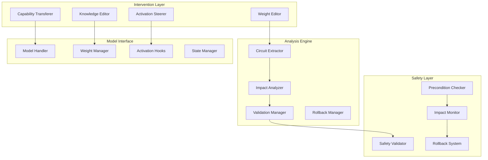

# Design Document

## Overview

The advanced circuit analysis system enables sophisticated model interventions through direct weight modification, activation steering, knowledge editing, and capability transfer. This system builds upon the core interpretability infrastructure to provide precise, targeted modifications while preserving model integrity and performance.

## Architecture



## Components and Interfaces

### 1. Circuit-Based Weight Editor

**Purpose**: Directly modify model weights that implement specific computational circuits while preserving unrelated functionality.

**Key Classes**:
```python
class CircuitWeightEditor:
    def __init__(self, model: ModelKit, safety_checker: SafetyChecker)
    def identify_circuit_weights(self, circuit: Circuit) -> WeightMapping
    def extract_circuit_weights(self, circuit: Circuit) -> torch.Tensor
    def create_weight_transform(self, target_behavior: str, preserve_capabilities: List[str]) -> WeightTransform
    def apply_weight_modification(self, transform: WeightTransform, circuit: Circuit) -> ModificationResult
    def validate_modification(self, original_weights: torch.Tensor, modified_weights: torch.Tensor) -> ValidationResult

class WeightTransform:
    def __init__(self, transform_type: str, parameters: Dict[str, Any])
    def apply_debias_transform(self, weights: torch.Tensor, bias_direction: torch.Tensor) -> torch.Tensor
    def apply_capability_enhancement(self, weights: torch.Tensor, enhancement_vector: torch.Tensor) -> torch.Tensor
    def preserve_orthogonal_capabilities(self, weights: torch.Tensor, preserve_subspace: torch.Tensor) -> torch.Tensor

class CircuitExtractor:
    def map_circuit_to_weights(self, circuit: Circuit, model: ModelKit) -> WeightMapping
    def compute_weight_importance(self, weights: torch.Tensor, circuit_function: str) -> torch.Tensor
    def identify_critical_connections(self, circuit: Circuit) -> List[WeightConnection]
```

**Interfaces**:
- `WeightModificationEngine`: Core engine for applying weight changes
- `CircuitValidator`: Validates circuit integrity after modifications
- `CapabilityPreserver`: Ensures unrelated capabilities remain intact

### 2. Activation Steering Controller

**Purpose**: Dynamically control model behavior through real-time activation modifications without changing weights.

**Key Classes**:
```python
class ActivationSteeringController:
    def __init__(self, model: ModelKit, neuron_analyzer: NeuronAnalyzer)
    def create_steering_hook(self, target_neurons: List[NeuronLocation], modification: Callable) -> SteeringHook
    def apply_conditional_steering(self, condition: Callable, steering_action: Callable) -> ConditionalHook
    def create_persistent_steering(self, steering_config: SteeringConfig) -> PersistentHook
    def manage_steering_conflicts(self, active_hooks: List[SteeringHook]) -> ConflictResolution

class SteeringHook:
    def __init__(self, layer: int, component: str, condition: Optional[Callable], action: Callable)
    def should_activate(self, context: GenerationContext) -> bool
    def apply_steering(self, activations: torch.Tensor) -> torch.Tensor
    def measure_steering_effect(self, original: torch.Tensor, modified: torch.Tensor) -> float

class ContextAnalyzer:
    def analyze_generation_context(self, tokens: List[int], position: int) -> GenerationContext
    def detect_task_type(self, context: GenerationContext) -> str
    def assess_steering_appropriateness(self, context: GenerationContext, steering_type: str) -> bool
```

**Interfaces**:
- `HookManager`: Manages multiple concurrent steering hooks
- `ConflictResolver`: Handles conflicts between multiple steering interventions
- `EffectivenessTracker`: Monitors steering effectiveness over time

### 3. Knowledge Editor

**Purpose**: Modify specific factual knowledge while preserving general capabilities and maintaining knowledge consistency.

**Key Classes**:
```python
class KnowledgeEditor:
    def __init__(self, model: ModelKit, knowledge_base: KnowledgeBase)
    def locate_factual_circuit(self, fact: str, layer_hint: Optional[int] = None) -> FactualCircuit
    def update_factual_knowledge(self, old_fact: str, new_fact: str, preserve_related: List[str]) -> UpdateResult
    def inject_new_knowledge(self, new_facts: List[str], integration_strategy: str) -> InjectionResult
    def validate_knowledge_consistency(self, updated_facts: List[str]) -> ConsistencyReport

class FactualCircuit:
    def __init__(self, fact: str, layers: List[int], weight_locations: List[WeightLocation])
    def extract_fact_representation(self, model: ModelKit) -> torch.Tensor
    def compute_fact_confidence(self, model: ModelKit, fact: str) -> float
    def identify_related_facts(self, knowledge_base: KnowledgeBase) -> List[str]

class KnowledgeConsistencyChecker:
    def check_fact_conflicts(self, new_fact: str, existing_facts: List[str]) -> List[Conflict]
    def resolve_conflicts(self, conflicts: List[Conflict], resolution_strategy: str) -> ResolutionPlan
    def validate_knowledge_graph_integrity(self, updated_knowledge: KnowledgeGraph) -> ValidationResult
```

**Interfaces**:
- `FactualKnowledgeLocator`: Identifies where facts are stored in the model
- `KnowledgeIntegrator`: Integrates new knowledge with existing structures
- `ConsistencyMaintainer`: Ensures knowledge remains consistent after updates

### 4. Capability Transfer System

**Purpose**: Transfer discovered circuits between models and enhance existing capabilities through circuit adaptation.

**Key Classes**:
```python
class CapabilityTransferSystem:
    def __init__(self, source_model: ModelKit, target_model: ModelKit)
    def extract_capability_circuit(self, capability: str, source_model: ModelKit) -> CapabilityCircuit
    def adapt_circuit_to_architecture(self, circuit: CapabilityCircuit, target_architecture: ModelArchitecture) -> AdaptedCircuit
    def install_circuit(self, adapted_circuit: AdaptedCircuit, target_layer: int) -> InstallationResult
    def validate_transfer_success(self, capability: str, target_model: ModelKit) -> TransferValidation

class CapabilityCircuit:
    def __init__(self, capability: str, components: List[CircuitComponent], dependencies: List[str])
    def extract_transferable_representation(self) -> TransferableRepresentation
    def compute_architecture_compatibility(self, target_arch: ModelArchitecture) -> CompatibilityScore
    def identify_adaptation_requirements(self, target_arch: ModelArchitecture) -> List[AdaptationStep]

class CircuitAdapter:
    def adapt_attention_heads(self, source_heads: List[AttentionHead], target_config: AttentionConfig) -> List[AttentionHead]
    def adapt_mlp_layers(self, source_mlp: MLPLayer, target_config: MLPConfig) -> MLPLayer
    def adapt_layer_connections(self, source_connections: List[Connection], target_layers: List[int]) -> List[Connection]
```

**Interfaces**:
- `ArchitectureAnalyzer`: Analyzes model architectures for compatibility
- `CircuitInstaller`: Handles the technical aspects of circuit installation
- `TransferValidator`: Validates successful capability transfer

## Data Models

### Core Data Structures

```python
@dataclass
class WeightMapping:
    circuit_id: str
    layer_weights: Dict[int, torch.Tensor]
    connection_weights: Dict[str, torch.Tensor]
    importance_scores: torch.Tensor
    modification_constraints: List[str]

@dataclass
class ModificationResult:
    success: bool
    original_performance: Dict[str, float]
    modified_performance: Dict[str, float]
    side_effects: List[str]
    rollback_data: Optional[torch.Tensor]

@dataclass
class SteeringConfig:
    target_behavior: str
    activation_modifications: List[ActivationModification]
    conditions: List[Callable]
    priority: int
    duration: Optional[int]

@dataclass
class FactualCircuit:
    fact: str
    confidence: float
    layer_locations: List[int]
    weight_coordinates: List[WeightCoordinate]
    related_facts: List[str]
    consistency_constraints: List[str]

@dataclass
class CapabilityCircuit:
    capability_name: str
    source_model: str
    components: List[CircuitComponent]
    performance_metrics: Dict[str, float]
    dependencies: List[str]
    transferability_score: float

@dataclass
class TransferResult:
    success: bool
    capability_preserved: bool
    performance_change: float
    integration_issues: List[str]
    validation_metrics: Dict[str, float]
```

### Safety and Validation Models

```python
@dataclass
class SafetyAssessment:
    risk_level: str  # "low", "medium", "high"
    potential_harms: List[str]
    mitigation_strategies: List[str]
    monitoring_requirements: List[str]
    approval_required: bool

@dataclass
class ValidationReport:
    modification_type: str
    success_metrics: Dict[str, float]
    failure_modes: List[str]
    performance_impact: Dict[str, float]
    safety_assessment: SafetyAssessment
    recommendations: List[str]
```

## Error Handling

### Exception Hierarchy

```python
class AdvancedAnalysisError(Exception):
    """Base exception for advanced circuit analysis"""

class WeightModificationError(AdvancedAnalysisError):
    """Raised when weight modifications fail or cause instability"""

class SteeringConflictError(AdvancedAnalysisError):
    """Raised when multiple steering hooks conflict"""

class KnowledgeInconsistencyError(AdvancedAnalysisError):
    """Raised when knowledge updates create logical inconsistencies"""

class TransferIncompatibilityError(AdvancedAnalysisError):
    """Raised when circuit transfer fails due to architecture incompatibility"""

class SafetyViolationError(AdvancedAnalysisError):
    """Raised when modifications violate safety constraints"""
```

### Recovery Mechanisms

1. **Automatic Rollback**: All modifications include rollback data for immediate recovery
2. **Gradual Application**: Apply modifications incrementally with validation at each step
3. **Conflict Resolution**: Automatic resolution of steering conflicts with priority systems
4. **Safety Monitoring**: Continuous monitoring with automatic intervention on safety violations
5. **Validation Checkpoints**: Regular validation with automatic rollback on failure

## Testing Strategy

### Modification Testing

1. **Weight Modification Validation**: Test weight changes preserve model stability
2. **Steering Effectiveness**: Validate steering produces intended behavioral changes
3. **Knowledge Consistency**: Ensure knowledge updates maintain logical consistency
4. **Transfer Success**: Validate successful capability transfer between models

### Safety Testing

1. **Harm Prevention**: Test that safety modifications prevent harmful outputs
2. **Capability Preservation**: Ensure beneficial capabilities remain intact
3. **Rollback Functionality**: Validate all rollback mechanisms work correctly
4. **Monitoring Systems**: Test continuous monitoring and intervention systems

### Integration Testing

1. **Multi-Component Interactions**: Test interactions between different modification types
2. **Concurrent Modifications**: Test multiple simultaneous modifications
3. **Long-term Stability**: Test modification stability over extended use
4. **Performance Impact**: Measure computational overhead of modifications