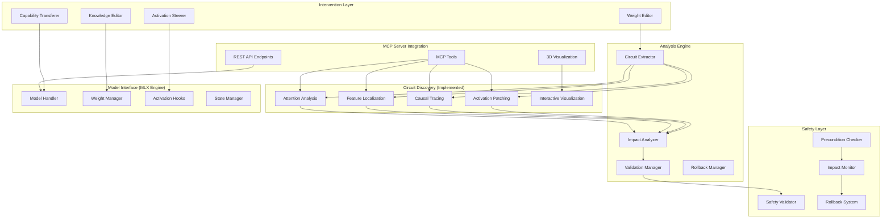

# Design Document

## Overview

The circuit analysis system enables model interventions through direct weight modification, activation steering, knowledge editing, and capability transfer. This system builds upon the core interpretability infrastructure to provide precise, targeted modifications while preserving model integrity and performance.

All circuit analysis capabilities are accessible through the **Mechanistic Interpretability MCP Server**, enabling LLM agents to perform complex model modifications through standardized tools. Agents can edit circuit weights, apply activation steering, modify factual knowledge, and transfer capabilities between models with built-in safety validation and automatic rollback mechanisms.

**Integration with Circuit Discovery**: This design incorporates the comprehensive circuit discovery implementation. The system leverages techniques including activation patching, causal tracing, feature localization, attention analysis, and interactive visualization to enable precise circuit-based interventions.

## Current Implementation Status

Based on the circuit discovery progress, the following components are **already implemented** and available for integration:

### ✅ Completed Infrastructure (High Priority)
- **Activation Patching Framework** (`mlx_engine/activation_patching.py`): Zero ablation, mean ablation, noise injection with statistical validation
- **Causal Tracing** (`mlx_engine/enhanced_causal_tracing.py`): Gradient attribution, integrated gradients, multi-scale analysis
- **Feature Localization** (`mlx_engine/feature_localization.py`): Sparse autoencoders, dictionary learning, probing classifiers
- **Attention Analysis** (`mlx_engine/attention_analysis.py`): Head-level analysis, pattern classification, cross-layer dependencies

### 🔄 In Progress Components
- **Interactive Circuit Visualization**: Enhanced 3D visualization with component highlighting
- **Gradient Computation Stability**: Resolving MLX framework limitations for reliable attribution
- **LIME and SHAP Attribution**: Model-agnostic explanation methods

### 📋 Planned Components
- **Residual Stream Tracking**: Information flow analysis across layers
- **Systematic Ablation Framework**: Comprehensive circuit validation testing

## Architecture



## Circuit Discovery Integration

### Implemented Components (Ready for Integration)

The following circuit discovery components are **already implemented** and provide the foundation for circuit analysis:

#### 1. Activation Patching Framework ✅
**Location**: `mlx_engine/activation_patching.py`
**Status**: Fully implemented and tested

**Capabilities**:
- **Causal Intervention Methods**: Zero ablation, mean ablation, noise injection
- **Statistical Validation**: Multiple runs with significance testing
- **Component Targeting**: Specific layers, attention heads, MLP components
- **Batch Processing**: Efficient processing for statistical significance

**API Integration**: `/v1/interventions/patch_activations` endpoint

```python
# Example usage for weight editing
def identify_critical_weights_via_patching(circuit_components):
    """Use activation patching to identify weights critical for circuit function"""
    patching_results = []
    for component in circuit_components:
        result = activation_patching.patch_component(
            component=component,
            method='zero_ablation',
            statistical_runs=10
        )
        patching_results.append(result)
    return extract_critical_weights(patching_results)
```

#### 2. Enhanced Causal Tracing ✅
**Location**: `mlx_engine/enhanced_causal_tracing.py`
**Status**: Fully implemented with gradient attribution

**Capabilities**:
- **Gradient Attribution**: Activation gradients with respect to output logits
- **Integrated Gradients**: Path integration for stable attributions
- **Multi-scale Analysis**: Layer-wise and component-wise causal effects
- **Noise Robustness**: Multiple corruption strategies for robust estimates

**API Integration**: `/v1/analysis/causal_trace` endpoint

```python
# Example usage for knowledge editing
def locate_factual_knowledge_circuits(fact_prompt, target_token):
    """Use causal tracing to locate circuits storing factual knowledge"""
    causal_effects = enhanced_causal_tracing.trace_causal_effects(
        clean_prompt=fact_prompt,
        corrupted_prompt=generate_corrupted_version(fact_prompt),
        target_token=target_token,
        methods=['gradient_attribution', 'integrated_gradients']
    )
    return identify_knowledge_storage_locations(causal_effects)
```

#### 3. Feature Localization ✅
**Location**: `mlx_engine/feature_localization.py`
**Status**: Fully implemented with multiple methods

**Capabilities**:
- **Sparse Autoencoders**: L1 sparsity constraints for interpretable features
- **Dictionary Learning**: K-SVD algorithm for feature extraction
- **Probing Classifiers**: Linear probes for concept localization
- **Feature Visualization**: Examples that maximally activate features

**API Integration**: `/v1/analysis/localize_features` endpoint

```python
# Example usage for capability transfer
def extract_transferable_features(capability_name, source_model):
    """Extract features representing specific capabilities for transfer"""
    features = feature_localization.localize_capability_features(
        capability=capability_name,
        model=source_model,
        method='sparse_autoencoder',
        layer_range=(8, 16)
    )
    return create_transferable_representation(features)
```

#### 4. Comprehensive Attention Analysis ✅
**Location**: `mlx_engine/attention_analysis.py`
**Status**: Fully implemented with head-level analysis

**Capabilities**:
- **Head-level Analysis**: Individual attention head behavior tracking
- **Pattern Classification**: Induction heads, copying heads identification
- **Cross-layer Dependencies**: Attention flow across layers
- **Token-level Attribution**: Fine-grained attention weight analysis

```python
# Example usage for activation steering
def identify_steering_targets(behavior_pattern):
    """Identify attention heads suitable for behavioral steering"""
    attention_patterns = attention_analysis.analyze_head_patterns(
        pattern_type=behavior_pattern,
        layer_range='all',
        classification_method='pattern_matching'
    )
    return select_steering_candidates(attention_patterns)
```

### Integration Points for Circuit Analysis

#### Weight Editor Integration
The **CircuitWeightEditor** leverages:
- **Activation Patching**: To identify which weights are causally necessary
- **Causal Tracing**: To measure weight importance for specific behaviors
- **Feature Localization**: To understand what concepts weights represent

#### Activation Steerer Integration
The **ActivationSteeringController** leverages:
- **Attention Analysis**: To identify optimal steering targets
- **Feature Localization**: To understand what features to modify
- **Causal Tracing**: To predict steering effects

#### Knowledge Editor Integration
The **KnowledgeEditor** leverages:
- **Causal Tracing**: To locate factual knowledge storage
- **Feature Localization**: To identify knowledge representation features
- **Activation Patching**: To validate knowledge circuit boundaries

#### Capability Transfer Integration
The **CapabilityTransferSystem** leverages:
- **Feature Localization**: To extract transferable capability representations
- **Attention Analysis**: To understand attention patterns for capabilities
- **Causal Tracing**: To validate successful capability transfer

## Components and Interfaces

### 1. Circuit-Based Weight Editor

**Purpose**: Directly modify model weights that implement specific computational circuits while preserving unrelated functionality.

**Integration**: Leverages existing circuit discovery components for precise weight identification and validation.

**Key Classes**:
```python
class CircuitWeightEditor:
    def __init__(self, model: ModelKit, safety_checker: SafetyChecker):
        self.model = model
        self.safety_checker = safety_checker
        # Integration with existing components
        self.activation_patcher = ActivationPatcher(model)
        self.causal_tracer = EnhancedCausalTracer(model)
        self.feature_localizer = FeatureLocalizer(model)
    
    def identify_circuit_weights(self, circuit: Circuit) -> WeightMapping:
        """Use activation patching and causal tracing to identify critical weights"""
        # Use existing activation patching to find causal components
        causal_components = self.activation_patcher.identify_causal_components(
            circuit.behavior_description,
            methods=['zero_ablation', 'mean_ablation']
        )
        
        # Use causal tracing to measure weight importance
        weight_importance = self.causal_tracer.compute_weight_attribution(
            circuit.target_behavior,
            components=causal_components
        )
        
        return WeightMapping(
            circuit_id=circuit.id,
            causal_components=causal_components,
            weight_importance=weight_importance
        )
    
    def extract_circuit_weights(self, circuit: Circuit) -> torch.Tensor:
        """Extract weights implementing the circuit using feature localization"""
        circuit_features = self.feature_localizer.localize_circuit_features(
            circuit.behavior_description,
            method='sparse_autoencoder'
        )
        return self._extract_weights_from_features(circuit_features)
    
    def create_weight_transform(self, target_behavior: str, preserve_capabilities: List[str]) -> WeightTransform:
        """Create transformation that modifies target behavior while preserving capabilities"""
        # Use feature localization to identify preservation constraints
        preserve_features = []
        for capability in preserve_capabilities:
            features = self.feature_localizer.localize_capability_features(capability)
            preserve_features.extend(features)
        
        return WeightTransform(
            target_behavior=target_behavior,
            preserve_features=preserve_features,
            modification_method='orthogonal_projection'
        )

class WeightTransform:
    def __init__(self, target_behavior: str, preserve_features: List[Feature], modification_method: str):
        self.target_behavior = target_behavior
        self.preserve_features = preserve_features
        self.modification_method = modification_method
    
    def apply_debias_transform(self, weights: torch.Tensor, bias_direction: torch.Tensor) -> torch.Tensor:
        """Remove bias while preserving orthogonal capabilities"""
        # Project out bias direction while preserving other features
        preserve_subspace = self._compute_preserve_subspace()
        debiased_weights = weights - torch.outer(weights @ bias_direction, bias_direction)
        return self._project_to_preserve_subspace(debiased_weights, preserve_subspace)
    
    def apply_capability_enhancement(self, weights: torch.Tensor, enhancement_vector: torch.Tensor) -> torch.Tensor:
        """Enhance capability while preserving existing functionality"""
        preserve_subspace = self._compute_preserve_subspace()
        enhanced_weights = weights + enhancement_vector
        return self._project_to_preserve_subspace(enhanced_weights, preserve_subspace)

class CircuitExtractor:
    def __init__(self, activation_patcher: ActivationPatcher, causal_tracer: EnhancedCausalTracer):
        self.activation_patcher = activation_patcher
        self.causal_tracer = causal_tracer
    
    def map_circuit_to_weights(self, circuit: Circuit, model: ModelKit) -> WeightMapping:
        """Map circuit components to specific model weights using causal analysis"""
        # Use activation patching to identify circuit boundaries
        circuit_components = self.activation_patcher.discover_circuit_components(
            circuit.behavior_description
        )
        
        # Use causal tracing to map components to weights
        weight_mapping = {}
        for component in circuit_components:
            causal_effects = self.causal_tracer.trace_component_effects(component)
            weight_mapping[component.id] = self._extract_critical_weights(causal_effects)
        
        return WeightMapping(circuit_components=circuit_components, weight_mapping=weight_mapping)
    
    def compute_weight_importance(self, weights: torch.Tensor, circuit_function: str) -> torch.Tensor:
        """Compute importance of each weight for circuit function using gradient attribution"""
        return self.causal_tracer.compute_weight_gradients(
            weights=weights,
            target_function=circuit_function,
            method='integrated_gradients'
        )
```

**Interfaces**:
- `WeightModificationEngine`: Core engine for applying weight changes with safety validation
- `CircuitValidator`: Validates circuit integrity using activation patching
- `CapabilityPreserver`: Ensures unrelated capabilities remain intact using feature localization

### 2. Activation Steering Controller

**Purpose**: Dynamically control model behavior through real-time activation modifications without changing weights.

**Integration**: Leverages attention analysis and feature localization to identify optimal steering targets and predict steering effects.

**Key Classes**:
```python
class ActivationSteeringController:
    def __init__(self, model: ModelKit, neuron_analyzer: NeuronAnalyzer):
        self.model = model
        self.neuron_analyzer = neuron_analyzer
        # Integration with existing components
        self.attention_analyzer = AttentionAnalyzer(model)
        self.feature_localizer = FeatureLocalizer(model)
        self.causal_tracer = EnhancedCausalTracer(model)
    
    def create_steering_hook(self, target_behavior: str, steering_strength: float) -> SteeringHook:
        """Create steering hook using attention analysis to identify optimal targets"""
        # Use attention analysis to find relevant attention heads
        relevant_heads = self.attention_analyzer.identify_behavior_heads(
            behavior_pattern=target_behavior,
            analysis_method='pattern_classification'
        )
        
        # Use feature localization to identify steering targets
        steering_features = self.feature_localizer.localize_behavior_features(
            behavior=target_behavior,
            target_layers=[head.layer for head in relevant_heads]
        )
        
        return SteeringHook(
            target_heads=relevant_heads,
            steering_features=steering_features,
            steering_strength=steering_strength,
            effectiveness_tracker=self._create_effectiveness_tracker()
        )
    
    def apply_conditional_steering(self, condition: Callable, steering_action: str) -> ConditionalHook:
        """Apply steering based on context analysis using attention patterns"""
        # Use attention analysis to understand when steering should activate
        activation_patterns = self.attention_analyzer.analyze_context_patterns(
            condition_description=condition.__doc__ or str(condition)
        )
        
        return ConditionalHook(
            activation_condition=condition,
            activation_patterns=activation_patterns,
            steering_action=steering_action,
            context_analyzer=self.context_analyzer
        )
    
    def create_persistent_steering(self, steering_config: SteeringConfig) -> PersistentHook:
        """Create persistent steering using causal tracing to predict long-term effects"""
        # Use causal tracing to predict steering effects
        predicted_effects = self.causal_tracer.predict_steering_effects(
            steering_config=steering_config,
            prediction_horizon=steering_config.duration
        )
        
        return PersistentHook(
            config=steering_config,
            predicted_effects=predicted_effects,
            monitoring_system=self._create_monitoring_system()
        )

class SteeringHook:
    def __init__(self, target_heads: List[AttentionHead], steering_features: List[Feature], 
                 steering_strength: float, effectiveness_tracker: EffectivenessTracker):
        self.target_heads = target_heads
        self.steering_features = steering_features
        self.steering_strength = steering_strength
        self.effectiveness_tracker = effectiveness_tracker
    
    def should_activate(self, context: GenerationContext) -> bool:
        """Determine if steering should activate based on attention patterns"""
        current_patterns = self._analyze_current_attention_patterns(context)
        return self._matches_target_patterns(current_patterns)
    
    def apply_steering(self, activations: torch.Tensor) -> torch.Tensor:
        """Apply steering using feature-based modifications"""
        steered_activations = activations.clone()
        
        for feature in self.steering_features:
            feature_direction = feature.direction
            current_activation = torch.dot(activations, feature_direction)
            target_activation = current_activation + self.steering_strength * feature.magnitude
            
            # Apply steering while preserving other features
            steering_vector = (target_activation - current_activation) * feature_direction
            steered_activations += steering_vector
        
        return steered_activations
    
    def measure_steering_effect(self, original: torch.Tensor, modified: torch.Tensor) -> float:
        """Measure steering effectiveness using feature space analysis"""
        effect_magnitude = 0.0
        for feature in self.steering_features:
            original_activation = torch.dot(original, feature.direction)
            modified_activation = torch.dot(modified, feature.direction)
            effect_magnitude += abs(modified_activation - original_activation)
        
        self.effectiveness_tracker.record_effect(effect_magnitude)
        return effect_magnitude

class ContextAnalyzer:
    def __init__(self, attention_analyzer: AttentionAnalyzer, feature_localizer: FeatureLocalizer):
        self.attention_analyzer = attention_analyzer
        self.feature_localizer = feature_localizer
    
    def analyze_generation_context(self, tokens: List[int], position: int) -> GenerationContext:
        """Analyze context using attention patterns and feature activations"""
        # Analyze attention patterns at current position
        attention_context = self.attention_analyzer.analyze_position_attention(
            tokens=tokens,
            position=position
        )
        
        # Analyze active features
        feature_context = self.feature_localizer.analyze_active_features(
            tokens=tokens,
            position=position
        )
        
        return GenerationContext(
            tokens=tokens,
            position=position,
            attention_patterns=attention_context,
            active_features=feature_context,
            task_type=self._infer_task_type(attention_context, feature_context)
        )
    
    def detect_task_type(self, context: GenerationContext) -> str:
        """Detect task type using attention pattern classification"""
        return self.attention_analyzer.classify_task_from_patterns(
            attention_patterns=context.attention_patterns
        )
    
    def assess_steering_appropriateness(self, context: GenerationContext, steering_type: str) -> bool:
        """Assess if steering is appropriate using feature analysis"""
        steering_features = self.feature_localizer.get_steering_features(steering_type)
        context_compatibility = self._compute_feature_compatibility(
            context.active_features, 
            steering_features
        )
        return context_compatibility > 0.7  # Threshold for appropriateness
```

**Interfaces**:
- `HookManager`: Manages multiple concurrent steering hooks with attention-based coordination
- `ConflictResolver`: Handles conflicts using feature space analysis and priority systems
- `EffectivenessTracker`: Monitors steering effectiveness using causal tracing and feature analysis

### 3. Knowledge Editor

**Purpose**: Modify specific factual knowledge while preserving general capabilities and maintaining knowledge consistency.

**Integration**: Uses causal tracing to locate factual circuits and feature localization to understand knowledge representations.

**Key Classes**:
```python
class KnowledgeEditor:
    def __init__(self, model: ModelKit, knowledge_base: KnowledgeBase):
        self.model = model
        self.knowledge_base = knowledge_base
        # Integration with existing components
        self.causal_tracer = EnhancedCausalTracer(model)
        self.feature_localizer = FeatureLocalizer(model)
        self.activation_patcher = ActivationPatcher(model)
    
    def locate_factual_circuit(self, fact: str, layer_hint: Optional[int] = None) -> FactualCircuit:
        """Locate factual knowledge circuits using causal tracing"""
        # Create prompts for causal tracing
        fact_prompt = f"The fact is: {fact}"
        corrupted_prompt = self._generate_corrupted_fact_prompt(fact)
        target_token = self._extract_key_token(fact)
        
        # Use causal tracing to identify storage locations
        causal_effects = self.causal_tracer.trace_causal_effects(
            clean_prompt=fact_prompt,
            corrupted_prompt=corrupted_prompt,
            target_token=target_token,
            layer_range=(layer_hint-2, layer_hint+2) if layer_hint else None
        )
        
        # Use feature localization to understand fact representation
        fact_features = self.feature_localizer.localize_factual_features(
            fact=fact,
            causal_locations=causal_effects.significant_locations
        )
        
        return FactualCircuit(
            fact=fact,
            causal_effects=causal_effects,
            fact_features=fact_features,
            confidence=self._compute_fact_confidence(fact, causal_effects)
        )
    
    def update_factual_knowledge(self, old_fact: str, new_fact: str, preserve_related: List[str]) -> UpdateResult:
        """Update factual knowledge while preserving related information"""
        # Locate the circuit storing the old fact
        old_circuit = self.locate_factual_circuit(old_fact)
        
        # Identify related knowledge to preserve
        related_circuits = []
        for related_fact in preserve_related:
            related_circuit = self.locate_factual_circuit(related_fact)
            related_circuits.append(related_circuit)
        
        # Use activation patching to validate update safety
        update_safety = self.activation_patcher.validate_knowledge_update(
            old_circuit=old_circuit,
            new_fact=new_fact,
            related_circuits=related_circuits
        )
        
        if not update_safety.is_safe:
            return UpdateResult(success=False, reason=update_safety.risk_factors)
        
        # Apply the knowledge update
        update_result = self._apply_knowledge_update(old_circuit, new_fact, related_circuits)
        
        return UpdateResult(
            success=True,
            old_circuit=old_circuit,
            updated_circuit=update_result.new_circuit,
            preserved_circuits=related_circuits,
            consistency_report=self._validate_consistency_post_update(update_result)
        )
    
    def inject_new_knowledge(self, new_facts: List[str], integration_strategy: str) -> InjectionResult:
        """Inject new knowledge using feature-based integration"""
        injection_results = []
        
        for fact in new_facts:
            # Use feature localization to find optimal injection location
            optimal_location = self.feature_localizer.find_knowledge_injection_site(
                fact=fact,
                integration_strategy=integration_strategy
            )
            
            # Create knowledge representation for injection
            fact_representation = self.feature_localizer.create_fact_representation(fact)
            
            # Use causal tracing to predict injection effects
            predicted_effects = self.causal_tracer.predict_knowledge_injection_effects(
                injection_site=optimal_location,
                fact_representation=fact_representation
            )
            
            injection_result = self._inject_knowledge_at_location(
                fact=fact,
                location=optimal_location,
                representation=fact_representation,
                predicted_effects=predicted_effects
            )
            
            injection_results.append(injection_result)
        
        return InjectionResult(
            injected_facts=new_facts,
            injection_results=injection_results,
            consistency_report=self._validate_global_consistency()
        )

class FactualCircuit:
    def __init__(self, fact: str, causal_effects: CausalEffects, fact_features: List[Feature], confidence: float):
        self.fact = fact
        self.causal_effects = causal_effects
        self.fact_features = fact_features
        self.confidence = confidence
        self.layers = causal_effects.significant_layers
        self.weight_locations = causal_effects.critical_weights
    
    def extract_fact_representation(self, model: ModelKit) -> torch.Tensor:
        """Extract fact representation using feature localization"""
        fact_vector = torch.zeros(model.config.hidden_size)
        for feature in self.fact_features:
            fact_vector += feature.activation_strength * feature.direction
        return fact_vector
    
    def compute_fact_confidence(self, model: ModelKit, fact: str) -> float:
        """Compute confidence using causal effect strength"""
        return self.causal_effects.total_causal_strength
    
    def identify_related_facts(self, knowledge_base: KnowledgeBase) -> List[str]:
        """Identify related facts using feature similarity"""
        related_facts = []
        fact_representation = self.extract_fact_representation(None)  # Use cached representation
        
        for candidate_fact in knowledge_base.facts:
            candidate_circuit = knowledge_base.get_fact_circuit(candidate_fact)
            if candidate_circuit:
                similarity = torch.cosine_similarity(
                    fact_representation,
                    candidate_circuit.extract_fact_representation(None)
                )
                if similarity > 0.8:  # High similarity threshold
                    related_facts.append(candidate_fact)
        
        return related_facts

class KnowledgeConsistencyChecker:
    def __init__(self, causal_tracer: EnhancedCausalTracer, feature_localizer: FeatureLocalizer):
        self.causal_tracer = causal_tracer
        self.feature_localizer = feature_localizer
    
    def check_fact_conflicts(self, new_fact: str, existing_facts: List[str]) -> List[Conflict]:
        """Check for conflicts using feature space analysis"""
        new_fact_features = self.feature_localizer.localize_factual_features(new_fact)
        conflicts = []
        
        for existing_fact in existing_facts:
            existing_features = self.feature_localizer.localize_factual_features(existing_fact)
            
            # Check for feature conflicts
            feature_conflicts = self._detect_feature_conflicts(new_fact_features, existing_features)
            if feature_conflicts:
                conflicts.append(Conflict(
                    type='feature_conflict',
                    new_fact=new_fact,
                    conflicting_fact=existing_fact,
                    conflict_details=feature_conflicts
                ))
        
        return conflicts
    
    def resolve_conflicts(self, conflicts: List[Conflict], resolution_strategy: str) -> ResolutionPlan:
        """Resolve conflicts using causal intervention analysis"""
        resolution_steps = []
        
        for conflict in conflicts:
            if resolution_strategy == 'preserve_existing':
                # Use causal tracing to minimize impact on existing knowledge
                resolution_step = self.causal_tracer.plan_minimal_impact_resolution(conflict)
            elif resolution_strategy == 'update_existing':
                # Plan coordinated update of conflicting facts
                resolution_step = self.causal_tracer.plan_coordinated_update(conflict)
            else:  # 'isolate_new'
                # Find isolated location for new fact
                resolution_step = self.feature_localizer.find_isolated_injection_site(conflict.new_fact)
            
            resolution_steps.append(resolution_step)
        
        return ResolutionPlan(
            conflicts=conflicts,
            resolution_steps=resolution_steps,
            predicted_outcomes=self._predict_resolution_outcomes(resolution_steps)
        )
```

**Interfaces**:
- `FactualKnowledgeLocator`: Uses causal tracing to identify fact storage locations
- `KnowledgeIntegrator`: Uses feature localization for optimal knowledge integration
- `ConsistencyMaintainer`: Uses causal analysis to maintain knowledge consistency

### 4. Capability Transfer System

**Purpose**: Transfer discovered circuits between models and enhance existing capabilities through circuit adaptation.

**Key Classes**:
```python
class CapabilityTransferSystem:
    def __init__(self, source_model: ModelKit, target_model: ModelKit)
    def extract_capability_circuit(self, capability: str, source_model: ModelKit) -> CapabilityCircuit
    def adapt_circuit_to_architecture(self, circuit: CapabilityCircuit, target_architecture: ModelArchitecture) -> AdaptedCircuit
    def install_circuit(self, adapted_circuit: AdaptedCircuit, target_layer: int) -> InstallationResult
    def validate_transfer_success(self, capability: str, target_model: ModelKit) -> TransferValidation

class CapabilityCircuit:
    def __init__(self, capability: str, components: List[CircuitComponent], dependencies: List[str])
    def extract_transferable_representation(self) -> TransferableRepresentation
    def compute_architecture_compatibility(self, target_arch: ModelArchitecture) -> CompatibilityScore
    def identify_adaptation_requirements(self, target_arch: ModelArchitecture) -> List[AdaptationStep]

class CircuitAdapter:
    def adapt_attention_heads(self, source_heads: List[AttentionHead], target_config: AttentionConfig) -> List[AttentionHead]
    def adapt_mlp_layers(self, source_mlp: MLPLayer, target_config: MLPConfig) -> MLPLayer
    def adapt_layer_connections(self, source_connections: List[Connection], target_layers: List[int]) -> List[Connection]
```

**Interfaces**:
- `ArchitectureAnalyzer`: Analyzes model architectures for compatibility
- `CircuitInstaller`: Handles the technical aspects of circuit installation
- `TransferValidator`: Validates successful capability transfer

## Data Models

### Core Data Structures

```python
@dataclass
class WeightMapping:
    circuit_id: str
    layer_weights: Dict[int, torch.Tensor]
    connection_weights: Dict[str, torch.Tensor]
    importance_scores: torch.Tensor
    modification_constraints: List[str]

@dataclass
class ModificationResult:
    success: bool
    original_performance: Dict[str, float]
    modified_performance: Dict[str, float]
    side_effects: List[str]
    rollback_data: Optional[torch.Tensor]

@dataclass
class SteeringConfig:
    target_behavior: str
    activation_modifications: List[ActivationModification]
    conditions: List[Callable]
    priority: int
    duration: Optional[int]

@dataclass
class FactualCircuit:
    fact: str
    confidence: float
    layer_locations: List[int]
    weight_coordinates: List[WeightCoordinate]
    related_facts: List[str]
    consistency_constraints: List[str]

@dataclass
class CapabilityCircuit:
    capability_name: str
    source_model: str
    components: List[CircuitComponent]
    performance_metrics: Dict[str, float]
    dependencies: List[str]
    transferability_score: float

@dataclass
class TransferResult:
    success: bool
    capability_preserved: bool
    performance_change: float
    integration_issues: List[str]
    validation_metrics: Dict[str, float]
```

### Safety and Validation Models

```python
@dataclass
class SafetyAssessment:
    risk_level: str  # "low", "medium", "high"
    potential_harms: List[str]
    mitigation_strategies: List[str]
    monitoring_requirements: List[str]
    approval_required: bool

@dataclass
class ValidationReport:
    modification_type: str
    success_metrics: Dict[str, float]
    failure_modes: List[str]
    performance_impact: Dict[str, float]
    safety_assessment: SafetyAssessment
    recommendations: List[str]
```

## Error Handling

### Exception Hierarchy

```python
class CircuitAnalysisError(Exception):
    """Base exception for circuit analysis"""

class WeightModificationError(CircuitAnalysisError):
    """Raised when weight modifications fail or cause instability"""

class SteeringConflictError(CircuitAnalysisError):
    """Raised when multiple steering hooks conflict"""

class KnowledgeInconsistencyError(CircuitAnalysisError):
    """Raised when knowledge updates create logical inconsistencies"""

class TransferIncompatibilityError(CircuitAnalysisError):
    """Raised when circuit transfer fails due to architecture incompatibility"""

class SafetyViolationError(CircuitAnalysisError):
    """Raised when modifications violate safety constraints"""
```

### Recovery Mechanisms

1. **Automatic Rollback**: All modifications include rollback data for immediate recovery
2. **Gradual Application**: Apply modifications incrementally with validation at each step
3. **Conflict Resolution**: Automatic resolution of steering conflicts with priority systems
4. **Safety Monitoring**: Continuous monitoring with automatic intervention on safety violations
5. **Validation Checkpoints**: Regular validation with automatic rollback on failure

## Testing Strategy

### Modification Testing

1. **Weight Modification Validation**: Test weight changes preserve model stability
2. **Steering Effectiveness**: Validate steering produces intended behavioral changes
3. **Knowledge Consistency**: Ensure knowledge updates maintain logical consistency
4. **Transfer Success**: Validate successful capability transfer between models

### Safety Testing

1. **Harm Prevention**: Test that safety modifications prevent harmful outputs
2. **Capability Preservation**: Ensure beneficial capabilities remain intact
3. **Rollback Functionality**: Validate all rollback mechanisms work correctly
4. **Monitoring Systems**: Test continuous monitoring and intervention systems

### Integration Testing

1. **Multi-Component Interactions**: Test interactions between different modification types
2. **Concurrent Modifications**: Test multiple simultaneous modifications
3. **Long-term Stability**: Test modification stability over extended use
4. **Performance Impact**: Measure computational overhead of modifications