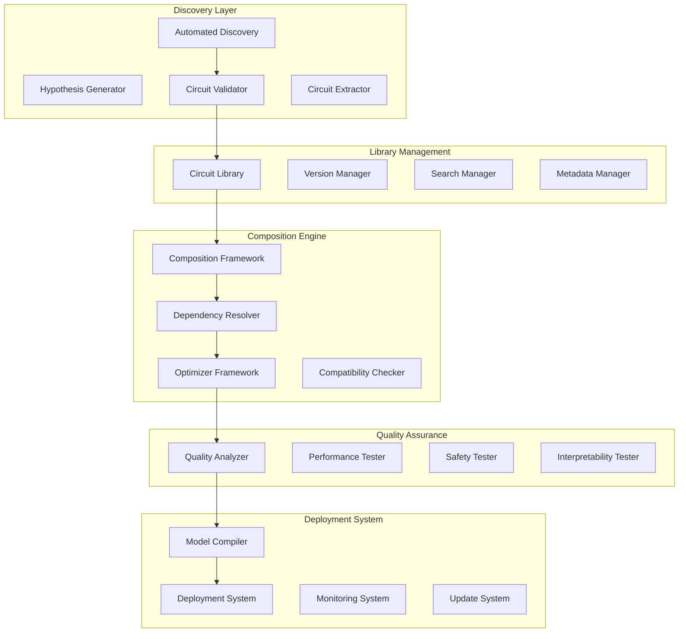

# Design Document

## Overview

The composable circuit ecosystem provides a comprehensive framework for building, discovering, composing, and validating circuits as reusable components. This system enables the creation of specialized AI systems through systematic circuit composition, automated discovery, and rigorous quality assurance.

## Architecture



## Components and Interfaces

### 1. Circuit Library Management System

**Purpose**: Comprehensive storage, organization, and retrieval of discovered and validated circuits with rich metadata.

**Key Classes**:
```python
class CircuitLibrary:
    def __init__(self, storage_backend: StorageBackend, indexing_system: IndexingSystem)
    def store_circuit(self, circuit: Circuit, metadata: CircuitMetadata) -> str
    def search_circuits(self, query: SearchQuery) -> List[CircuitSearchResult]
    def get_circuit(self, circuit_id: str, version: Optional[str] = None) -> Circuit
    def update_circuit(self, circuit_id: str, updates: CircuitUpdate) -> bool
    def delete_circuit(self, circuit_id: str, version: Optional[str] = None) -> bool

class CircuitMetadata:
    def __init__(self, name: str, category: str, functionality: str, validation_results: ValidationResults)
    def add_performance_metrics(self, metrics: Dict[str, float])
    def add_compatibility_info(self, compatible_architectures: List[str])
    def add_dependency_info(self, dependencies: List[str])
    def update_validation_status(self, new_results: ValidationResults)

class CircuitSearchEngine:
    def semantic_search(self, query: str, limit: int = 10) -> List[CircuitSearchResult]
    def filter_by_category(self, category: str) -> List[Circuit]
    def filter_by_performance(self, min_performance: float, metric: str) -> List[Circuit]
    def find_compatible_circuits(self, target_architecture: str) -> List[Circuit]
```

**Interfaces**:
- `StorageBackend`: Pluggable storage system (filesystem, database, cloud)
- `IndexingSystem`: Efficient search and retrieval indexing
- `VersionControl`: Circuit versioning and change tracking

### 2. Automated Circuit Discovery Engine

**Purpose**: Systematically discover new circuits in models through hypothesis generation, testing, and validation.

**Key Classes**:
```python
class AutomatedCircuitDiscovery:
    def __init__(self, model: ModelKit, search_strategy: SearchStrategy)
    def generate_hypotheses(self, target_capability: str) -> List[CircuitHypothesis]
    def test_hypothesis(self, hypothesis: CircuitHypothesis) -> HypothesisTestResult
    def extract_validated_circuit(self, validated_hypothesis: CircuitHypothesis) -> Circuit
    def run_discovery_pipeline(self, capability: str, max_circuits: int = 10) -> List[Circuit]

class CircuitHypothesis:
    def __init__(self, capability: str, layers: List[int], components: List[str], confidence: float)
    def generate_test_cases(self, num_cases: int = 100) -> List[TestCase]
    def compute_expected_behavior(self, test_case: TestCase) -> ExpectedBehavior
    def validate_against_examples(self, examples: List[str]) -> ValidationScore

class SearchStrategy:
    def __init__(self, strategy_type: str, parameters: Dict[str, Any])
    def exhaustive_search(self, model: ModelKit, capability: str) -> Iterator[CircuitHypothesis]
    def guided_search(self, model: ModelKit, capability: str, prior_knowledge: List[Circuit]) -> Iterator[CircuitHypothesis]
    def evolutionary_search(self, model: ModelKit, capability: str, population_size: int) -> Iterator[CircuitHypothesis]
```

**Interfaces**:
- `HypothesisGenerator`: Creates testable hypotheses about circuit locations
- `TestCaseGenerator`: Generates comprehensive test cases for validation
- `ValidationEngine`: Validates circuit hypotheses against test cases

### 3. Circuit Composition Framework

**Purpose**: Combine multiple circuits into sophisticated, specialized AI systems with optimized performance.

**Key Classes**:
```python
class CircuitComposer:
    def __init__(self, target_architecture: ModelArchitecture)
    def add_circuit(self, circuit: Circuit, priority: int, constraints: List[str]) -> bool
    def resolve_dependencies(self) -> DependencyResolution
    def optimize_composition(self, optimization_goals: List[str]) -> OptimizationResult
    def validate_compatibility(self) -> CompatibilityReport
    def compile_composed_model(self) -> ComposedModel

class DependencyResolver:
    def analyze_circuit_dependencies(self, circuits: List[Circuit]) -> DependencyGraph
    def detect_circular_dependencies(self, dependency_graph: DependencyGraph) -> List[CircularDependency]
    def resolve_dependency_conflicts(self, conflicts: List[DependencyConflict]) -> ResolutionPlan
    def order_circuits_by_dependencies(self, circuits: List[Circuit]) -> List[Circuit]

class CompositionOptimizer:
    def optimize_data_flow(self, circuits: List[Circuit]) -> DataFlowOptimization
    def minimize_computational_overhead(self, composition: CircuitComposition) -> OptimizedComposition
    def balance_accuracy_efficiency(self, composition: CircuitComposition, trade_off: float) -> BalancedComposition
    def optimize_memory_usage(self, composition: CircuitComposition) -> MemoryOptimizedComposition
```

**Interfaces**:
- `CompatibilityChecker`: Ensures circuits can work together
- `OptimizationEngine`: Optimizes composed systems for various goals
- `ModelCompiler`: Generates executable models from circuit compositions

### 4. Quality Assurance System

**Purpose**: Comprehensive testing and validation to ensure circuit reliability, safety, and interpretability.

**Key Classes**:
```python
class CircuitQualityAssurance:
    def __init__(self, circuit: Circuit, test_suites: Dict[str, TestSuite])
    def test_functionality(self) -> FunctionalityTestResult
    def benchmark_performance(self) -> PerformanceTestResult
    def validate_interpretability(self) -> InterpretabilityTestResult
    def test_safety(self) -> SafetyTestResult
    def generate_quality_report(self) -> QualityReport

class FunctionalityTester:
    def test_core_capability(self, circuit: Circuit, test_cases: List[TestCase]) -> FunctionalityScore
    def test_edge_cases(self, circuit: Circuit, edge_cases: List[EdgeCase]) -> EdgeCaseResults
    def test_robustness(self, circuit: Circuit, perturbations: List[Perturbation]) -> RobustnessScore
    def validate_expected_behavior(self, circuit: Circuit, behavioral_specs: List[BehaviorSpec]) -> ValidationResult

class PerformanceBenchmarker:
    def measure_accuracy(self, circuit: Circuit, benchmark_dataset: Dataset) -> AccuracyMetrics
    def measure_efficiency(self, circuit: Circuit, computational_budget: ComputationalBudget) -> EfficiencyMetrics
    def measure_scalability(self, circuit: Circuit, scale_factors: List[float]) -> ScalabilityMetrics
    def compare_against_baselines(self, circuit: Circuit, baselines: List[Baseline]) -> ComparisonResults

class SafetyTester:
    def test_harmful_outputs(self, circuit: Circuit, harmful_prompts: List[str]) -> HarmfulnessScore
    def test_bias_detection(self, circuit: Circuit, bias_test_suite: BiasTestSuite) -> BiasResults
    def test_adversarial_robustness(self, circuit: Circuit, adversarial_examples: List[str]) -> RobustnessResults
    def validate_safety_constraints(self, circuit: Circuit, safety_constraints: List[SafetyConstraint]) -> SafetyValidation
```

**Interfaces**:
- `TestSuiteManager`: Manages different types of test suites
- `BenchmarkRunner`: Executes performance benchmarks
- `SafetyValidator`: Validates safety properties of circuits

## Data Models

### Core Circuit Models

```python
@dataclass
class Circuit:
    id: str
    name: str
    version: str
    category: str
    functionality: str
    layers: List[int]
    components: List[CircuitComponent]
    dependencies: List[str]
    metadata: CircuitMetadata
    validation_status: ValidationStatus

@dataclass
class CircuitComponent:
    type: str  # "attention", "mlp", "residual", etc.
    layer: int
    parameters: Dict[str, Any]
    connections: List[Connection]
    importance_score: float

@dataclass
class CircuitComposition:
    name: str
    circuits: List[Circuit]
    dependency_graph: DependencyGraph
    optimization_config: OptimizationConfig
    performance_targets: Dict[str, float]
    constraints: List[Constraint]
```

### Quality Assurance Models

```python
@dataclass
class QualityReport:
    circuit_id: str
    timestamp: datetime
    functionality_score: float
    performance_metrics: Dict[str, float]
    interpretability_score: float
    safety_score: float
    overall_score: float
    recommendations: List[str]
    certification_level: str

@dataclass
class ValidationResults:
    test_type: str
    passed: bool
    score: float
    details: Dict[str, Any]
    failure_modes: List[str]
    recommendations: List[str]

@dataclass
class PerformanceMetrics:
    accuracy: float
    efficiency: float
    scalability: float
    memory_usage: float
    computational_cost: float
    latency: float
```

### Discovery and Search Models

```python
@dataclass
class CircuitHypothesis:
    capability: str
    layers: List[int]
    components: List[str]
    confidence: float
    test_cases: List[TestCase]
    expected_behavior: List[ExpectedBehavior]

@dataclass
class SearchQuery:
    semantic_query: Optional[str]
    category_filter: Optional[str]
    performance_threshold: Optional[float]
    compatibility_requirements: Optional[List[str]]
    sort_by: str = "relevance"

@dataclass
class CircuitSearchResult:
    circuit: Circuit
    relevance_score: float
    match_reasons: List[str]
    compatibility_score: float
```

## Error Handling

### Exception Hierarchy

```python
class CircuitEcosystemError(Exception):
    """Base exception for circuit ecosystem operations"""

class CircuitDiscoveryError(CircuitEcosystemError):
    """Raised when automated discovery fails"""

class CompositionError(CircuitEcosystemError):
    """Raised when circuit composition fails"""

class QualityAssuranceError(CircuitEcosystemError):
    """Raised when quality assurance testing fails"""

class LibraryError(CircuitEcosystemError):
    """Raised when library operations fail"""

class ValidationError(CircuitEcosystemError):
    """Raised when circuit validation fails"""
```

### Recovery Strategies

1. **Discovery Failures**: Adjust search parameters, try alternative strategies
2. **Composition Conflicts**: Provide alternative compositions, suggest modifications
3. **Quality Failures**: Provide improvement recommendations, suggest alternatives
4. **Library Errors**: Implement redundancy, provide backup storage
5. **Validation Errors**: Provide detailed diagnostics, suggest fixes

## Testing Strategy

### Discovery Testing

1. **Hypothesis Generation**: Test generation of diverse, valid hypotheses
2. **Validation Accuracy**: Ensure validation correctly identifies functional circuits
3. **Search Efficiency**: Test discovery completes within reasonable time bounds
4. **Result Quality**: Validate discovered circuits meet quality standards

### Composition Testing

1. **Dependency Resolution**: Test correct handling of complex dependencies
2. **Optimization Effectiveness**: Validate optimization improves target metrics
3. **Compatibility Checking**: Ensure compatibility checks prevent invalid compositions
4. **Compilation Success**: Test composed models compile and execute correctly

### Quality Assurance Testing

1. **Test Coverage**: Ensure QA tests cover all relevant aspects
2. **Accuracy of Assessment**: Validate QA scores correlate with actual performance
3. **Safety Detection**: Test safety testing catches potential harms
4. **Interpretability Validation**: Ensure interpretability tests are meaningful

### Library Testing

1. **Storage Reliability**: Test circuit storage and retrieval under various conditions
2. **Search Accuracy**: Validate search returns relevant results
3. **Version Management**: Test versioning handles updates correctly
4. **Metadata Integrity**: Ensure metadata remains consistent and accurate