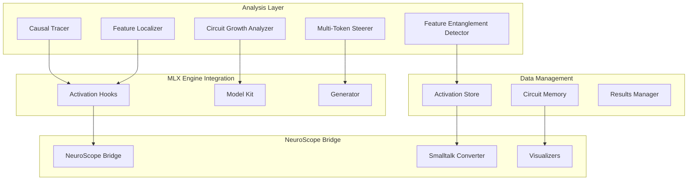

# Design Document

## Overview

The core mechanistic interpretability system provides foundational capabilities for understanding transformer model internals through systematic analysis of circuits, features, and activation patterns. The design leverages the existing MLX Engine activation hook infrastructure and extends it with specialized analysis tools for causal tracing, feature localization, steering, and cross-domain analysis.

## Architecture



## Components and Interfaces

### 1. Causal Tracer

**Purpose**: Verify circuit universality across model scales through activation patching and intervention analysis.

**Key Classes**:
```python
class CausalTracer:
    def __init__(self, model: ModelKit, reference_circuits: Dict[str, Circuit])
    def find_analogous_circuits(self, target_phenomenon: str) -> List[CircuitCandidate]
    def patch_activations(self, source_run: ActivationSet, target_run: ActivationSet) -> PatchResults
    def measure_performance_recovery(self, patched_activations: ActivationSet) -> float
    def attribute_components(self, circuit: Circuit) -> ComponentAttributions

class Circuit:
    def __init__(self, name: str, layers: List[int], components: List[str])
    def extract_from_model(self, model: ModelKit) -> ActivationPattern
    def validate_against_examples(self, examples: List[str]) -> ValidationResults

class ActivationPatcher:
    def create_intervention(self, layer: int, component: str, modification: Callable)
    def apply_patch(self, activations: torch.Tensor, patch_data: torch.Tensor) -> torch.Tensor
    def measure_causal_effect(self, original: GenerationResult, patched: GenerationResult) -> float
```

**Interfaces**:
- `CircuitFinder`: Identifies potential circuits using attention patterns and activation correlations
- `InterventionEngine`: Applies systematic interventions to test causal relationships
- `ValidationFramework`: Validates discovered circuits against known benchmarks

### 2. Feature Localizer

**Purpose**: Map neurons and subspaces to high-level semantic features with ablation testing.

**Key Classes**:
```python
class FeatureLocalizer:
    def __init__(self, model: ModelKit, feature_datasets: Dict[str, Dataset])
    def identify_feature_neurons(self, feature_type: str) -> List[NeuronLocation]
    def apply_pca_analysis(self, activations: torch.Tensor) -> PCAResults
    def run_probing_classifier(self, features: str, layers: List[int]) -> ProbingResults
    def perform_ablation_study(self, neurons: List[NeuronLocation]) -> AblationResults

class NeuronAnalyzer:
    def analyze_activation_patterns(self, neuron: NeuronLocation, examples: List[str]) -> ActivationPattern
    def compute_feature_selectivity(self, neuron: NeuronLocation) -> SelectivityScore
    def generate_semantic_labels(self, activation_pattern: ActivationPattern) -> List[str]

class AblationEngine:
    def zero_neurons(self, neurons: List[NeuronLocation]) -> AblationConfig
    def randomize_neurons(self, neurons: List[NeuronLocation]) -> AblationConfig
    def measure_degradation(self, original_performance: float, ablated_performance: float) -> float
```

**Interfaces**:
- `FeatureExtractor`: Extracts feature representations from model activations
- `ClassifierTrainer`: Trains probing classifiers for feature detection
- `AblationTester`: Systematically tests neuron importance through ablation

### 3. Multi-Token Steerer

**Purpose**: Compare and implement single-token vs. distributed steering strategies.

**Key Classes**:
```python
class MultiTokenSteerer:
    def __init__(self, model: ModelKit, steering_vectors: Dict[str, torch.Tensor])
    def apply_single_token_steering(self, position: int, vector: torch.Tensor) -> SteeringConfig
    def apply_distributed_steering(self, positions: List[int], vectors: List[torch.Tensor]) -> SteeringConfig
    def compare_steering_effectiveness(self, single: SteeringResult, distributed: SteeringResult) -> ComparisonResults
    def optimize_steering_positions(self, target_behavior: str) -> List[int]

class SteeringVectorManager:
    def load_steering_vectors(self, category: str) -> Dict[str, torch.Tensor]
    def create_custom_vector(self, positive_examples: List[str], negative_examples: List[str]) -> torch.Tensor
    def validate_vector_effectiveness(self, vector: torch.Tensor, test_cases: List[str]) -> float

class SemanticDensityAnalyzer:
    def analyze_token_positions(self, text: str, model: ModelKit) -> List[float]
    def identify_optimal_positions(self, semantic_scores: List[float], num_positions: int) -> List[int]
    def measure_steering_impact(self, original: str, steered: str) -> float
```

**Interfaces**:
- `SteeringController`: Manages real-time steering during generation
- `EffectivenessMetrics`: Measures steering success across different strategies
- `PositionOptimizer`: Finds optimal token positions for steering application

### 4. Circuit Growth Analyzer

**Purpose**: Analyze how computational circuits evolve with model scale.

**Key Classes**:
```python
class CircuitGrowthAnalyzer:
    def __init__(self, models: Dict[str, ModelKit])  # Different sizes of same architecture
    def analyze_circuit_complexity(self, task: str, model_size: str) -> CircuitComplexity
    def compare_across_scales(self, task: str) -> ScaleComparisonResults
    def identify_reuse_patterns(self, circuits: List[Circuit]) -> ReuseAnalysis
    def measure_specialization_trends(self, circuits: List[Circuit]) -> SpecializationMetrics

class CircuitComplexityMeasurer:
    def count_required_components(self, circuit: Circuit) -> ComponentCount
    def measure_interaction_density(self, circuit: Circuit) -> float
    def calculate_efficiency_metrics(self, circuit: Circuit, task_performance: float) -> EfficiencyScore

class ScalePatternDetector:
    def detect_growth_patterns(self, complexity_by_scale: Dict[str, CircuitComplexity]) -> GrowthPattern
    def identify_scaling_laws(self, data_points: List[Tuple[int, float]]) -> ScalingLaw
    def predict_circuit_evolution(self, current_patterns: List[GrowthPattern]) -> Prediction
```

**Interfaces**:
- `ModelScaleManager`: Handles multiple model sizes and ensures consistent analysis
- `ComplexityMetrics`: Standardized metrics for circuit complexity measurement
- `PatternVisualizer`: Creates visualizations of circuit growth patterns

### 5. Feature Entanglement Detector

**Purpose**: Detect cross-domain feature sharing and multi-task neuron behavior.

**Key Classes**:
```python
class FeatureEntanglementDetector:
    def __init__(self, model: ModelKit, domains: List[str])
    def perform_similarity_search(self, domains: List[str]) -> SimilarityMatrix
    def identify_entangled_neurons(self, similarity_threshold: float) -> List[EntangledNeuron]
    def validate_semantic_relationships(self, entangled_features: List[EntangledNeuron]) -> ValidationResults
    def analyze_multi_task_roles(self, neuron: NeuronLocation) -> MultiTaskAnalysis

class CrossDomainAnalyzer:
    def extract_domain_activations(self, domain: str, examples: List[str]) -> DomainActivations
    def compute_cross_domain_correlations(self, domain1: DomainActivations, domain2: DomainActivations) -> float
    def identify_shared_representations(self, domains: List[DomainActivations]) -> SharedRepresentations

class EntanglementVisualizer:
    def create_entanglement_graph(self, entangled_neurons: List[EntangledNeuron]) -> Graph
    def generate_semantic_maps(self, cross_domain_features: List[Feature]) -> SemanticMap
    def visualize_multi_task_behavior(self, neuron: NeuronLocation, tasks: List[str]) -> Visualization
```

**Interfaces**:
- `DomainManager`: Manages different semantic domains and their datasets
- `SimilarityCalculator`: Computes various similarity metrics between activations
- `EntanglementMetrics`: Quantifies the degree and type of feature entanglement

## Data Models

### Core Data Structures

```python
@dataclass
class CircuitCandidate:
    name: str
    confidence_score: float
    layers: List[int]
    components: List[str]
    validation_metrics: Dict[str, float]
    analogous_to: Optional[str] = None

@dataclass
class ActivationPattern:
    neuron_locations: List[NeuronLocation]
    activation_values: torch.Tensor
    semantic_labels: List[str]
    selectivity_scores: List[float]
    examples: List[str]

@dataclass
class SteeringResult:
    strategy: str  # "single_token" or "distributed"
    effectiveness_score: float
    text_quality_score: float
    target_behavior_achieved: bool
    side_effects: List[str]

@dataclass
class CircuitComplexity:
    num_heads: int
    num_mlp_layers: int
    interaction_density: float
    efficiency_score: float
    task_performance: float

@dataclass
class EntangledNeuron:
    location: NeuronLocation
    domains: List[str]
    correlation_scores: Dict[str, float]
    semantic_roles: List[str]
    multi_task_evidence: Dict[str, float]
```

### Storage Schema

```python
class ExperimentResults:
    """Unified storage for all experiment results"""
    experiment_type: str
    timestamp: datetime
    model_info: ModelInfo
    parameters: Dict[str, Any]
    results: Dict[str, Any]
    metadata: Dict[str, Any]

class CircuitDatabase:
    """Persistent storage for discovered circuits"""
    def store_circuit(self, circuit: Circuit, validation_results: ValidationResults)
    def query_circuits(self, criteria: Dict[str, Any]) -> List[Circuit]
    def update_circuit_validation(self, circuit_id: str, new_results: ValidationResults)
```

## Error Handling

### Exception Hierarchy

```python
class InterpretabilityError(Exception):
    """Base exception for interpretability experiments"""

class CircuitNotFoundError(InterpretabilityError):
    """Raised when expected circuits cannot be identified"""

class AblationFailureError(InterpretabilityError):
    """Raised when ablation experiments produce invalid results"""

class SteeringIneffectiveError(InterpretabilityError):
    """Raised when steering vectors fail to produce expected behavior"""

class ScaleAnalysisError(InterpretabilityError):
    """Raised when cross-scale analysis encounters incompatible models"""

class EntanglementDetectionError(InterpretabilityError):
    """Raised when entanglement analysis fails to find meaningful patterns"""
```

### Error Recovery Strategies

1. **Circuit Discovery Failures**: Fall back to broader search criteria or alternative detection methods
2. **Ablation Inconsistencies**: Retry with different ablation strategies or validate with additional examples
3. **Steering Ineffectiveness**: Try alternative steering vectors or adjust application strategies
4. **Scale Comparison Issues**: Use normalized metrics or focus on relative rather than absolute comparisons
5. **Entanglement Detection Failures**: Adjust similarity thresholds or try different correlation metrics

## Testing Strategy

### Unit Testing

1. **Component Testing**: Test each analyzer class independently with mock data
2. **Integration Testing**: Test interactions between analyzers and MLX Engine
3. **Data Validation**: Ensure all data structures maintain consistency and validity
4. **Error Handling**: Test all error conditions and recovery mechanisms

### Validation Testing

1. **Known Circuit Validation**: Test against well-established circuits from literature
2. **Cross-Model Validation**: Verify results are consistent across different model architectures
3. **Ablation Validation**: Ensure ablation results are reproducible and meaningful
4. **Steering Validation**: Verify steering effects are consistent and controllable

### Performance Testing

1. **Scalability Testing**: Ensure system works with large models and datasets
2. **Memory Usage**: Monitor memory consumption during large-scale analyses
3. **Computation Time**: Benchmark analysis speed for different experiment types
4. **Resource Optimization**: Test efficiency of activation capture and processing

### Integration Testing

1. **NeuroScope Integration**: Validate complete workflow from MLX Engine to NeuroScope
2. **API Compatibility**: Ensure REST API integration works correctly
3. **Data Format Validation**: Test conversion between different data formats
4. **End-to-End Workflows**: Test complete experimental pipelines from start to finish