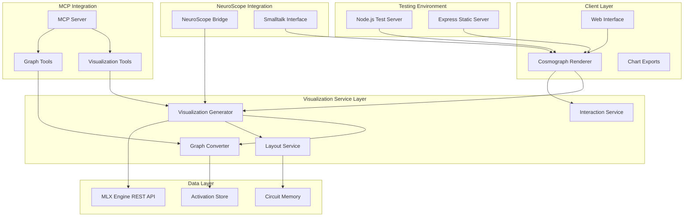
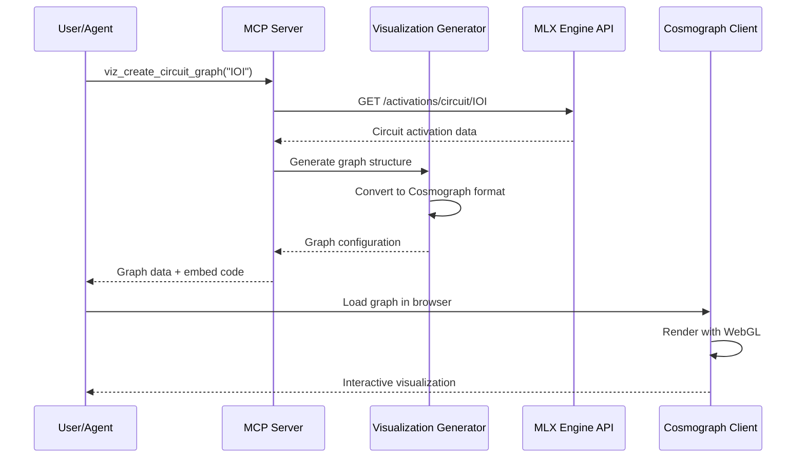

# Design Document

## Overview

The Cosmograph Visualization Integration extends the MLX Engine with NeuroScope Integration project by adding high-performance, interactive graph visualizations using the Cosmograph JavaScript library. This integration provides intuitive visual representations of neural network circuits, attention patterns, activation flows, and model architecture graphs, enhancing the mechanistic interpretability capabilities with powerful visual analysis tools.

The design leverages Cosmograph's WebGL-based rendering engine to handle large-scale graphs with thousands of nodes while maintaining smooth interaction performance. The integration follows the existing architecture patterns, extending both the **MLX Engine REST API Server** with visualization endpoints and the **Mechanistic Interpretability MCP Server** with graph generation tools.

**Architecture Integration**: The Cosmograph visualization system operates as a **client-side component** that receives graph data from both the MLX Engine REST API and the MCP Server. This three-tier architecture enables:
- **MLX Engine**: Provides activation data and model information
- **MCP Server**: Processes data into graph structures and provides visualization tools
- **Cosmograph Client**: Renders interactive visualizations in web browsers

The system supports both **embedded visualizations** in the NeuroScope web interface and **standalone graph applications** for dedicated analysis workflows.

**Testing Environment**: For development and testing, a **Node.js Express server** provides a simple way to serve Cosmograph assets and test the visualization components without the complexity of the full MCP integration.

## Architecture

### High-Level Architecture



### Integration Points

The Cosmograph visualization system integrates with existing components through well-defined interfaces:

1. **MLX Engine REST API**: New visualization endpoints for graph data
2. **MCP Server**: New visualization tools for graph generation
3. **NeuroScope Bridge**: Graph data conversion to Smalltalk format
4. **Web Interface**: Embedded Cosmograph components

**Testing Integration**: A Node.js Express server provides a development environment for testing Cosmograph integration without requiring the full MCP server setup.

### Cosmograph Integration Architecture



## Components and Interfaces

### 1. Cosmograph Renderer (Client-Side)

**Purpose**: High-performance WebGL-based graph rendering using the Cosmograph library.

**Key Classes**:
```javascript
class CosmographRenderer {
  constructor(container, config) {
    this.cosmos = null;
    this.container = container;
    this.config = config;
  }
  
  async loadGraph(graphData) {
    // Implementation
  }
  
  updateNodeData(nodeUpdates) {
    // Implementation
  }
  
  updateLinkData(linkUpdates) {
    // Implementation
  }
  
  async exportImage(format) {
    // Returns Promise<Blob>
  }
  
  exportData() {
    // Returns GraphExportData
  }
}

// NodeData structure:
// {
//   id: string,
//   label: string,
//   type: 'neuron' | 'attention_head' | 'layer' | 'circuit',
//   value: number,           // Size/importance
//   color: string,
//   metadata: object
// }

// LinkData structure:
// {
//   source: string,
//   target: string,
//   weight: number,          // Connection strength
//   type: 'activation' | 'attention' | 'circuit',
//   color: string,
//   metadata: object
// }

class InteractionController {
  constructor(renderer) {
    this.renderer = renderer;
  }
  
  onNodeClick(callback) {
    // callback: (node) => void
  }
  
  onNodeHover(callback) {
    // callback: (node | null) => void
  }
  
  onLinkClick(callback) {
    // callback: (link) => void
  }
  
  highlightNodes(nodeIds) {
    // nodeIds: string[]
  }
  
  filterGraph(predicate) {
    // predicate: (node, link) => boolean
  }
}
```

**Cosmograph Configuration**:
```javascript
// CosmographConfig structure:
// {
//   // Performance settings
//   nodeSize: number | function(node) { return number; },
//   linkWidth: number | function(link) { return number; },
//   linkArrows: boolean,
//   
//   // Visual settings
//   backgroundColor: string,
//   nodeColor: string | function(node) { return string; },
//   linkColor: string | function(link) { return string; },
//   
//   // Layout settings
//   simulation: {
//     repulsion: number,
//     linkSpring: number,
//     linkDistance: number,
//     gravity: number
//   },
//   
//   // Interaction settings
//   disableSimulation: boolean,
//   showLabels: boolean,
//   enableZoom: boolean,
//   enablePan: boolean
// }
```

### 2. Visualization Generator (Server-Side)

**Purpose**: Converts MLX Engine activation data and circuit information into Cosmograph-compatible graph structures.

**Key Classes**:
```javascript
class VisualizationGenerator {
  constructor(mlxClient) {
    this.mlxClient = mlxClient;
  }
  
  async generateCircuitGraph(circuitId) {
    // Returns Promise<GraphData>
  }
  
  async generateAttentionGraph(layerRange) {
    // layerRange: [number, number]
    // Returns Promise<GraphData>
  }
  
  async generateActivationFlowGraph(tokens) {
    // tokens: string[]
    // Returns Promise<GraphData>
  }
  
  async generateModelArchitectureGraph(modelId) {
    // Returns Promise<GraphData>
  }
  
  async generateComparisonGraph(graphIds) {
    // graphIds: string[]
    // Returns Promise<GraphData>
  }
}

class GraphConverter {
  convertCircuitToGraph(circuit, activations) {
    // Returns GraphData
  }
  
  convertAttentionToGraph(attentionData) {
    // attentionData: AttentionPattern[]
    // Returns GraphData
  }
  
  convertActivationsToGraph(activations) {
    // Returns GraphData
  }
  
  convertModelToGraph(modelInfo) {
    // Returns GraphData
  }
}

// GraphData structure:
// {
//   nodes: NodeData[],
//   links: LinkData[],
//   metadata: {
//     title: string,
//     description: string,
//     type: GraphType,
//     created_at: Date,
//     model_info: ModelInfo
//   },
//   layout: {
//     algorithm: 'force' | 'hierarchical' | 'circular',
//     parameters: object
//   },
//   styling: {
//     theme: 'light' | 'dark' | 'custom',
//     colorScheme: string[],
//     nodeScale: [number, number],
//     linkScale: [number, number]
//   }
// }

// GraphType: 'circuit' | 'attention' | 'activation_flow' | 'model_architecture' | 'comparison'
```

### 3. Layout Service

**Purpose**: Provides intelligent graph layout algorithms optimized for different visualization types.

**Key Classes**:
```javascript
class LayoutService {
  calculateCircuitLayout(nodes, links) {
    // nodes: NodeData[], links: LinkData[]
    // Returns LayoutResult
  }
  
  calculateAttentionLayout(nodes, links) {
    // Returns LayoutResult
  }
  
  calculateHierarchicalLayout(nodes, links) {
    // Returns LayoutResult
  }
  
  calculateComparisonLayout(graphs) {
    // graphs: GraphData[]
    // Returns LayoutResult
  }
}

// LayoutResult structure:
// {
//   nodePositions: object, // Record<string, { x: number, y: number }>
//   bounds: { minX: number, maxX: number, minY: number, maxY: number },
//   algorithm: string,
//   parameters: object
// }

class LayoutOptimizer {
  optimizeForPerformance(graphData) {
    // Returns GraphData
  }
  
  optimizeForClarity(graphData) {
    // Returns GraphData
  }
  
  optimizeForComparison(graphs) {
    // graphs: GraphData[]
    // Returns GraphData[]
  }
}
```

### 4. MCP Visualization Tools

**Purpose**: Provides MCP tools for generating and managing Cosmograph visualizations.

**MCP Tools**:
```javascript
// Core visualization tools
const vizTools = [
  'viz_create_circuit_graph',      // Generate circuit visualization
  'viz_create_attention_graph',    // Generate attention pattern visualization
  'viz_create_flow_graph',         // Generate activation flow visualization
  'viz_create_architecture_graph', // Generate model architecture visualization
  'viz_create_comparison_graph',   // Generate side-by-side comparison
  'viz_export_graph',              // Export graph in various formats
  'viz_update_graph',              // Update existing graph data
  'viz_apply_layout',              // Apply specific layout algorithm
  'viz_customize_styling',         // Apply custom styling
  'viz_embed_graph'                // Generate embeddable graph code
];

// VizCreateCircuitGraphParams structure:
// {
//   circuit_id: string,
//   model_id: string,
//   layout?: 'force' | 'hierarchical' | 'circular',
//   theme?: 'light' | 'dark' | 'custom',
//   show_weights?: boolean,
//   filter_threshold?: number
// }

// VizCreateCircuitGraphResult structure:
// {
//   success: boolean,
//   graph_id: string,
//   graph_data: GraphData,
//   embed_code: string,
//   preview_url: string,
//   export_options: string[]
// }
```

### 5. Web Interface Integration

**Purpose**: Embeds Cosmograph visualizations into the existing NeuroScope web interface.

**Key Components**:
```javascript
class VisualizationPanel {
  constructor(container) {
    this.container = container;
    this.renderer = null;
    this.toolbar = null;
  }
  
  async loadVisualization(graphData) {
    // Returns Promise<void>
  }
  
  updateVisualization(updates) {
    // updates: GraphUpdate
  }
  
  async exportVisualization(format) {
    // format: ExportFormat
    // Returns Promise<Blob>
  }
}

class VisualizationToolbar {
  constructor() {
    this.controls = [];
  }
  
  addLayoutControl() {
    // Implementation
  }
  
  addFilterControl() {
    // Implementation
  }
  
  addExportControl() {
    // Implementation
  }
  
  addComparisonControl() {
    // Implementation
  }
  
  onControlChange(callback) {
    // callback: (control: string, value: any) => void
  }
}

class VisualizationEmbedder {
  generateEmbedCode(graphId, options) {
    // options: EmbedOptions
    // Returns string
  }
  
  createStandaloneViewer(graphData) {
    // Returns string
  }
  
  generateShareableLink(graphId) {
    // Returns string
  }
}
```

### 6. Export and Sharing System

**Purpose**: Enables export of visualizations in multiple formats and sharing capabilities.

**Key Classes**:
```javascript
class ExportManager {
  async exportPNG(graphId, options) {
    // options: ImageExportOptions
    // Returns Promise<Blob>
  }
  
  async exportSVG(graphId, options) {
    // options: VectorExportOptions
    // Returns Promise<Blob>
  }
  
  async exportJSON(graphId) {
    // Returns Promise<GraphExportData>
  }
  
  async exportInteractive(graphId) {
    // Returns Promise<string> - HTML with embedded Cosmograph
  }
}

// ImageExportOptions structure:
// {
//   width: number,
//   height: number,
//   scale: number,
//   backgroundColor: string,
//   includeLabels: boolean
// }

// VectorExportOptions structure (extends ImageExportOptions):
// {
//   width: number,
//   height: number,
//   scale: number,
//   backgroundColor: string,
//   includeLabels: boolean,
//   embedFonts: boolean,
//   preserveInteractivity: boolean
// }

// GraphExportData structure:
// {
//   graph_data: GraphData,
//   cosmograph_config: CosmographConfig,
//   export_metadata: {
//     exported_at: Date,
//     version: string,
//     source: string
//   }
// }
```

## Data Models

### Graph Data Structures

```javascript
// GraphData structure:
// {
//   id: string,
//   nodes: NodeData[],
//   links: LinkData[],
//   metadata: GraphMetadata,
//   layout: LayoutConfiguration,
//   styling: StylingConfiguration
// }

// NodeData structure:
// {
//   id: string,
//   label: string,
//   type: NodeType,
//   value: number,
//   color: string,
//   position?: { x: number, y: number },
//   metadata: {
//     layer?: number,
//     component?: string,
//     activation_strength?: number,
//     semantic_role?: string,
//     // Additional properties as needed
//   }
// }

// LinkData structure:
// {
//   id: string,
//   source: string,
//   target: string,
//   weight: number,
//   type: LinkType,
//   color: string,
//   metadata: {
//     connection_type?: string,
//     attention_weight?: number,
//     causal_strength?: number,
//     // Additional properties as needed
//   }
// }

// NodeType: 'neuron' | 'attention_head' | 'layer' | 'circuit' | 'token' | 'feature'
// LinkType: 'activation' | 'attention' | 'circuit' | 'causal' | 'similarity'

// GraphMetadata structure:
// {
//   title: string,
//   description: string,
//   type: GraphType,
//   created_at: Date,
//   model_info: {
//     model_id: string,
//     architecture: string,
//     num_layers: number
//   },
//   analysis_info: {
//     circuit_id?: string,
//     layer_range?: [number, number],
//     tokens?: string[],
//     phenomenon?: string
//   }
// }
```

### Cosmograph Integration Models

```javascript
// CosmographConfig structure:
// {
//   // Core settings
//   nodeSize: number | function(node) { return number; },
//   linkWidth: number | function(link) { return number; },
//   linkArrows: boolean,
//   
//   // Visual appearance
//   backgroundColor: string,
//   nodeColor: string | function(node) { return string; },
//   linkColor: string | function(link) { return string; },
//   
//   // Simulation physics
//   simulation: {
//     repulsion: number,
//     linkSpring: number,
//     linkDistance: number,
//     gravity: number,
//     friction: number
//   },
//   
//   // Interaction settings
//   disableSimulation: boolean,
//   showLabels: boolean,
//   enableZoom: boolean,
//   enablePan: boolean,
//   fitViewOnInit: boolean,
//   
//   // Performance settings
//   renderLinks: boolean,
//   useQuadtree: boolean,
//   pixelRatio: number
// }

// VisualizationState structure:
// {
//   graph_id: string,
//   zoom_level: number,
//   pan_position: { x: number, y: number },
//   selected_nodes: string[],
//   highlighted_nodes: string[],
//   active_filters: FilterConfiguration[],
//   layout_state: LayoutState
// }
```

### MLX Engine Integration Models

```javascript
// VisualizationRequest structure:
// {
//   type: GraphType,
//   model_id: string,
//   parameters: {
//     circuit_id?: string,
//     layer_range?: [number, number],
//     tokens?: string[],
//     phenomenon?: string,
//     comparison_targets?: string[]
//   },
//   options: {
//     layout: string,
//     theme: string,
//     filters: FilterConfiguration[],
//     styling: StylingOverrides
//   }
// }

// VisualizationResponse structure:
// {
//   success: boolean,
//   graph_id: string,
//   graph_data: GraphData,
//   cosmograph_config: CosmographConfig,
//   embed_code: string,
//   preview_url: string,
//   export_formats: string[],
//   error?: string
// }
```

## Error Handling

### Visualization-Specific Errors

```javascript
class VisualizationError extends Error {
  constructor(message, code, graphId) {
    super(message);
    this.name = 'VisualizationError';
    this.code = code;
    this.graphId = graphId;
  }
}

class GraphRenderingError extends VisualizationError {
  constructor(message, graphId, cause) {
    super(`Graph rendering failed: ${message}`, 'RENDER_ERROR', graphId);
    this.cause = cause;
  }
}

class DataConversionError extends VisualizationError {
  constructor(message, dataType) {
    super(`Data conversion failed for ${dataType}: ${message}`, 'CONVERSION_ERROR');
  }
}

class PerformanceError extends VisualizationError {
  constructor(nodeCount, linkCount) {
    super(
      `Graph too large for optimal performance: ${nodeCount} nodes, ${linkCount} links`,
      'PERFORMANCE_ERROR'
    );
  }
}
```

### Error Recovery Strategies

1. **Rendering Failures**:
   - Fall back to simplified visualization
   - Reduce graph complexity automatically
   - Provide alternative visualization types

2. **Performance Issues**:
   - Implement level-of-detail rendering
   - Apply automatic filtering for large graphs
   - Offer progressive loading

3. **Data Conversion Errors**:
   - Validate data before conversion
   - Provide detailed error messages
   - Suggest data format corrections

4. **Browser Compatibility**:
   - Detect WebGL support
   - Provide fallback renderers
   - Show compatibility warnings

### Graceful Degradation

```javascript
class VisualizationFallback {
  static detectCapabilities() {
    // Returns BrowserCapabilities
  }
  
  static selectRenderer(capabilities) {
    // capabilities: BrowserCapabilities
    // Returns RendererType
  }
  
  static simplifyGraph(graphData, targetComplexity) {
    // Returns GraphData
  }
  
  static provideFallbackVisualization(graphData) {
    // Returns string (SVG fallback)
  }
}

// BrowserCapabilities structure:
// {
//   webgl: boolean,
//   webgl2: boolean,
//   maxTextureSize: number,
//   maxVertexUniforms: number,
//   performanceLevel: 'high' | 'medium' | 'low'
// }
```

## Testing Strategy

### Unit Testing

1. **Graph Conversion Tests**: Validate conversion from MLX data to Cosmograph format
2. **Layout Algorithm Tests**: Test layout algorithms with various graph types
3. **Rendering Tests**: Test Cosmograph integration and rendering
4. **Export Tests**: Validate export functionality across formats

### Integration Testing

1. **MLX Engine Integration**: Test complete data flow from MLX Engine to visualization
2. **MCP Tool Tests**: Validate all visualization MCP tools
3. **Web Interface Integration**: Test embedded visualizations in NeuroScope
4. **Cross-Browser Testing**: Ensure compatibility across browsers

### Performance Testing

1. **Large Graph Testing**: Test with graphs containing 1000+ nodes
2. **Memory Usage Testing**: Monitor memory consumption during rendering
3. **Interaction Performance**: Test zoom, pan, and selection performance
4. **Export Performance**: Benchmark export times for different formats

### Visual Testing

1. **Screenshot Comparison**: Automated visual regression testing
2. **Layout Consistency**: Ensure consistent layouts across runs
3. **Color Accuracy**: Validate color schemes and accessibility
4. **Responsive Design**: Test visualizations at different screen sizes

### User Experience Testing

1. **Interaction Testing**: Test all user interactions (click, hover, zoom)
2. **Accessibility Testing**: Ensure visualizations are accessible
3. **Mobile Testing**: Test touch interactions on mobile devices
4. **Performance Perception**: Test perceived performance and responsiveness

## Testing Environment Details

### Node.js Test Server (Development Only)

For development and testing of Cosmograph integration, a simple Node.js Express server provides module resolution:

**Project Structure**:
```
mcp-server/
├── package.json              # Node.js dependencies for testing
├── server.js                 # Express server for serving test assets
├── cosmograph-test.html      # Test visualization interface
├── node_modules/             # npm dependencies including Cosmograph
│   └── @cosmograph/
│       └── cosmograph/
│           └── dist/
│               └── index.esm.js  # ES module for browser import
└── src/
    └── visualization/        # MCP visualization implementation
```

**Key Dependencies**:
```json
{
  "dependencies": {
    "@cosmograph/cosmograph": "^1.4.0",
    "express": "^4.18.0"
  },
  "type": "module"
}
```

**Server Configuration**:
```javascript
// Serve static files including HTML, CSS, JS
app.use(express.static(__dirname));

// Critical: Serve node_modules for browser access to Cosmograph
app.use('/node_modules', express.static(path.join(__dirname, 'node_modules')));
```

**Browser Module Loading**:
```javascript
// Import Cosmograph from served node_modules
import { Cosmograph } from '/node_modules/@cosmograph/cosmograph/dist/index.esm.js';

// Make available globally for event handlers
window.Cosmograph = Cosmograph;
```

**Benefits for Testing**:
1. **Simplified Module Resolution**: No complex import maps or CDN dependencies
2. **Reliable Local Dependencies**: Uses exact npm-installed version of Cosmograph
3. **Easy Development**: Standard Node.js development workflow for testing
4. **Isolated Testing**: Test Cosmograph integration without full MCP server setup

## Documentation Updates

### Node.js Visualization Server README

A new README must be created for the Node.js visualization server to document the capabilities:

**Sections to Include:**

1. **Getting Started Section**:
```markdown
## Cosmograph Visualization Server

A Node.js web application for visualizing neural network circuits, attention patterns, and activation flows using the Cosmograph WebGL library.

### Quick Start

1. Install dependencies:
```bash
npm install
```

2. Start the server:
```bash
npm start
```

3. Open browser to http://localhost:3000

### Features
- Interactive WebGL-based graph visualization
- Real-time neural circuit exploration
- Attention pattern analysis
- Activation flow visualization
- Export capabilities (PNG, SVG, JSON)
- Responsive web interface
```

2. **Usage Examples Section**:
```markdown
### Usage Examples

#### Basic Visualization Workflow

1. **Initialize Cosmograph**: Click "Initialize Cosmograph" to set up WebGL renderer
2. **Load Sample Graph**: Click "Load Sample Graph" to display neural circuit
3. **Interact**: Click and drag nodes, zoom with mouse wheel
4. **Randomize Layout**: Click "Randomize Layout" to scramble and watch physics

#### Integrating with MLX Engine

```javascript
// Fetch circuit data from MLX Engine
const circuitData = await fetch('http://localhost:8080/activations/circuit/IOI');
const activations = await circuitData.json();

// Convert to graph format
const graphData = GraphDataGenerator.convertMLXToGraph(activations);

// Load into Cosmograph
cosmos.setData(graphData.nodes, graphData.links);
```

#### Custom Graph Creation

```javascript
const customNodes = [
  { id: 'node1', label: 'Input', size: 0.8, color: '#58a6ff' },
  { id: 'node2', label: 'Hidden', size: 0.6, color: '#f85149' },
  { id: 'node3', label: 'Output', size: 0.9, color: '#3fb950' }
];

const customLinks = [
  { source: 'node1', target: 'node2', width: 0.7 },
  { source: 'node2', target: 'node3', width: 0.8 }
];

cosmos.setData(customNodes, customLinks);
```
```

3. **Configuration Section Update**:
```markdown
### Visualization Configuration

Add to your MCP server configuration:

```javascript
// MCPServerConfig structure:
// {
//   // ... existing config ...
//   
//   visualization: {
//     cosmograph: {
//       maxNodes: number,        // Maximum nodes per graph (default: 5000)
//       maxLinks: number,        // Maximum links per graph (default: 10000)
//       defaultTheme: string,    // Default theme: 'light' | 'dark' | 'custom'
//       enableWebGL: boolean,    // Enable WebGL rendering (default: true)
//       exportFormats: string[]  // Supported export formats
//     },
//     storage: {
//       graphCachePath: string,  // Path for caching generated graphs
//       exportPath: string,      // Path for exported visualizations
//       maxCacheSize: number     // Maximum cache size in MB
//     },
//     performance: {
//       renderTimeout: number,   // Rendering timeout in milliseconds
//       simplifyThreshold: number, // Auto-simplify graphs above this size
//       enableLOD: boolean       // Enable level-of-detail rendering
//     }
//   }
// }
```
```

4. **Browser Requirements Section**:
```markdown
### Browser Requirements for Visualizations

Cosmograph visualizations require modern browser support:

**Minimum Requirements:**
- WebGL 1.0 support
- ES2015+ JavaScript support
- Canvas 2D context support

**Recommended:**
- WebGL 2.0 support for optimal performance
- Hardware acceleration enabled
- 4GB+ RAM for large graph visualizations

**Fallback Support:**
- SVG fallback for browsers without WebGL
- Simplified layouts for low-performance devices
- Progressive enhancement for older browsers
```

5. **Troubleshooting Section Addition**:
```markdown
### Visualization Troubleshooting

**Common Issues:**

1. **Graph Not Rendering**
   - Check WebGL support: `navigator.gpu` or WebGL detection
   - Verify graph data format matches Cosmograph requirements
   - Check browser console for JavaScript errors

2. **Performance Issues**
   - Reduce graph complexity with `filter_threshold` parameter
   - Enable level-of-detail rendering in configuration
   - Use simplified layouts for large graphs

3. **Export Failures**
   - Ensure sufficient memory for large exports
   - Check export path permissions
   - Verify export format is supported

4. **Integration Issues**
   - Confirm MLX Engine REST API is accessible
   - Validate activation data format
   - Check MCP tool parameter schemas
```
```

### API Documentation Updates

The REST API documentation should include new visualization endpoints:

```markdown
## Visualization Endpoints

### POST /visualizations/create
Create a new graph visualization

**Request Body:**
```json
{
  "type": "circuit" | "attention" | "flow" | "architecture" | "comparison",
  "model_id": "string",
  "parameters": {
    "circuit_id": "string",
    "layer_range": [number, number],
    "tokens": ["string"],
    "phenomenon": "string"
  },
  "options": {
    "layout": "force" | "hierarchical" | "circular",
    "theme": "light" | "dark" | "custom",
    "filters": [],
    "styling": {}
  }
}
```

**Response:**
```json
{
  "success": boolean,
  "graph_id": "string",
  "graph_data": GraphData,
  "embed_code": "string",
  "preview_url": "string"
}
```

### GET /visualizations/{graph_id}
Retrieve existing visualization

### POST /visualizations/{graph_id}/export
Export visualization in specified format

### PUT /visualizations/{graph_id}
Update existing visualization
```