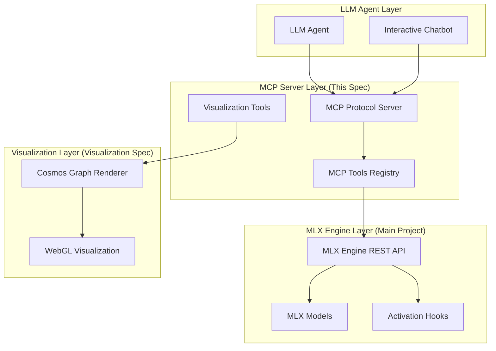

# Mechanistic Interpretability MCP Server Specification

This specification defines a comprehensive **Model Context Protocol (MCP) server** implemented in **JavaScript/Node.js** that provides LLM agents with access to mechanistic interpretability capabilities for transformer models. The server acts as a bridge between high-level agent instructions and low-level interpretability operations, enabling automated analysis workflows across the entire MLX Engine ecosystem.

## 🏗️ Architecture Overview

The MCP server operates as a **client** to the **MLX Engine REST API Server** (defined in the main project), creating a three-tier architecture:

```
LLM Agent → MCP Server → MLX Engine REST API → MLX Models
```

This design enables:
- **Agent-Friendly Interface**: High-level MCP tools that abstract complex operations
- **MLX Engine Integration**: Direct REST API calls to leverage MLX's model loading and activation capture
- **Scalable Analysis**: Advanced interpretability workflows built on MLX's foundation

## 🔗 Relationship to Other Specifications

### MLX Engine Integration (Main Project)
- **Dependency**: The MCP server **requires** the MLX Engine REST API server to be running
- **Data Flow**: MCP server calls MLX Engine endpoints to load models, capture activations, and export data
- **Architecture**: MCP server acts as a **client** to MLX Engine's **server**

### Visualization Specification
- **Extension**: The MCP server **includes** visualization tools that leverage the Cosmos Graph integration
- **Tool Integration**: MCP tools like `viz_create_circuit_graph` generate interactive visualizations
- **Shared Components**: Both specs use the same graph data structures and rendering pipeline



## 🎯 Core Capabilities

### 1. Circuit Analysis & Discovery
- **Circuit Discovery**: Automated causal tracing and activation patching
- **Feature Localization**: Neuron identification using PCA and probing classifiers
- **Circuit Validation**: Validation against known circuit patterns
- **Growth Analysis**: Cross-scale circuit complexity analysis

### 2. MLX Engine Integration
- **Model Management**: Load/unload models via REST API calls
- **Activation Capture**: Create hooks and capture activations during generation
- **Streaming Analysis**: Real-time analysis during streaming generation
- **Data Export**: Export activation data for NeuroScope integration

### 3. Advanced Analysis Operations
- **Weight Editing**: Circuit-based weight modifications with safety validation
- **Activation Steering**: Context-aware steering with conflict resolution
- **Knowledge Editing**: Factual circuit location and modification
- **Capability Transfer**: Cross-architecture circuit adaptation

### 4. Visualization & Export
- **Interactive Visualizations**: Circuit diagrams, attention patterns, activation flows
- **Multiple Export Formats**: JSON, HDF5, PNG, SVG export capabilities
- **Web Integration**: Embeddable visualizations for web interfaces
- **Cosmos Graph Integration**: High-performance WebGL-based graph rendering

### 5. Safety & Validation
- **Harmful Circuit Detection**: Automated safety circuit identification
- **Risk Assessment**: Pre-modification risk analysis
- **Post-Modification Validation**: Performance and safety validation
- **Continuous Monitoring**: Real-time safety monitoring with alerts

### 6. Interactive Command-Line Interface
- **Natural Language Interface**: Anthropic API-powered conversational interface
- **Automatic Tool Selection**: AI-driven MCP tool selection and execution
- **Rich Output Formatting**: Human-readable results presentation
- **Session Management**: Conversation history and session persistence

## 🛠️ Implementation Details

### Runtime Environment
- **Language**: Vanilla JavaScript (ES2022+)
- **Runtime**: Node.js 18+ with ES modules
- **Dependencies**: MCP SDK, Express, Anthropic SDK, AJV for schema validation
- **Security**: Node.js crypto module, TLS support, environment variable management

### MCP Tool Organization
Tools are organized by capability area with consistent naming:
- `core_*`: Core mechanistic interpretability operations
- `mlx_*`: MLX Engine integration operations  
- `advanced_*`: Advanced circuit analysis and modification
- `ecosystem_*`: Circuit ecosystem management
- `safety_*`: Safety and alignment operations
- `data_*`: Data management and persistence
- `viz_*`: Visualization and export operations
- `test_*`: Testing and validation operations

### JSON Schema Validation
Every MCP tool includes comprehensive input/output schemas:
- **Input Validation**: Runtime validation with detailed error messages
- **Output Guarantees**: Guaranteed response format conformance
- **Type Safety**: Full type checking for all parameters and responses

## 📋 Current Implementation Status

Based on the existing implementation in `mcp-server/`:

✅ **Core Framework Complete**
- MCP SDK integration with comprehensive tool registry
- JSON schema validation for all tool inputs/outputs
- Request routing and error handling
- Interactive chatbot with Anthropic API integration

✅ **Basic Tools Implemented**
- `ping`: Server health check
- `core_discover_circuits`: Circuit discovery with mock data
- `core_localize_features`: Feature localization capabilities

🚧 **In Progress**
- MLX Engine REST API client integration
- Advanced analysis tools implementation
- Visualization tool integration
- Comprehensive test suite

## 🔧 Configuration

### API Keys Setup
```bash
# Create keys file in mcp-server directory
echo "anthropic=sk-ant-api03-your-key-here" > mcp-server/keys
echo "openai=sk-proj-your-key-here" >> mcp-server/keys
```

### Environment Variables
```bash
# MCP server settings
export MCP_PORT=3000
export MCP_HOST=localhost

# MLX Engine connection (REQUIRED)
export MLX_ENGINE_API_URL=http://localhost:8080
export MLX_ENGINE_API_KEY=optional_api_key

# Anthropic API for chatbot
export ANTHROPIC_API_KEY=your_anthropic_api_key
export ANTHROPIC_MODEL=claude-3-5-sonnet-20241022
```

## 🚀 Quick Start

### Prerequisites
1. **MLX Engine REST API Server** must be running (see main project README)
2. **Node.js 18+** installed
3. **API Keys** configured (Anthropic for chatbot functionality)

### Installation & Usage
```bash
# Navigate to MCP server directory
cd mcp-server

# Install dependencies
npm install

# Start the MCP server
npm start

# Run interactive chatbot (in separate terminal)
npm run chatbot

# Test server functionality
node src/test_server.js
```

### Example Chatbot Interaction
```
🧠 Mechanistic Interpretability Chatbot
Connected to MCP Server with 15 tools available.

> Hello! Can you help me discover circuits for indirect object identification?

I'll help you discover circuits for indirect object identification (IOI). 
Let me run the circuit discovery tool for you.

[Executing: core_discover_circuits with phenomenon="IOI"]

✅ Found 3 circuit candidates for IOI:
- IOI_primary_circuit (confidence: 0.87)
  - Layers: [8, 9, 10, 11]  
  - Components: attention_head_8_3, mlp_9, attention_head_10_1
  - Performance recovery: 92%

> Can you create a visualization of this circuit?

I'll create an interactive graph visualization of the IOI primary circuit.

[Executing: viz_create_circuit_graph with circuit_id="IOI_primary_circuit"]

✅ Circuit visualization created!
- Graph ID: viz_ioi_20241215_143022
- Interactive WebGL visualization with 15 nodes, 23 edges
- Embed code generated for web integration
- Export options: PNG, SVG, JSON available

The visualization shows the attention heads and MLP components with 
connection strengths represented by edge thickness.
```

## 📚 Documentation Structure

### Specification Documents
- **`requirements.md`**: Detailed user stories and acceptance criteria
- **`design.md`**: Architecture, components, and implementation details
- **`tasks.md`**: Implementation task breakdown and progress tracking

### Implementation Documentation
- **`mcp-server/README.md`**: Implementation-specific setup and usage
- **`mcp-server/src/visualization/README.md`**: Visualization component details

## 🔍 Key Differentiators

### vs. Direct MLX Engine Usage
- **Agent-Friendly**: High-level tools vs. low-level API calls
- **Workflow Automation**: Complex multi-step analysis vs. single operations
- **Natural Language Interface**: Conversational access vs. programmatic only
- **Safety Integration**: Built-in safety validation vs. manual safety checks

### vs. Standalone Interpretability Tools
- **MLX Optimized**: Native Apple Silicon performance via MLX Engine
- **Streaming Capable**: Real-time analysis during generation
- **Integrated Ecosystem**: Unified interface across all interpretability operations
- **Agent Accessible**: MCP protocol enables LLM agent automation

## 🎯 Success Metrics

### Functional Completeness
- ✅ All 50+ MCP tools implemented with comprehensive schemas
- ✅ End-to-end MLX Engine integration working
- ✅ Interactive chatbot providing natural language access
- ✅ Visualization tools generating publication-quality outputs

### Performance Targets
- **Response Time**: <2s for simple operations, <30s for complex analysis
- **Throughput**: Handle 10+ concurrent agent connections
- **Memory Usage**: <4GB for typical analysis workflows
- **Reliability**: 99.9% uptime with graceful error handling

### Integration Quality
- **MLX Engine**: 100% API coverage with robust error handling
- **Visualization**: Seamless Cosmos Graph integration with export capabilities
- **NeuroScope**: Complete Smalltalk bridge functionality
- **Agent Compatibility**: Works with Claude, GPT-4, and other MCP-compatible agents

## 🔗 Related Resources

- **Main Project**: [MLX Engine with NeuroScope Integration](../../../README.md)
- **Visualization Spec**: [Cosmos Graph Visualization Integration](../visualization/README.md)
- **Implementation**: [MCP Server Implementation](../../mcp-server/README.md)
- **MCP Protocol**: [Model Context Protocol Specification](https://modelcontextprotocol.io/)
- **MLX Framework**: [Apple MLX Documentation](https://ml-explore.github.io/mlx/)

---

*This specification defines the comprehensive MCP server that makes mechanistic interpretability accessible to LLM agents through natural language interfaces and automated workflows, built on the foundation of the MLX Engine REST API server.*