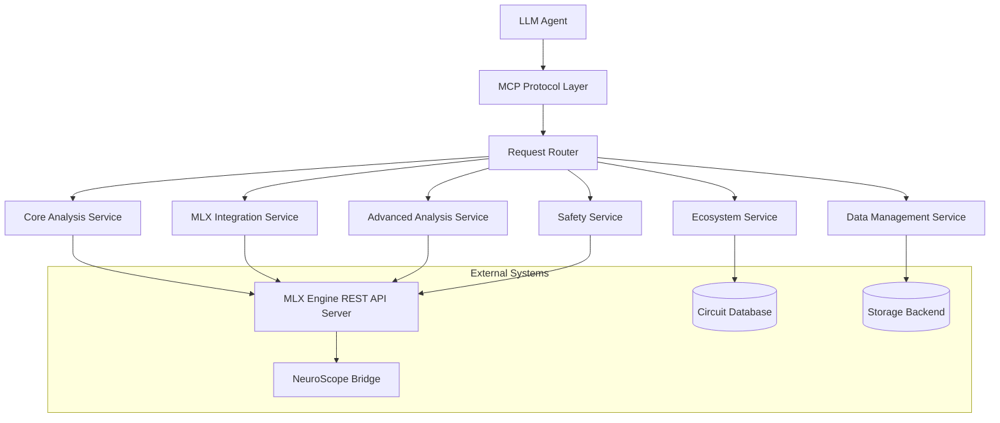
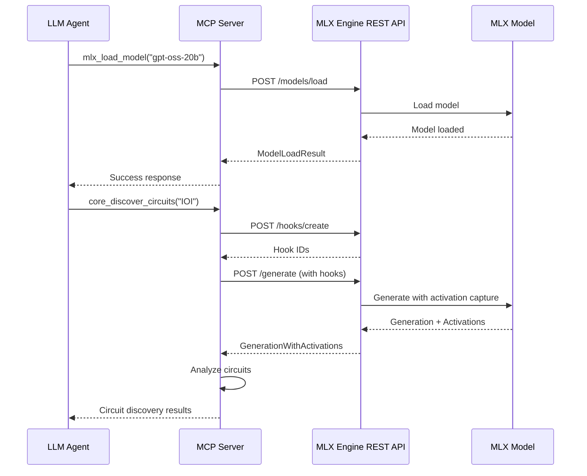

# Design Document

## Overview

The Mechanistic Interpretability MCP Server is a comprehensive Model Context Protocol server that exposes all mechanistic interpretability capabilities as standardized MCP tools. The server acts as a bridge between LLM agents and the complex mechanistic interpretability ecosystem, providing a unified interface for circuit analysis, model modification, safety validation, and ecosystem management.

The server is implemented in **JavaScript** using the **Deno** runtime environment, providing modern TypeScript support, built-in security features, and excellent performance for I/O-intensive operations. Deno's permission system ensures secure execution while its built-in HTTP server and JSON handling capabilities make it ideal for MCP protocol implementation.

The design follows a modular architecture where each major capability area is implemented as a separate service module, with a central orchestrator managing tool registration, request routing, and resource coordination. The server leverages the existing MLX Engine infrastructure through HTTP API calls while providing agent-friendly abstractions for complex operations.

## Runtime Environment

### Deno Runtime Features

The server leverages Deno's key features for secure and efficient operation:

- **TypeScript Support**: Native TypeScript compilation without external tooling
- **Security Model**: Permission-based security with explicit network, file system, and environment access
- **Standard Library**: Built-in HTTP server, JSON handling, and cryptographic functions
- **ES Modules**: Modern module system with URL-based imports
- **Web APIs**: Standard Web APIs for consistent cross-platform behavior
- **Performance**: V8 JavaScript engine with optimized I/O operations

### JavaScript/TypeScript Implementation

```typescript
// Example MCP tool implementation structure
interface MCPTool {
  name: string;
  description: string;
  inputSchema: JSONSchema;
  handler: (params: unknown) => Promise<MCPResult>;
}

class MCPServer {
  private tools: Map<string, MCPTool> = new Map();
  private services: ServiceModule[] = [];
  
  async start(port: number): Promise<void> {
    // Server initialization
  }
  
  registerTool(tool: MCPTool): void {
    this.tools.set(tool.name, tool);
  }
}
```

### Dependencies and Libraries

- **@modelcontextprotocol/sdk**: Official MCP SDK for JavaScript/TypeScript
- **std/http**: Deno standard library HTTP server and client for REST API calls
- **std/crypto**: Cryptographic functions for security
- **std/fs**: File system operations for data management
- **std/json**: JSON schema validation and processing
- **npm:zod**: Runtime type validation and schema definition

### Configuration

The MCP server requires configuration to connect to the MLX Engine REST API server:

```typescript
interface MCPServerConfig {
  // MCP server settings
  mcp: {
    port: number;
    host: string;
  };
  
  // MLX Engine REST API connection
  mlxEngine: {
    apiUrl: string;          // e.g., "http://localhost:8080"
    timeout: number;         // Request timeout in milliseconds
    retryAttempts: number;   // Number of retry attempts for failed requests
    apiKey?: string;         // Optional API key for authentication
  };
  
  // Data storage
  storage: {
    activationsPath: string; // Path for storing activation data
    circuitsPath: string;    // Path for circuit library storage
    cachePath: string;       // Path for analysis result cache
  };
  
  // Analysis settings
  analysis: {
    maxConcurrentRequests: number;  // Max concurrent MLX API requests
    defaultTimeout: number;         // Default analysis timeout
    cacheResults: boolean;          // Whether to cache analysis results
  };
}
```

**Environment Variables:**
```bash
# MLX Engine connection
MLX_ENGINE_API_URL=http://localhost:8080
MLX_ENGINE_API_KEY=optional_api_key
MLX_ENGINE_TIMEOUT=30000

# MCP server settings
MCP_SERVER_PORT=3000
MCP_SERVER_HOST=localhost

# Storage paths
ACTIVATIONS_PATH=./data/activations
CIRCUITS_PATH=./data/circuits
CACHE_PATH=./data/cache
```

## Architecture

### High-Level Architecture



### MLX Engine REST API Integration

The MCP server acts as a client to the **MLX Engine REST API Server** (defined in the MLX Engine Integration spec). This integration enables the MCP server to:

- **Model Management**: Load and manage models through REST endpoints
- **Activation Capture**: Create hooks and capture activations during generation
- **Streaming Analysis**: Perform real-time analysis during streaming generation
- **Data Export**: Export activation data for NeuroScope integration

```typescript
interface MLXEngineClient {
  baseUrl: string;
  
  // Model management
  loadModel(modelPath: string): Promise<ModelLoadResult>;
  listModels(): Promise<ModelInfo[]>;
  
  // Activation capture
  createHooks(specs: ActivationHookSpec[]): Promise<string[]>;
  generateWithActivations(messages: Message[], hookIds: string[]): Promise<GenerationWithActivations>;
  streamWithActivations(messages: Message[], hookIds: string[]): AsyncIterator<StreamingResult>;
  
  // Data management
  clearHooks(hookIds?: string[]): Promise<boolean>;
  exportActivations(format: string): Promise<ExportResult>;
}
```

### Integration Architecture

The MCP server operates as a **client** to the MLX Engine REST API server, not as a replacement. This architecture provides:



**Key Integration Points:**

1. **Model Lifecycle**: MCP server manages model loading/unloading through REST API
2. **Activation Capture**: MCP tools create hooks and capture activations via API calls
3. **Analysis Pipeline**: MCP server processes captured activations locally
4. **Data Flow**: Activations flow from MLX Engine → MCP Server → Analysis Results
5. **Error Handling**: MCP server handles both API errors and analysis errors

### Service Architecture

The server is organized into six primary service modules:

1. **Core Analysis Service**: Implements fundamental mechanistic interpretability operations
2. **MLX Integration Service**: Handles MLX Engine integration and activation capture
3. **Advanced Analysis Service**: Provides circuit modification and advanced analysis capabilities
4. **Ecosystem Service**: Manages circuit libraries, discovery, and composition
5. **Safety Service**: Ensures safe operations with risk assessment and validation
6. **Data Management Service**: Handles storage, caching, and format conversion

### MCP Tool Organization

Tools are organized by capability area with consistent naming conventions:

- `core_*`: Core mechanistic interpretability operations
- `mlx_*`: MLX Engine integration operations
- `advanced_*`: Advanced circuit analysis and modification
- `ecosystem_*`: Circuit ecosystem management
- `safety_*`: Safety and alignment operations
- `data_*`: Data management and persistence
- `viz_*`: Visualization and export operations
- `test_*`: Testing and validation operations

## Components and Interfaces

### MCP Protocol Layer

**MCPServer**: Main server class implementing the MCP protocol
- Handles tool registration and discovery
- Manages client connections and request routing
- Provides error handling and response formatting
- Implements authentication and authorization

**ToolRegistry**: Central registry for all available tools
- Dynamic tool registration from service modules
- Tool metadata management and validation
- Request routing based on tool names
- Tool dependency resolution

### Core Analysis Service

**CircuitAnalyzer**: Core circuit discovery and analysis
- `core_discover_circuits`: Causal tracing with activation patching
- `core_validate_circuit`: Circuit validation against known examples
- `core_find_analogous`: Pattern matching for similar circuits

**FeatureLocalizer**: Feature identification and analysis
- `core_localize_features`: Neuron identification for specific features
- `core_analyze_neurons`: Detailed neuron activation analysis
- `core_run_ablation`: Systematic ablation studies

**MultiTokenSteerer**: Steering vector management and application
- `core_apply_steering`: Single and multi-token steering application
- `core_create_steering_vectors`: Custom steering vector creation
- `core_analyze_semantic_density`: Token position semantic analysis

**CircuitGrowthAnalyzer**: Cross-scale circuit analysis
- `core_analyze_growth`: Circuit complexity analysis across scales
- `core_detect_patterns`: Growth pattern detection
- `core_measure_complexity`: Circuit complexity metrics

**FeatureEntanglementDetector**: Cross-domain feature analysis
- `core_detect_entanglement`: Cross-domain similarity search
- `core_analyze_domains`: Domain activation extraction
- `core_visualize_entanglement`: Entanglement visualization

### MLX Integration Service

**ActivationCaptureClient**: REST API integration with MLX Engine
- `mlx_load_model`: Calls `POST /models/load` to load models on MLX Engine server
- `mlx_create_hooks`: Calls `POST /hooks/create` to set up activation capture hooks
- `mlx_capture_activations`: Calls `POST /generate` with hook parameters for activation capture
- `mlx_stream_analysis`: Uses `POST /stream` endpoint for real-time streaming analysis

**Implementation Details:**
```typescript
class ActivationCaptureClient {
  constructor(private mlxApiUrl: string) {}
  
  async loadModel(modelPath: string): Promise<ModelLoadResult> {
    const response = await fetch(`${this.mlxApiUrl}/models/load`, {
      method: 'POST',
      headers: { 'Content-Type': 'application/json' },
      body: JSON.stringify({ model_path: modelPath })
    });
    return await response.json();
  }
  
  async createHooks(specs: ActivationHookSpec[]): Promise<string[]> {
    const response = await fetch(`${this.mlxApiUrl}/hooks/create`, {
      method: 'POST',
      headers: { 'Content-Type': 'application/json' },
      body: JSON.stringify({ hook_specs: specs })
    });
    const result = await response.json();
    return result.hook_ids;
  }
}
```

**CircuitAnalysisEngine**: Domain-specific circuit analysis
- `mlx_analyze_math`: Captures activations via REST API, then performs local mathematical reasoning analysis
- `mlx_analyze_attention`: Extracts attention matrices from REST API activations
- `mlx_analyze_factual`: Uses REST API for factual queries, analyzes results locally
- `mlx_track_residual`: Captures residual stream data via API, tracks information flow locally

**NeuroScopeIntegrator**: NeuroScope integration and validation
- `mlx_export_neuroscope`: Converts REST API activation data to NeuroScope format
- `mlx_validate_integration`: Tests complete MLX Engine → MCP Server → NeuroScope pipeline
- `mlx_generate_smalltalk`: Generates Smalltalk code that can connect to MLX Engine REST API

### Advanced Analysis Service

**CircuitWeightEditor**: Circuit-based weight modification
- `advanced_identify_weights`: Circuit weight identification
- `advanced_modify_weights`: Safe weight modification with validation
- `advanced_validate_modification`: Post-modification validation

**ActivationSteeringController**: Advanced activation steering
- `advanced_create_steering_hooks`: Context-aware steering hooks
- `advanced_resolve_conflicts`: Multi-hook conflict resolution
- `advanced_measure_effectiveness`: Steering effectiveness tracking

**KnowledgeEditor**: Factual knowledge modification
- `advanced_locate_facts`: Factual circuit location
- `advanced_edit_knowledge`: Knowledge update and injection
- `advanced_check_consistency`: Knowledge consistency validation

**CapabilityTransferSystem**: Cross-architecture capability transfer
- `advanced_extract_capability`: Capability circuit extraction
- `advanced_adapt_circuit`: Architecture adaptation
- `advanced_transfer_capability`: Complete capability transfer

### Ecosystem Service

**CircuitLibrary**: Circuit storage and management
- `ecosystem_store_circuit`: Circuit storage with metadata
- `ecosystem_search_circuits`: Semantic circuit search
- `ecosystem_version_circuit`: Circuit versioning and tracking

**AutomatedDiscovery**: Automated circuit discovery
- `ecosystem_generate_hypothesis`: Hypothesis generation
- `ecosystem_test_hypothesis`: Automated hypothesis testing
- `ecosystem_discover_circuits`: Complete discovery pipeline

**CircuitComposer**: Circuit composition and optimization
- `ecosystem_compose_circuits`: Circuit composition with validation
- `ecosystem_resolve_dependencies`: Dependency resolution
- `ecosystem_optimize_composition`: Composition optimization

**QualityAssurance**: Circuit quality testing
- `ecosystem_test_functionality`: Functional testing
- `ecosystem_benchmark_performance`: Performance benchmarking
- `ecosystem_validate_safety`: Safety validation

### Safety Service

**SafetyModificationEngine**: Safety-oriented modifications
- `safety_detect_harmful`: Harmful circuit detection
- `safety_apply_intervention`: Safety intervention application
- `safety_validate_safety`: Safety improvement validation

**InterpretabilityGuidedTrainer**: Safe fine-tuning
- `safety_guided_training`: Circuit-aware training
- `safety_preserve_capabilities`: Capability preservation
- `safety_monitor_training`: Training integrity monitoring

**RiskAssessment**: Pre-modification risk analysis
- `safety_assess_risk`: Comprehensive risk assessment
- `safety_predict_impact`: Modification impact prediction
- `safety_suggest_mitigation`: Risk mitigation strategies

**PostModificationValidator**: Post-modification validation
- `safety_validate_performance`: Performance validation
- `safety_validate_capabilities`: Capability retention testing
- `safety_generate_report`: Validation report generation

### Data Management Service

**StorageManager**: Data storage and retrieval
- `data_store_activations`: Activation data storage
- `data_store_circuits`: Circuit data storage
- `data_retrieve_data`: Data retrieval with filtering

**FormatConverter**: Data format conversion
- `data_convert_format`: Format conversion between standards
- `data_validate_format`: Format validation and verification
- `data_export_data`: Data export to external formats

**CacheManager**: Intelligent caching system
- `data_cache_result`: Result caching with metadata
- `data_invalidate_cache`: Cache invalidation management
- `data_optimize_storage`: Storage optimization

## Data Models

### Circuit Representation

```typescript
interface Circuit {
  id: string;
  name: string;
  description: string;
  layers: number[];
  components: string[];
  confidence: number;
  metadata: Record<string, unknown>;
  validation_status: ValidationStatus;
  created_at: Date;
  updated_at: Date;
}
```

### Activation Data

```typescript
interface ActivationData {
  model_id: string;
  layer_activations: Record<number, Float32Array>;
  attention_patterns: Record<number, Float32Array>;
  residual_stream: Float32Array;
  tokens: string[];
  metadata: Record<string, unknown>;
}
```

### Analysis Result

```typescript
interface AnalysisResult {
  operation: string;
  status: ResultStatus;
  data: Record<string, unknown>;
  confidence?: number;
  validation?: ValidationResult;
  timestamp: Date;
  execution_time: number;
}
```

### MLX Engine Integration Models

```typescript
interface MLXEngineRequest {
  endpoint: string;
  method: 'GET' | 'POST' | 'PUT' | 'DELETE';
  body?: Record<string, unknown>;
  headers?: Record<string, string>;
  timeout?: number;
}

interface MLXEngineResponse<T = unknown> {
  success: boolean;
  data?: T;
  error?: string;
  status_code: number;
  request_id: string;
}

interface ActivationHookSpec {
  layer_name: string;
  component: string;
  hook_id: string;
  capture_input: boolean;
  capture_output: boolean;
}

interface GenerationWithActivations {
  choices: Array<{
    message: { content: string };
    finish_reason: string;
  }>;
  activations: Record<string, CapturedActivation[]>;
  usage: {
    prompt_tokens: number;
    completion_tokens: number;
    total_tokens: number;
  };
}
```

## Error Handling

### MLX Engine Integration Errors

The MCP server must handle various types of errors from the MLX Engine REST API:

```typescript
class MLXEngineError extends Error {
  constructor(
    message: string,
    public statusCode: number,
    public endpoint: string,
    public requestId?: string
  ) {
    super(message);
    this.name = 'MLXEngineError';
  }
}

class MLXEngineConnectionError extends MLXEngineError {
  constructor(endpoint: string, cause: Error) {
    super(`Failed to connect to MLX Engine at ${endpoint}: ${cause.message}`, 0, endpoint);
    this.name = 'MLXEngineConnectionError';
  }
}

class MLXEngineTimeoutError extends MLXEngineError {
  constructor(endpoint: string, timeout: number) {
    super(`Request to ${endpoint} timed out after ${timeout}ms`, 408, endpoint);
    this.name = 'MLXEngineTimeoutError';
  }
}
```

**Error Recovery Strategies:**

1. **Connection Failures**: 
   - Retry with exponential backoff (3 attempts)
   - Check MLX Engine server status
   - Provide clear error messages to agent

2. **API Errors**:
   - Parse MLX Engine error responses
   - Map HTTP status codes to meaningful errors
   - Suggest corrective actions

3. **Timeout Handling**:
   - Configurable timeouts per operation type
   - Cancel long-running operations gracefully
   - Provide progress updates for long operations

4. **Data Validation**:
   - Validate MLX Engine responses before processing
   - Handle malformed activation data
   - Ensure data consistency across API calls

### Error Categories

1. **Protocol Errors**: MCP protocol violations and communication issues
2. **Validation Errors**: Input validation and constraint violations
3. **Computation Errors**: Analysis computation failures
4. **Integration Errors**: MLX Engine and external system integration issues
5. **Safety Errors**: Safety constraint violations and risk threshold breaches
6. **Resource Errors**: Memory, storage, and computational resource limitations

### Error Response Format

```typescript
interface MCPError {
  code: string;
  message: string;
  details?: Record<string, unknown>;
  suggestions?: string[];
  recoverable: boolean;
}
```

### Recovery Mechanisms

- **Automatic Retry**: For transient failures with exponential backoff
- **Graceful Degradation**: Fallback to simpler analysis methods
- **State Rollback**: Automatic rollback for failed modifications
- **Resource Cleanup**: Automatic cleanup of partial computations
- **Error Reporting**: Detailed error reporting with diagnostic information

## Testing Strategy

### Unit Testing

- **Tool Implementation Tests**: Individual tool functionality validation
- **Service Module Tests**: Service-level integration testing
- **Data Model Tests**: Data structure validation and serialization
- **Error Handling Tests**: Error condition and recovery testing

### Integration Testing

- **MCP Protocol Tests**: Protocol compliance and communication testing
- **MLX Engine Integration**: End-to-end MLX Engine integration validation
- **NeuroScope Integration**: NeuroScope bridge functionality testing
- **Cross-Service Tests**: Inter-service communication and coordination

### Performance Testing

- **Load Testing**: High-volume request handling
- **Memory Testing**: Memory usage optimization and leak detection
- **Latency Testing**: Response time optimization
- **Scalability Testing**: Multi-client and concurrent request handling

### Safety Testing

- **Security Testing**: Authentication, authorization, and data protection
- **Safety Validation**: Safety constraint enforcement
- **Risk Assessment**: Risk assessment accuracy and calibration
- **Rollback Testing**: Rollback mechanism reliability

### Acceptance Testing

- **Agent Integration**: Real LLM agent integration testing
- **Workflow Testing**: Complete analysis workflow validation
- **Reproducibility Testing**: Result consistency and reproducibility
- **Documentation Testing**: API documentation accuracy and completeness