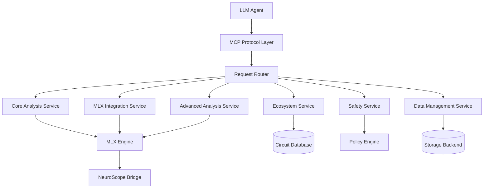

# Design Document

## Overview

The Mechanistic Interpretability MCP Server is a comprehensive Model Context Protocol server that exposes all mechanistic interpretability capabilities as standardized MCP tools. The server acts as a bridge between LLM agents and the complex mechanistic interpretability ecosystem, providing a unified interface for circuit analysis, model modification, safety validation, and ecosystem management.

The design follows a modular architecture where each major capability area is implemented as a separate service module, with a central orchestrator managing tool registration, request routing, and resource coordination. The server leverages the existing MLX Engine infrastructure while providing agent-friendly abstractions for complex operations.

## Architecture

### High-Level Architecture



### Service Architecture

The server is organized into six primary service modules:

1. **Core Analysis Service**: Implements fundamental mechanistic interpretability operations
2. **MLX Integration Service**: Handles MLX Engine integration and activation capture
3. **Advanced Analysis Service**: Provides circuit modification and advanced analysis capabilities
4. **Ecosystem Service**: Manages circuit libraries, discovery, and composition
5. **Safety Service**: Ensures safe operations with risk assessment and validation
6. **Data Management Service**: Handles storage, caching, and format conversion

### MCP Tool Organization

Tools are organized by capability area with consistent naming conventions:

- `core_*`: Core mechanistic interpretability operations
- `mlx_*`: MLX Engine integration operations
- `advanced_*`: Advanced circuit analysis and modification
- `ecosystem_*`: Circuit ecosystem management
- `safety_*`: Safety and alignment operations
- `data_*`: Data management and persistence
- `viz_*`: Visualization and export operations
- `test_*`: Testing and validation operations

## Components and Interfaces

### MCP Protocol Layer

**MCPServer**: Main server class implementing the MCP protocol
- Handles tool registration and discovery
- Manages client connections and request routing
- Provides error handling and response formatting
- Implements authentication and authorization

**ToolRegistry**: Central registry for all available tools
- Dynamic tool registration from service modules
- Tool metadata management and validation
- Request routing based on tool names
- Tool dependency resolution

### Core Analysis Service

**CircuitAnalyzer**: Core circuit discovery and analysis
- `core_discover_circuits`: Causal tracing with activation patching
- `core_validate_circuit`: Circuit validation against known examples
- `core_find_analogous`: Pattern matching for similar circuits

**FeatureLocalizer**: Feature identification and analysis
- `core_localize_features`: Neuron identification for specific features
- `core_analyze_neurons`: Detailed neuron activation analysis
- `core_run_ablation`: Systematic ablation studies

**MultiTokenSteerer**: Steering vector management and application
- `core_apply_steering`: Single and multi-token steering application
- `core_create_steering_vectors`: Custom steering vector creation
- `core_analyze_semantic_density`: Token position semantic analysis

**CircuitGrowthAnalyzer**: Cross-scale circuit analysis
- `core_analyze_growth`: Circuit complexity analysis across scales
- `core_detect_patterns`: Growth pattern detection
- `core_measure_complexity`: Circuit complexity metrics

**FeatureEntanglementDetector**: Cross-domain feature analysis
- `core_detect_entanglement`: Cross-domain similarity search
- `core_analyze_domains`: Domain activation extraction
- `core_visualize_entanglement`: Entanglement visualization

### MLX Integration Service

**ActivationCaptureClient**: REST API integration with MLX Engine
- `mlx_load_model`: Model loading and management
- `mlx_create_hooks`: Activation hook creation and management
- `mlx_capture_activations`: Generation with activation capture
- `mlx_stream_analysis`: Real-time streaming analysis

**CircuitAnalysisEngine**: Domain-specific circuit analysis
- `mlx_analyze_math`: Mathematical reasoning circuit analysis
- `mlx_analyze_attention`: Attention pattern analysis
- `mlx_analyze_factual`: Factual recall circuit analysis
- `mlx_track_residual`: Residual stream information flow

**NeuroScopeIntegrator**: NeuroScope integration and validation
- `mlx_export_neuroscope`: Data export for NeuroScope
- `mlx_validate_integration`: End-to-end workflow validation
- `mlx_generate_smalltalk`: Smalltalk interface generation

### Advanced Analysis Service

**CircuitWeightEditor**: Circuit-based weight modification
- `advanced_identify_weights`: Circuit weight identification
- `advanced_modify_weights`: Safe weight modification with validation
- `advanced_validate_modification`: Post-modification validation

**ActivationSteeringController**: Advanced activation steering
- `advanced_create_steering_hooks`: Context-aware steering hooks
- `advanced_resolve_conflicts`: Multi-hook conflict resolution
- `advanced_measure_effectiveness`: Steering effectiveness tracking

**KnowledgeEditor**: Factual knowledge modification
- `advanced_locate_facts`: Factual circuit location
- `advanced_edit_knowledge`: Knowledge update and injection
- `advanced_check_consistency`: Knowledge consistency validation

**CapabilityTransferSystem**: Cross-architecture capability transfer
- `advanced_extract_capability`: Capability circuit extraction
- `advanced_adapt_circuit`: Architecture adaptation
- `advanced_transfer_capability`: Complete capability transfer

### Ecosystem Service

**CircuitLibrary**: Circuit storage and management
- `ecosystem_store_circuit`: Circuit storage with metadata
- `ecosystem_search_circuits`: Semantic circuit search
- `ecosystem_version_circuit`: Circuit versioning and tracking

**AutomatedDiscovery**: Automated circuit discovery
- `ecosystem_generate_hypothesis`: Hypothesis generation
- `ecosystem_test_hypothesis`: Automated hypothesis testing
- `ecosystem_discover_circuits`: Complete discovery pipeline

**CircuitComposer**: Circuit composition and optimization
- `ecosystem_compose_circuits`: Circuit composition with validation
- `ecosystem_resolve_dependencies`: Dependency resolution
- `ecosystem_optimize_composition`: Composition optimization

**QualityAssurance**: Circuit quality testing
- `ecosystem_test_functionality`: Functional testing
- `ecosystem_benchmark_performance`: Performance benchmarking
- `ecosystem_validate_safety`: Safety validation

### Safety Service

**SafetyModificationEngine**: Safety-oriented modifications
- `safety_detect_harmful`: Harmful circuit detection
- `safety_apply_intervention`: Safety intervention application
- `safety_validate_safety`: Safety improvement validation

**InterpretabilityGuidedTrainer**: Safe fine-tuning
- `safety_guided_training`: Circuit-aware training
- `safety_preserve_capabilities`: Capability preservation
- `safety_monitor_training`: Training integrity monitoring

**RiskAssessment**: Pre-modification risk analysis
- `safety_assess_risk`: Comprehensive risk assessment
- `safety_predict_impact`: Modification impact prediction
- `safety_suggest_mitigation`: Risk mitigation strategies

**PostModificationValidator**: Post-modification validation
- `safety_validate_performance`: Performance validation
- `safety_validate_capabilities`: Capability retention testing
- `safety_generate_report`: Validation report generation

### Data Management Service

**StorageManager**: Data storage and retrieval
- `data_store_activations`: Activation data storage
- `data_store_circuits`: Circuit data storage
- `data_retrieve_data`: Data retrieval with filtering

**FormatConverter**: Data format conversion
- `data_convert_format`: Format conversion between standards
- `data_validate_format`: Format validation and verification
- `data_export_data`: Data export to external formats

**CacheManager**: Intelligent caching system
- `data_cache_result`: Result caching with metadata
- `data_invalidate_cache`: Cache invalidation management
- `data_optimize_storage`: Storage optimization

## Data Models

### Circuit Representation

```python
@dataclass
class Circuit:
    id: str
    name: str
    description: str
    layers: List[int]
    components: List[str]
    confidence: float
    metadata: Dict[str, Any]
    validation_status: ValidationStatus
    created_at: datetime
    updated_at: datetime
```

### Activation Data

```python
@dataclass
class ActivationData:
    model_id: str
    layer_activations: Dict[int, torch.Tensor]
    attention_patterns: Dict[int, torch.Tensor]
    residual_stream: torch.Tensor
    tokens: List[str]
    metadata: Dict[str, Any]
```

### Analysis Result

```python
@dataclass
class AnalysisResult:
    operation: str
    status: ResultStatus
    data: Dict[str, Any]
    confidence: Optional[float]
    validation: Optional[ValidationResult]
    timestamp: datetime
    execution_time: float
```

## Error Handling

### Error Categories

1. **Protocol Errors**: MCP protocol violations and communication issues
2. **Validation Errors**: Input validation and constraint violations
3. **Computation Errors**: Analysis computation failures
4. **Integration Errors**: MLX Engine and external system integration issues
5. **Safety Errors**: Safety constraint violations and risk threshold breaches
6. **Resource Errors**: Memory, storage, and computational resource limitations

### Error Response Format

```python
@dataclass
class MCPError:
    code: str
    message: str
    details: Optional[Dict[str, Any]]
    suggestions: Optional[List[str]]
    recoverable: bool
```

### Recovery Mechanisms

- **Automatic Retry**: For transient failures with exponential backoff
- **Graceful Degradation**: Fallback to simpler analysis methods
- **State Rollback**: Automatic rollback for failed modifications
- **Resource Cleanup**: Automatic cleanup of partial computations
- **Error Reporting**: Detailed error reporting with diagnostic information

## Testing Strategy

### Unit Testing

- **Tool Implementation Tests**: Individual tool functionality validation
- **Service Module Tests**: Service-level integration testing
- **Data Model Tests**: Data structure validation and serialization
- **Error Handling Tests**: Error condition and recovery testing

### Integration Testing

- **MCP Protocol Tests**: Protocol compliance and communication testing
- **MLX Engine Integration**: End-to-end MLX Engine integration validation
- **NeuroScope Integration**: NeuroScope bridge functionality testing
- **Cross-Service Tests**: Inter-service communication and coordination

### Performance Testing

- **Load Testing**: High-volume request handling
- **Memory Testing**: Memory usage optimization and leak detection
- **Latency Testing**: Response time optimization
- **Scalability Testing**: Multi-client and concurrent request handling

### Safety Testing

- **Security Testing**: Authentication, authorization, and data protection
- **Safety Validation**: Safety constraint enforcement
- **Risk Assessment**: Risk assessment accuracy and calibration
- **Rollback Testing**: Rollback mechanism reliability

### Acceptance Testing

- **Agent Integration**: Real LLM agent integration testing
- **Workflow Testing**: Complete analysis workflow validation
- **Reproducibility Testing**: Result consistency and reproducibility
- **Documentation Testing**: API documentation accuracy and completeness