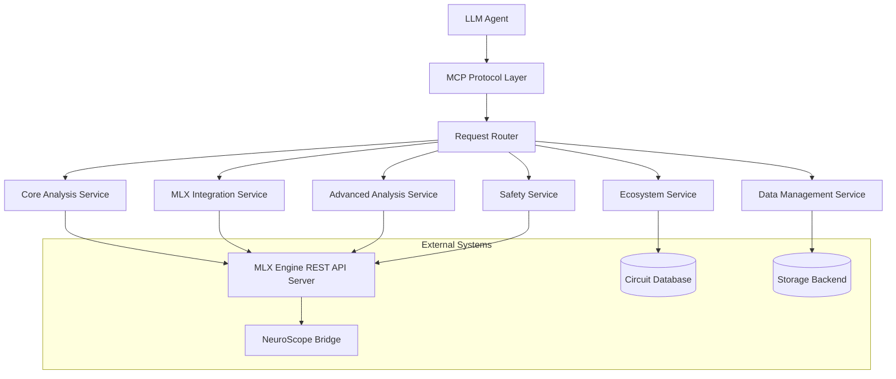
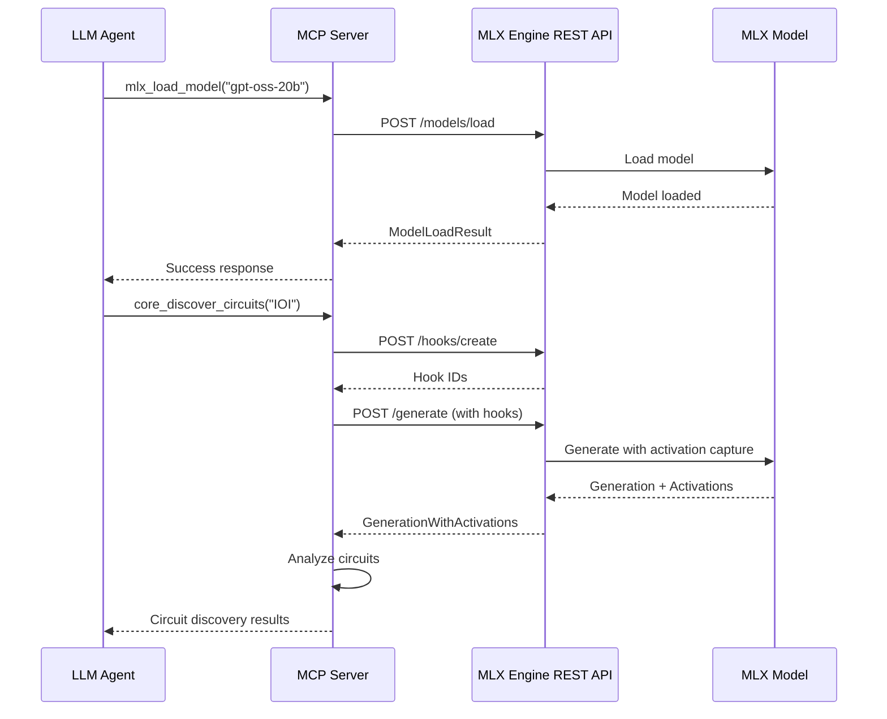

# Design Document

## Overview

The Mechanistic Interpretability MCP Server is a comprehensive Model Context Protocol server that exposes all mechanistic interpretability capabilities as standardized MCP tools. The server acts as a bridge between LLM agents and the complex mechanistic interpretability ecosystem, providing a unified interface for circuit analysis, model modification, safety validation, and ecosystem management.

**Architecture Relationship**: The MCP server operates as a **client** to the **MLX Engine REST API Server** (defined in the MLX Engine Integration specification). This client-server architecture enables the MCP server to leverage MLX Engine's model loading, activation capture, and generation capabilities through standardized HTTP API calls, while providing LLM agents with simplified, high-level tools for complex interpretability workflows.

The server is implemented in **vanilla JavaScript** using the **Node.js** runtime environment, providing excellent performance for I/O-intensive operations, mature ecosystem support, and extensive package availability through npm. Node.js's robust HTTP server capabilities and JSON handling make it ideal for both MCP protocol implementation and REST API client operations.

The design follows a modular architecture where each major capability area is implemented as a separate service module, with a central orchestrator managing tool registration, request routing, and resource coordination. The server leverages the MLX Engine REST API server for all model operations while providing agent-friendly abstractions and advanced analysis capabilities that extend beyond basic activation capture.

## Runtime Environment

### Node.js Runtime Features

The server leverages Node.js's key features for secure and efficient operation:

- **Vanilla JavaScript**: Pure JavaScript implementation without TypeScript compilation
- **Security Model**: Process-level security with environment variable management
- **Standard Library**: Built-in HTTP server, JSON handling, and cryptographic functions
- **ES Modules**: Modern module system with CommonJS compatibility
- **NPM Ecosystem**: Extensive package ecosystem for additional functionality
- **Performance**: V8 JavaScript engine with optimized I/O operations

### Vanilla JavaScript Implementation

```javascript
// Example MCP tool implementation structure
class MCPServer {
  constructor() {
    this.tools = new Map();
    this.services = [];
  }
  
  async start(port) {
    // Server initialization
  }
  
  registerTool(tool) {
    this.tools.set(tool.name, tool);
  }
}

// Example tool structure
const exampleTool = {
  name: 'core_discover_circuits',
  description: 'Discover circuits for a specific phenomenon',
  inputSchema: {
    type: 'object',
    properties: {
      phenomenon: { type: 'string' },
      model_id: { type: 'string' }
    },
    required: ['phenomenon', 'model_id']
  },
  handler: async (params) => {
    // Tool implementation
  }
};
```

### Dependencies and Libraries

- **@modelcontextprotocol/sdk**: Official MCP SDK for JavaScript
- **express**: HTTP server framework for REST API handling
- **node-fetch**: HTTP client for REST API calls to MLX Engine
- **crypto**: Node.js built-in cryptographic functions for security
- **fs/promises**: Node.js file system operations for data management
- **ajv**: JSON schema validation and processing
- **@anthropic-ai/sdk**: Official Anthropic API client for chatbot functionality
- **readline**: Node.js built-in module for interactive command-line interface

### Configuration

The MCP server requires configuration to connect to the MLX Engine REST API server:

```javascript
// Example configuration object structure
const mcpServerConfig = {
  // MCP server settings
  mcp: {
    port: 3000,
    host: 'localhost'
  },
  
  // MLX Engine REST API connection
  mlxEngine: {
    apiUrl: 'http://localhost:8080',
    timeout: 30000,
    retryAttempts: 3,
    apiKey: null // Optional API key for authentication
  },
  
  // Anthropic API for chatbot
  anthropic: {
    apiKey: process.env.ANTHROPIC_API_KEY,
    model: 'claude-3-5-sonnet-20241022',
    maxTokens: 4096,
    temperature: 0.7
  },
  
  // Data storage
  storage: {
    activationsPath: './data/activations',
    circuitsPath: './data/circuits',
    cachePath: './data/cache'
  },
  
  // Analysis settings
  analysis: {
    maxConcurrentRequests: 5,
    defaultTimeout: 60000,
    cacheResults: true
  }
};
```

**Environment Variables:**
```bash
# MLX Engine connection
MLX_ENGINE_API_URL=http://localhost:8080
MLX_ENGINE_API_KEY=optional_api_key
MLX_ENGINE_TIMEOUT=30000

# MCP server settings
MCP_SERVER_PORT=3000
MCP_SERVER_HOST=localhost

# Anthropic API for chatbot
ANTHROPIC_API_KEY=your_anthropic_api_key
ANTHROPIC_MODEL=claude-3-5-sonnet-20241022

# Storage paths
ACTIVATIONS_PATH=./data/activations
CIRCUITS_PATH=./data/circuits
CACHE_PATH=./data/cache
```

## Architecture

### High-Level Architecture



### MLX Engine REST API Integration

The MCP server acts as a client to the **MLX Engine REST API Server** (defined in the MLX Engine Integration spec). This integration enables the MCP server to:

- **Model Management**: Load and manage models through REST endpoints
- **Activation Capture**: Create hooks and capture activations during generation
- **Streaming Analysis**: Perform real-time analysis during streaming generation
- **Data Export**: Export activation data for NeuroScope integration

```typescript
interface MLXEngineClient {
  baseUrl: string;
  
  // Model management
  loadModel(modelPath: string): Promise<ModelLoadResult>;
  listModels(): Promise<ModelInfo[]>;
  
  // Activation capture
  createHooks(specs: ActivationHookSpec[]): Promise<string[]>;
  generateWithActivations(messages: Message[], hookIds: string[]): Promise<GenerationWithActivations>;
  streamWithActivations(messages: Message[], hookIds: string[]): AsyncIterator<StreamingResult>;
  
  // Data management
  clearHooks(hookIds?: string[]): Promise<boolean>;
  exportActivations(format: string): Promise<ExportResult>;
}
```

### Integration Architecture

The MCP server operates as a **client** to the MLX Engine REST API server, not as a replacement. This architecture provides:



**Key Integration Points:**

1. **Model Lifecycle**: MCP server manages model loading/unloading through REST API
2. **Activation Capture**: MCP tools create hooks and capture activations via API calls
3. **Analysis Pipeline**: MCP server processes captured activations locally
4. **Data Flow**: Activations flow from MLX Engine → MCP Server → Analysis Results
5. **Error Handling**: MCP server handles both API errors and analysis errors

### Service Architecture

The server is organized into six primary service modules:

1. **Core Analysis Service**: Implements fundamental mechanistic interpretability operations
2. **MLX Integration Service**: Handles MLX Engine integration and activation capture
3. **Advanced Analysis Service**: Provides circuit modification and advanced analysis capabilities
4. **Ecosystem Service**: Manages circuit libraries, discovery, and composition
5. **Safety Service**: Ensures safe operations with risk assessment and validation
6. **Data Management Service**: Handles storage, caching, and format conversion

### MCP Tool Organization

Tools are organized by capability area with consistent naming conventions:

- `core_*`: Core mechanistic interpretability operations
- `mlx_*`: MLX Engine integration operations
- `advanced_*`: Advanced circuit analysis and modification
- `ecosystem_*`: Circuit ecosystem management
- `safety_*`: Safety and alignment operations
- `data_*`: Data management and persistence
- `viz_*`: Visualization and export operations
- `test_*`: Testing and validation operations

## Components and Interfaces

### MCP Protocol Layer

**MCPServer**: Main server class implementing the MCP protocol
- Handles tool registration and discovery with comprehensive JSON schemas
- Manages client connections and request routing
- Provides error handling and response formatting
- Implements authentication and authorization

**ToolRegistry**: Central registry for all available tools with exhaustive schemas
- Dynamic tool registration from service modules with input/output schema validation
- Tool metadata management including comprehensive JSON schema definitions
- Request routing based on tool names with schema-based input validation
- Tool dependency resolution and schema compatibility checking

**JSON Schema Implementation**: Every MCP tool includes exhaustive schemas
```javascript
// Example MCP tool structure with comprehensive schemas
const createMCPTool = (name, description, inputSchema, outputSchema, handler) => ({
  name,
  description,
  inputSchema: {
    type: "object",
    properties: inputSchema.properties,
    required: inputSchema.required || [],
    additionalProperties: false
  },
  outputSchema: {
    type: "object", 
    properties: outputSchema.properties,
    required: outputSchema.required || [],
    additionalProperties: false
  },
  handler
});

// Example: Circuit discovery tool schema
const coreDiscoverCircuitsSchema = {
  inputSchema: {
    type: "object",
    properties: {
      phenomenon: {
        type: "string",
        description: "The target phenomenon to find circuits for (e.g., 'IOI', 'indirect_object_identification')",
        enum: ["IOI", "indirect_object_identification", "arithmetic", "factual_recall"]
      },
      model_id: {
        type: "string",
        description: "Identifier of the loaded model to analyze"
      },
      confidence_threshold: {
        type: "number",
        minimum: 0,
        maximum: 1,
        default: 0.7,
        description: "Minimum confidence score for circuit candidates"
      },
      max_circuits: {
        type: "integer",
        minimum: 1,
        maximum: 50,
        default: 10,
        description: "Maximum number of circuit candidates to return"
      }
    },
    required: ["phenomenon", "model_id"],
    additionalProperties: false
  },
  outputSchema: {
    type: "object",
    properties: {
      success: { type: "boolean" },
      circuits: {
        type: "array",
        items: {
          type: "object",
          properties: {
            id: { type: "string" },
            name: { type: "string" },
            confidence: { type: "number", minimum: 0, maximum: 1 },
            layers: { type: "array", items: { type: "integer" } },
            components: { type: "array", items: { type: "string" } },
            validation_metrics: {
              type: "object",
              properties: {
                performance_recovery: { type: "number" },
                attribution_score: { type: "number" },
                consistency_score: { type: "number" }
              },
              required: ["performance_recovery", "attribution_score", "consistency_score"]
            }
          },
          required: ["id", "name", "confidence", "layers", "components", "validation_metrics"]
        }
      },
      execution_time_ms: { type: "number" },
      model_info: {
        type: "object",
        properties: {
          model_id: { type: "string" },
          architecture: { type: "string" },
          num_layers: { type: "integer" }
        },
        required: ["model_id", "architecture", "num_layers"]
      }
    },
    required: ["success", "circuits", "execution_time_ms", "model_info"],
    additionalProperties: false
  }
};
```

**Schema Validation**: All tool calls undergo rigorous validation
- **Input Validation**: AJV-based runtime validation against declared input schemas
- **Output Validation**: Response validation ensures conformance to output schemas
- **Error Reporting**: Detailed schema violation messages with specific constraint failures
- **Runtime Safety**: JavaScript validation ensures runtime schema consistency

### Core Analysis Service

**CircuitAnalyzer**: Core circuit discovery and analysis
- `core_discover_circuits`: Causal tracing with activation patching
- `core_validate_circuit`: Circuit validation against known examples
- `core_find_analogous`: Pattern matching for similar circuits

**FeatureLocalizer**: Feature identification and analysis
- `core_localize_features`: Neuron identification for specific features
- `core_analyze_neurons`: Detailed neuron activation analysis
- `core_run_ablation`: Systematic ablation studies

**MultiTokenSteerer**: Steering vector management and application
- `core_apply_steering`: Single and multi-token steering application
- `core_create_steering_vectors`: Custom steering vector creation
- `core_analyze_semantic_density`: Token position semantic analysis

**CircuitGrowthAnalyzer**: Cross-scale circuit analysis
- `core_analyze_growth`: Circuit complexity analysis across scales
- `core_detect_patterns`: Growth pattern detection
- `core_measure_complexity`: Circuit complexity metrics

**FeatureEntanglementDetector**: Cross-domain feature analysis
- `core_detect_entanglement`: Cross-domain similarity search
- `core_analyze_domains`: Domain activation extraction
- `core_visualize_entanglement`: Entanglement visualization

### MLX Integration Service

**ActivationCaptureClient**: REST API integration with MLX Engine
- `mlx_load_model`: Calls `POST /models/load` to load models on MLX Engine server
- `mlx_create_hooks`: Calls `POST /hooks/create` to set up activation capture hooks
- `mlx_capture_activations`: Calls `POST /generate` with hook parameters for activation capture
- `mlx_stream_analysis`: Uses `POST /stream` endpoint for real-time streaming analysis

**Implementation Details:**
```javascript
class ActivationCaptureClient {
  constructor(mlxApiUrl) {
    this.mlxApiUrl = mlxApiUrl;
  }
  
  async loadModel(modelPath) {
    const response = await fetch(`${this.mlxApiUrl}/models/load`, {
      method: 'POST',
      headers: { 'Content-Type': 'application/json' },
      body: JSON.stringify({ model_path: modelPath })
    });
    return await response.json();
  }
  
  async createHooks(specs) {
    const response = await fetch(`${this.mlxApiUrl}/hooks/create`, {
      method: 'POST',
      headers: { 'Content-Type': 'application/json' },
      body: JSON.stringify({ hook_specs: specs })
    });
    const result = await response.json();
    return result.hook_ids;
  }
}
```

**CircuitAnalysisEngine**: Domain-specific circuit analysis
- `mlx_analyze_math`: Captures activations via REST API, then performs local mathematical reasoning analysis
- `mlx_analyze_attention`: Extracts attention matrices from REST API activations
- `mlx_analyze_factual`: Uses REST API for factual queries, analyzes results locally
- `mlx_track_residual`: Captures residual stream data via API, tracks information flow locally

**NeuroScopeIntegrator**: NeuroScope integration and validation
- `mlx_export_neuroscope`: Converts REST API activation data to NeuroScope format
- `mlx_validate_integration`: Tests complete MLX Engine → MCP Server → NeuroScope pipeline
- `mlx_generate_smalltalk`: Generates Smalltalk code that can connect to MLX Engine REST API

### Advanced Analysis Service

**CircuitWeightEditor**: Circuit-based weight modification
- `advanced_identify_weights`: Circuit weight identification
- `advanced_modify_weights`: Safe weight modification with validation
- `advanced_validate_modification`: Post-modification validation

**ActivationSteeringController**: Advanced activation steering
- `advanced_create_steering_hooks`: Context-aware steering hooks
- `advanced_resolve_conflicts`: Multi-hook conflict resolution
- `advanced_measure_effectiveness`: Steering effectiveness tracking

**KnowledgeEditor**: Factual knowledge modification
- `advanced_locate_facts`: Factual circuit location
- `advanced_edit_knowledge`: Knowledge update and injection
- `advanced_check_consistency`: Knowledge consistency validation

**CapabilityTransferSystem**: Cross-architecture capability transfer
- `advanced_extract_capability`: Capability circuit extraction
- `advanced_adapt_circuit`: Architecture adaptation
- `advanced_transfer_capability`: Complete capability transfer

### Ecosystem Service

**CircuitLibrary**: Circuit storage and management
- `ecosystem_store_circuit`: Circuit storage with metadata
- `ecosystem_search_circuits`: Semantic circuit search
- `ecosystem_version_circuit`: Circuit versioning and tracking

**AutomatedDiscovery**: Automated circuit discovery
- `ecosystem_generate_hypothesis`: Hypothesis generation
- `ecosystem_test_hypothesis`: Automated hypothesis testing
- `ecosystem_discover_circuits`: Complete discovery pipeline

**CircuitComposer**: Circuit composition and optimization
- `ecosystem_compose_circuits`: Circuit composition with validation
- `ecosystem_resolve_dependencies`: Dependency resolution
- `ecosystem_optimize_composition`: Composition optimization

**QualityAssurance**: Circuit quality testing
- `ecosystem_test_functionality`: Functional testing
- `ecosystem_benchmark_performance`: Performance benchmarking
- `ecosystem_validate_safety`: Safety validation

### Safety Service

**SafetyModificationEngine**: Safety-oriented modifications
- `safety_detect_harmful`: Harmful circuit detection
- `safety_apply_intervention`: Safety intervention application
- `safety_validate_safety`: Safety improvement validation

**InterpretabilityGuidedTrainer**: Safe fine-tuning
- `safety_guided_training`: Circuit-aware training
- `safety_preserve_capabilities`: Capability preservation
- `safety_monitor_training`: Training integrity monitoring

**RiskAssessment**: Pre-modification risk analysis
- `safety_assess_risk`: Comprehensive risk assessment
- `safety_predict_impact`: Modification impact prediction
- `safety_suggest_mitigation`: Risk mitigation strategies

**PostModificationValidator**: Post-modification validation
- `safety_validate_performance`: Performance validation
- `safety_validate_capabilities`: Capability retention testing
- `safety_generate_report`: Validation report generation

### Data Management Service

**StorageManager**: Data storage and retrieval
- `data_store_activations`: Activation data storage
- `data_store_circuits`: Circuit data storage
- `data_retrieve_data`: Data retrieval with filtering

**FormatConverter**: Data format conversion
- `data_convert_format`: Format conversion between standards
- `data_validate_format`: Format validation and verification
- `data_export_data`: Data export to external formats

**CacheManager**: Intelligent caching system
- `data_cache_result`: Result caching with metadata
- `data_invalidate_cache`: Cache invalidation management
- `data_optimize_storage`: Storage optimization

### Interactive Command-Line Interface

**ChatbotService**: Interactive command-line chatbot with Anthropic API integration
- `startInteractiveSession`: Initializes command-line interface with conversation history
- `processUserInput`: Handles natural language queries and converts to MCP tool calls
- `executeToolsFromConversation`: Automatically executes appropriate MCP tools based on user requests
- `explainResults`: Converts technical MCP tool results into natural language explanations
- `provideHelp`: Offers contextual assistance and examples for mechanistic interpretability operations

**Implementation Architecture:**
```javascript
class InteractiveChatbot {
  constructor(anthropicClient, mcpServer) {
    this.anthropicClient = anthropicClient;
    this.mcpServer = mcpServer;
    this.conversationHistory = [];
  }
  
  async startSession() {
    // Initialize readline interface
    // Display welcome message and available capabilities
    // Start conversation loop
  }
  
  async processUserQuery(input) {
    // Send query to Anthropic API with MCP tool context
    // Parse response for tool calls
    // Execute MCP tools if requested
    // Format results for human consumption
  }
  
  async explainCapabilities() {
    // Generate natural language explanation of all available MCP tools
    // Provide examples and use cases
    // Suggest common workflows
  }
}

## Data Models

### Circuit Representation

```javascript
// Example circuit object structure
const createCircuit = (id, name, description, layers, components, confidence) => ({
  id,
  name,
  description,
  layers,
  components,
  confidence,
  metadata: {},
  validation_status: 'pending', // 'pending', 'validated', 'failed'
  created_at: new Date(),
  updated_at: new Date()
});
```

### Activation Data

```javascript
// Example activation data structure
const createActivationData = (modelId, layerActivations, attentionPatterns, residualStream, tokens) => ({
  model_id: modelId,
  layer_activations: layerActivations, // Object with layer numbers as keys, Float32Array as values
  attention_patterns: attentionPatterns, // Object with layer numbers as keys, Float32Array as values
  residual_stream: residualStream, // Float32Array
  tokens: tokens, // Array of strings
  metadata: {}
});
```

### Analysis Result

```javascript
// Example analysis result structure
const createAnalysisResult = (operation, status, data, confidence = null, validation = null) => ({
  operation,
  status, // 'success', 'error', 'partial'
  data,
  confidence,
  validation,
  timestamp: new Date(),
  execution_time: 0 // milliseconds
});
```

### MLX Engine Integration Models

```javascript
// MLX Engine request structure
const createMLXEngineRequest = (endpoint, method, body = null, headers = {}, timeout = 30000) => ({
  endpoint,
  method, // 'GET', 'POST', 'PUT', 'DELETE'
  body,
  headers,
  timeout
});

// MLX Engine response structure
const createMLXEngineResponse = (success, data = null, error = null, statusCode = 200, requestId = null) => ({
  success,
  data,
  error,
  status_code: statusCode,
  request_id: requestId
});

// Activation hook specification
const createActivationHookSpec = (layerName, component, hookId, captureInput = true, captureOutput = true) => ({
  layer_name: layerName,
  component,
  hook_id: hookId,
  capture_input: captureInput,
  capture_output: captureOutput
});

// Generation with activations result
const createGenerationWithActivations = (choices, activations, usage) => ({
  choices, // Array of choice objects with message and finish_reason
  activations, // Object with hook IDs as keys, activation arrays as values
  usage // Object with token counts
});
```

## Error Handling

### MLX Engine Integration Errors

The MCP server must handle various types of errors from the MLX Engine REST API:

```javascript
class MLXEngineError extends Error {
  constructor(message, statusCode, endpoint, requestId = null) {
    super(message);
    this.name = 'MLXEngineError';
    this.statusCode = statusCode;
    this.endpoint = endpoint;
    this.requestId = requestId;
  }
}

class MLXEngineConnectionError extends MLXEngineError {
  constructor(endpoint, cause) {
    super(`Failed to connect to MLX Engine at ${endpoint}: ${cause.message}`, 0, endpoint);
    this.name = 'MLXEngineConnectionError';
  }
}

class MLXEngineTimeoutError extends MLXEngineError {
  constructor(endpoint, timeout) {
    super(`Request to ${endpoint} timed out after ${timeout}ms`, 408, endpoint);
    this.name = 'MLXEngineTimeoutError';
  }
}
```

**Error Recovery Strategies:**

1. **Connection Failures**: 
   - Retry with exponential backoff (3 attempts)
   - Check MLX Engine server status
   - Provide clear error messages to agent

2. **API Errors**:
   - Parse MLX Engine error responses
   - Map HTTP status codes to meaningful errors
   - Suggest corrective actions

3. **Timeout Handling**:
   - Configurable timeouts per operation type
   - Cancel long-running operations gracefully
   - Provide progress updates for long operations

4. **Data Validation**:
   - Validate MLX Engine responses before processing
   - Handle malformed activation data
   - Ensure data consistency across API calls

### Error Categories

1. **Protocol Errors**: MCP protocol violations and communication issues
2. **Validation Errors**: Input validation and constraint violations
3. **Computation Errors**: Analysis computation failures
4. **Integration Errors**: MLX Engine and external system integration issues
5. **Safety Errors**: Safety constraint violations and risk threshold breaches
6. **Resource Errors**: Memory, storage, and computational resource limitations

### Error Response Format

```javascript
// MCP error response structure
const createMCPError = (code, message, details = null, suggestions = [], recoverable = false) => ({
  code,
  message,
  details,
  suggestions,
  recoverable
});
```

### Recovery Mechanisms

- **Automatic Retry**: For transient failures with exponential backoff
- **Graceful Degradation**: Fallback to simpler analysis methods
- **State Rollback**: Automatic rollback for failed modifications
- **Resource Cleanup**: Automatic cleanup of partial computations
- **Error Reporting**: Detailed error reporting with diagnostic information

## Testing Strategy

### Unit Testing

- **Tool Implementation Tests**: Individual tool functionality validation
- **Service Module Tests**: Service-level integration testing
- **Data Model Tests**: Data structure validation and serialization
- **Error Handling Tests**: Error condition and recovery testing

### Integration Testing

- **MCP Protocol Tests**: Protocol compliance and communication testing
- **MLX Engine Integration**: End-to-end MLX Engine integration validation
- **NeuroScope Integration**: NeuroScope bridge functionality testing
- **Cross-Service Tests**: Inter-service communication and coordination

### Performance Testing

- **Load Testing**: High-volume request handling
- **Memory Testing**: Memory usage optimization and leak detection
- **Latency Testing**: Response time optimization
- **Scalability Testing**: Multi-client and concurrent request handling

### Safety Testing

- **Security Testing**: Authentication, authorization, and data protection
- **Safety Validation**: Safety constraint enforcement
- **Risk Assessment**: Risk assessment accuracy and calibration
- **Rollback Testing**: Rollback mechanism reliability

### Acceptance Testing

- **Agent Integration**: Real LLM agent integration testing
- **Workflow Testing**: Complete analysis workflow validation
- **Reproducibility Testing**: Result consistency and reproducibility
- **Documentation Testing**: API documentation accuracy and completeness