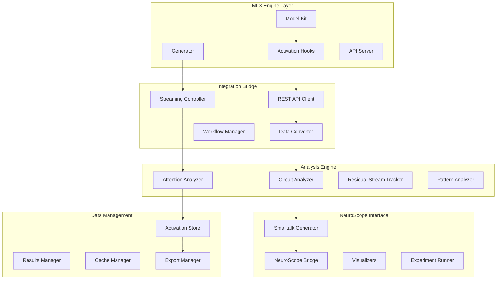

# Design Document

## Overview

The MLX Engine integration system provides seamless connectivity between MLX Engine's activation capture capabilities and NeuroScope's interpretability analysis tools. This system enables comprehensive circuit analysis, real-time activation monitoring, and end-to-end workflows from model inference to sophisticated interpretability research.

## Architecture



## Components and Interfaces

### 1. REST API Activation Capture System

**Purpose**: Provide comprehensive activation capture capabilities through REST API endpoints with full compatibility with existing MLX Engine infrastructure.

**Key Classes**:
```python
class RESTActivationCaptureClient:
    def __init__(self, base_url: str, timeout: int = 30)
    def load_model(self, model_path: str) -> ModelLoadResult
    def create_activation_hooks(self, hook_specs: List[ActivationHookSpec]) -> List[str]
    def generate_with_activations(self, messages: List[Dict], hooks: List[str], **kwargs) -> GenerationWithActivations
    def stream_with_activations(self, messages: List[Dict], hooks: List[str], **kwargs) -> Iterator[StreamingResult]
    def clear_activation_hooks(self, hook_ids: Optional[List[str]] = None) -> bool

class ActivationHookSpec:
    def __init__(self, layer_name: str, component: str, hook_id: str, capture_input: bool = False, capture_output: bool = True)
    def validate_specification(self, model_architecture: ModelArchitecture) -> ValidationResult
    def to_api_format(self) -> Dict[str, Any]
    def from_api_format(cls, data: Dict[str, Any]) -> 'ActivationHookSpec'

class GenerationWithActivations:
    def __init__(self, choices: List[Choice], activations: Dict[str, List[CapturedActivation]], usage: Usage)
    def get_activations_by_layer(self, layer: int) -> List[CapturedActivation]
    def get_activations_by_component(self, component: str) -> List[CapturedActivation]
    def export_for_neuroscope(self) -> NeuroScopeData
```

**Interfaces**:
- `ModelManager`: Handles model loading and management
- `HookManager`: Manages activation hook lifecycle
- `DataSerializer`: Converts between different data formats

### 2. Comprehensive Circuit Analysis Engine

**Purpose**: Perform detailed analysis across different reasoning domains using MLX Engine's activation capture capabilities.

**Key Classes**:
```python
class CircuitAnalysisEngine:
    def __init__(self, client: RESTActivationCaptureClient, analysis_config: AnalysisConfig)
    def analyze_mathematical_reasoning(self, math_problems: List[str]) -> MathReasoningAnalysis
    def analyze_factual_recall(self, factual_queries: List[str]) -> FactualRecallAnalysis
    def analyze_creative_writing(self, writing_prompts: List[str]) -> CreativeWritingAnalysis
    def analyze_attention_patterns(self, text_samples: List[str]) -> AttentionPatternAnalysis
    def track_residual_stream(self, generation_sequence: str) -> ResidualStreamAnalysis

class MathReasoningAnalyzer:
    def identify_arithmetic_circuits(self, activations: Dict[str, List[CapturedActivation]]) -> List[ArithmeticCircuit]
    def trace_computation_flow(self, problem: str, activations: Dict) -> ComputationTrace
    def analyze_error_patterns(self, incorrect_solutions: List[Tuple[str, str]]) -> ErrorPatternAnalysis
    def measure_reasoning_confidence(self, activations: Dict) -> ConfidenceMetrics

class AttentionPatternAnalyzer:
    def extract_attention_matrices(self, activations: Dict[str, List[CapturedActivation]]) -> List[AttentionMatrix]
    def identify_attention_heads_by_function(self, attention_data: List[AttentionMatrix]) -> Dict[str, List[AttentionHead]]
    def analyze_multi_head_interactions(self, attention_matrices: List[AttentionMatrix]) -> InteractionAnalysis
    def visualize_attention_patterns(self, attention_data: AttentionMatrix, tokens: List[str]) -> AttentionVisualization

class ResidualStreamTracker:
    def track_information_flow(self, activations: Dict[str, List[CapturedActivation]]) -> InformationFlowGraph
    def identify_information_routing(self, residual_activations: List[CapturedActivation]) -> RoutingAnalysis
    def measure_layer_contributions(self, residual_stream: List[torch.Tensor]) -> LayerContributions
    def detect_skip_connections(self, flow_graph: InformationFlowGraph) -> List[SkipConnection]
```

**Interfaces**:
- `DomainAnalyzer`: Base interface for domain-specific analysis
- `PatternDetector`: Detects patterns in activation data
- `FlowTracker`: Tracks information flow through the model

### 3. Streaming Activation Analysis System

**Purpose**: Enable real-time activation capture and analysis during streaming text generation.

**Key Classes**:
```python
class StreamingActivationAnalyzer:
    def __init__(self, client: RESTActivationCaptureClient, real_time_processors: List[RealTimeProcessor])
    def start_streaming_analysis(self, messages: List[Dict], hooks: List[str]) -> StreamingSession
    def process_streaming_token(self, token: str, activations: Dict) -> TokenAnalysisResult
    def detect_pattern_changes(self, current_activations: Dict, history: ActivationHistory) -> List[PatternChange]
    def trigger_interventions(self, pattern_changes: List[PatternChange]) -> List[Intervention]

class RealTimeProcessor:
    def __init__(self, processor_type: str, parameters: Dict[str, Any])
    def process_token_activations(self, token: str, activations: Dict) -> ProcessingResult
    def update_running_statistics(self, new_data: ProcessingResult) -> None
    def should_trigger_alert(self, current_state: ProcessingResult) -> bool

class StreamingSession:
    def __init__(self, session_id: str, hooks: List[str], processors: List[RealTimeProcessor])
    def add_token_result(self, token: str, activations: Dict) -> None
    def get_session_summary(self) -> SessionSummary
    def export_session_data(self, format: str = "neuroscope") -> ExportedData
    def close_session(self) -> SessionReport
```

**Interfaces**:
- `StreamingManager`: Manages multiple concurrent streaming sessions
- `RealTimeAnalyzer`: Provides real-time analysis capabilities
- `InterventionEngine`: Handles real-time interventions based on analysis

### 4. NeuroScope Integration Validation System

**Purpose**: Ensure complete workflow validation from MLX Engine to NeuroScope with comprehensive error handling and debugging.

**Key Classes**:
```python
class NeuroScopeIntegrationValidator:
    def __init__(self, mlx_client: RESTActivationCaptureClient, neuroscope_bridge: NeuroScopeBridge)
    def validate_end_to_end_workflow(self, test_cases: List[TestCase]) -> ValidationReport
    def test_data_format_conversion(self, activation_data: Dict) -> ConversionTestResult
    def validate_smalltalk_interface(self, generated_code: str) -> SmallTalkValidationResult
    def test_circuit_analysis_pipeline(self, circuit_type: str) -> PipelineTestResult

class NeuroScopeBridge:
    def __init__(self, conversion_config: ConversionConfig)
    def convert_activations_to_neuroscope(self, mlx_activations: Dict) -> NeuroScopeActivations
    def generate_smalltalk_client(self, api_endpoint: str) -> str
    def create_circuit_analysis_hooks(self, num_layers: int, components: List[str]) -> List[ActivationHookSpec]
    def export_analysis_results(self, results: AnalysisResults, format: str) -> ExportedResults

class WorkflowValidator:
    def test_model_loading(self, model_path: str) -> ModelLoadingTest
    def test_activation_capture(self, test_prompts: List[str]) -> ActivationCaptureTest
    def test_data_conversion(self, captured_data: Dict) -> DataConversionTest
    def test_neuroscope_integration(self, converted_data: NeuroScopeActivations) -> IntegrationTest
    def generate_validation_report(self, test_results: List[TestResult]) -> ValidationReport
```

**Interfaces**:
- `DataConverter`: Converts between MLX Engine and NeuroScope formats
- `IntegrationTester`: Tests integration points between systems
- `WorkflowOrchestrator`: Orchestrates complete analysis workflows

## Data Models

### Activation Data Models

```python
@dataclass
class CapturedActivation:
    hook_id: str
    layer_name: str
    component: str
    shape: List[int]
    dtype: str
    is_input: bool
    data: torch.Tensor
    metadata: Dict[str, Any]

@dataclass
class GenerationWithActivations:
    choices: List[Choice]
    activations: Dict[str, List[CapturedActivation]]
    usage: Usage
    generation_metadata: Dict[str, Any]

@dataclass
class StreamingResult:
    token: str
    activations: Dict[str, CapturedActivation]
    is_complete: bool
    generation_metadata: Dict[str, Any]
```

### Analysis Result Models

```python
@dataclass
class CircuitAnalysisResult:
    circuit_type: str
    identified_circuits: List[IdentifiedCircuit]
    confidence_scores: Dict[str, float]
    analysis_metadata: Dict[str, Any]
    visualization_data: Optional[VisualizationData]

@dataclass
class AttentionPatternAnalysis:
    attention_matrices: List[AttentionMatrix]
    head_functions: Dict[str, List[AttentionHead]]
    pattern_summaries: List[PatternSummary]
    interaction_graphs: List[InteractionGraph]

@dataclass
class ResidualStreamAnalysis:
    information_flow: InformationFlowGraph
    layer_contributions: LayerContributions
    routing_patterns: List[RoutingPattern]
    skip_connections: List[SkipConnection]
```

### Integration Models

```python
@dataclass
class NeuroScopeActivations:
    format_version: str
    model_info: ModelInfo
    activation_data: Dict[str, Any]
    metadata: Dict[str, Any]
    conversion_timestamp: datetime

@dataclass
class ValidationReport:
    test_type: str
    success: bool
    test_results: List[TestResult]
    error_messages: List[str]
    recommendations: List[str]
    timestamp: datetime

@dataclass
class WorkflowResult:
    workflow_id: str
    steps_completed: List[str]
    results: Dict[str, Any]
    performance_metrics: Dict[str, float]
    errors: List[str]
```

## Error Handling

### Exception Hierarchy

```python
class MLXIntegrationError(Exception):
    """Base exception for MLX Engine integration"""

class ActivationCaptureError(MLXIntegrationError):
    """Raised when activation capture fails"""

class DataConversionError(MLXIntegrationError):
    """Raised when data format conversion fails"""

class StreamingError(MLXIntegrationError):
    """Raised when streaming analysis encounters errors"""

class NeuroScopeIntegrationError(MLXIntegrationError):
    """Raised when NeuroScope integration fails"""

class WorkflowValidationError(MLXIntegrationError):
    """Raised when workflow validation fails"""
```

### Recovery Mechanisms

1. **Connection Failures**: Automatic retry with exponential backoff
2. **Data Corruption**: Validation and re-capture of corrupted data
3. **Format Errors**: Fallback to alternative data formats
4. **Integration Failures**: Detailed diagnostics and alternative pathways
5. **Performance Issues**: Automatic optimization and resource management

## Testing Strategy

### Integration Testing

1. **API Connectivity**: Test all REST API endpoints under various conditions
2. **Data Format Compatibility**: Validate data conversion between systems
3. **End-to-End Workflows**: Test complete pipelines from capture to analysis
4. **Error Handling**: Test recovery from various failure modes

### Performance Testing

1. **Activation Capture Speed**: Benchmark capture performance with large models
2. **Streaming Latency**: Measure real-time analysis latency
3. **Memory Usage**: Monitor memory consumption during large-scale analysis
4. **Concurrent Sessions**: Test multiple simultaneous analysis sessions

### Validation Testing

1. **Data Integrity**: Ensure activation data remains intact through conversion
2. **Analysis Accuracy**: Validate analysis results against known benchmarks
3. **NeuroScope Compatibility**: Test generated Smalltalk code in NeuroScope
4. **Workflow Completeness**: Ensure all workflow steps execute correctly