# Design Document

## Overview

The safety and alignment system applies mechanistic interpretability insights to create safer AI systems through targeted interventions, interpretability-guided training, and comprehensive validation frameworks. This system ensures responsible development and deployment of interpretability techniques while maintaining model capabilities and preventing harmful behaviors.

All safety and alignment capabilities are exposed through the **Mechanistic Interpretability MCP Server**, enabling LLM agents to perform safety analysis, apply interventions, conduct risk assessments, and validate modifications through standardized tools. This allows agents to automatically ensure AI safety while maintaining full transparency and control over safety-critical operations.

## Architecture

```mermaid
graph TB
    subgraph "Safety Analysis Layer"
        HC[Harmful Circuit Detector]
        SI[Safety Intervention Engine]
        RM[Risk Monitor]
        TM[Threat Modeler]
    end
    
    subgraph "Training Enhancement"
        IGT[Interpretability-Guided Trainer]
        CA[Circuit-Aware Optimizer]
        CP[Capability Preserver]
        VM[Validation Monitor]
    end
    
    subgraph "Risk Assessment"
        PRA[Pre-Modification Risk Assessor]
        IA[Impact Analyzer]
        SC[Safety Checker]
        RA[Risk Aggregator]
    end
    
    subgraph "Validation Framework"
        PMV[Post-Modification Validator]
        PT[Performance Tester]
        ST[Safety Tester]
        CT[Capability Tester]
    end
    
    subgraph "Monitoring System"
        CM[Continuous Monitor]
        AD[Anomaly Detector]
        AS[Alert System]
        RB[Rollback Controller]
    end
    
    HC --> SI
    SI --> RM
    IGT --> CA
    CA --> CP
    PRA --> IA
    IA --> SC
    PMV --> PT
    PT --> ST
    CM --> AD
    AD --> AS
```



## Components and Interfaces

### 1. Safety-Oriented Model Modification System

**Purpose**: Identify and neutralize harmful capabilities while preserving beneficial model functionality through targeted circuit interventions.

**Key Classes**:
```python
class SafetyModificationEngine:
    def __init__(self, model: ModelKit, safety_config: SafetyConfig, harm_detector: HarmDetector)
    def identify_harmful_circuits(self, harm_categories: List[str], test_dataset: Dataset) -> List[HarmfulCircuit]
    def create_safety_interventions(self, harmful_circuits: List[HarmfulCircuit]) -> List[SafetyIntervention]
    def apply_safety_modifications(self, interventions: List[SafetyIntervention]) -> ModificationResult
    def validate_safety_improvements(self, modified_model: ModelKit, test_suite: SafetyTestSuite) -> SafetyValidationResult

class HarmfulCircuitDetector:
    def __init__(self, harm_taxonomy: HarmTaxonomy, detection_thresholds: Dict[str, float])
    def scan_for_violence_circuits(self, model: ModelKit, violence_prompts: List[str]) -> List[ViolenceCircuit]
    def detect_misinformation_circuits(self, model: ModelKit, factual_test_set: Dataset) -> List[MisinformationCircuit]
    def identify_toxicity_circuits(self, model: ModelKit, toxicity_dataset: Dataset) -> List[ToxicityCircuit]
    def analyze_bias_circuits(self, model: ModelKit, bias_test_suite: BiasTestSuite) -> List[BiasCircuit]

class SafetyInterventionEngine:
    def create_redirection_hook(self, harmful_circuit: HarmfulCircuit, safe_alternative: str) -> RedirectionHook
    def create_suppression_hook(self, harmful_circuit: HarmfulCircuit, suppression_strength: float) -> SuppressionHook
    def create_context_aware_hook(self, harmful_circuit: HarmfulCircuit, context_detector: Callable) -> ContextAwareHook
    def validate_intervention_effectiveness(self, hook: SafetyHook, test_cases: List[str]) -> EffectivenessResult
```

**Interfaces**:
- `HarmDetector`: Identifies potentially harmful model behaviors
- `InterventionApplicator`: Applies safety interventions to models
- `SafetyValidator`: Validates effectiveness of safety modifications

### 2. Interpretability-Guided Fine-tuning System

**Purpose**: Use circuit insights to guide more effective fine-tuning that targets specific components while preserving interpretability and general capabilities.

**Key Classes**:
```python
class InterpretabilityGuidedTrainer:
    def __init__(self, model: ModelKit, circuit_analyzer: CircuitAnalyzer, training_config: TrainingConfig)
    def identify_task_relevant_circuits(self, task: str, examples: List[str]) -> List[TaskCircuit]
    def create_circuit_aware_optimizer(self, target_circuits: List[TaskCircuit]) -> CircuitAwareOptimizer
    def train_with_circuit_preservation(self, dataset: Dataset, preserve_circuits: List[Circuit]) -> TrainingResult
    def monitor_circuit_integrity(self, training_step: int, current_model: ModelKit) -> CircuitIntegrityReport

class CircuitAwareOptimizer:
    def __init__(self, base_optimizer: torch.optim.Optimizer, circuit_constraints: List[CircuitConstraint])
    def compute_circuit_aware_gradients(self, loss: torch.Tensor, target_circuits: List[Circuit]) -> Dict[str, torch.Tensor]
    def apply_circuit_preservation_penalty(self, gradients: Dict[str, torch.Tensor], preserve_circuits: List[Circuit]) -> Dict[str, torch.Tensor]
    def balance_objectives(self, task_loss: torch.Tensor, circuit_coherence_loss: torch.Tensor, capability_preservation_loss: torch.Tensor) -> torch.Tensor

class CapabilityPreserver:
    def identify_critical_capabilities(self, model: ModelKit, capability_test_suite: CapabilityTestSuite) -> List[CriticalCapability]
    def monitor_capability_degradation(self, original_model: ModelKit, current_model: ModelKit) -> CapabilityDegradationReport
    def create_capability_preservation_constraints(self, critical_capabilities: List[CriticalCapability]) -> List[PreservationConstraint]
    def validate_capability_retention(self, trained_model: ModelKit, capability_benchmarks: List[Benchmark]) -> CapabilityRetentionReport
```

**Interfaces**:
- `CircuitAnalyzer`: Analyzes circuit structure and function
- `TrainingMonitor`: Monitors training progress and circuit integrity
- `CapabilityTester`: Tests model capabilities during training

### 3. Pre-Modification Risk Assessment System

**Purpose**: Analyze potential impacts and risks before applying model modifications to prevent unintended consequences.

**Key Classes**:
```python
class PreModificationRiskAssessor:
    def __init__(self, risk_models: Dict[str, RiskModel], assessment_config: AssessmentConfig)
    def assess_modification_risks(self, proposed_modification: ModelModification) -> RiskAssessment
    def analyze_capability_loss_risk(self, modification: ModelModification, critical_capabilities: List[str]) -> CapabilityLossRisk
    def evaluate_behavior_change_risk(self, modification: ModelModification, behavior_benchmarks: List[Benchmark]) -> BehaviorChangeRisk
    def assess_safety_implications(self, modification: ModelModification, safety_criteria: List[SafetyCriterion]) -> SafetyRisk

class RiskModel:
    def __init__(self, risk_type: str, model_parameters: Dict[str, Any])
    def predict_risk_level(self, modification: ModelModification, context: ModificationContext) -> RiskLevel
    def identify_risk_factors(self, modification: ModelModification) -> List[RiskFactor]
    def suggest_mitigation_strategies(self, identified_risks: List[RiskFactor]) -> List[MitigationStrategy]

class ImpactAnalyzer:
    def simulate_modification_impact(self, modification: ModelModification, test_scenarios: List[TestScenario]) -> ImpactSimulation
    def predict_performance_changes(self, modification: ModelModification, performance_metrics: List[str]) -> PerformancePrediction
    def analyze_interaction_effects(self, modification: ModelModification, existing_modifications: List[ModelModification]) -> InteractionAnalysis
    def estimate_rollback_complexity(self, modification: ModelModification) -> RollbackComplexity
```

**Interfaces**:
- `RiskPredictor`: Predicts various types of risks from modifications
- `ImpactSimulator`: Simulates potential impacts of modifications
- `MitigationPlanner`: Plans risk mitigation strategies

### 4. Post-Modification Validation Framework

**Purpose**: Comprehensive validation after model modifications to ensure they work as intended without harmful side effects.

**Key Classes**:
```python
class PostModificationValidator:
    def __init__(self, validation_suites: Dict[str, ValidationSuite], validation_config: ValidationConfig)
    def run_comprehensive_validation(self, modified_model: ModelKit, original_model: ModelKit) -> ComprehensiveValidationReport
    def validate_original_task_performance(self, modified_model: ModelKit, original_benchmarks: List[Benchmark]) -> TaskPerformanceValidation
    def run_safety_validation_suite(self, modified_model: ModelKit, safety_tests: SafetyTestSuite) -> SafetyValidationReport
    def test_general_capabilities(self, modified_model: ModelKit, capability_tests: CapabilityTestSuite) -> CapabilityValidationReport

class PerformanceTester:
    def benchmark_task_performance(self, model: ModelKit, task_benchmarks: List[Benchmark]) -> PerformanceResults
    def compare_performance_metrics(self, original_results: PerformanceResults, modified_results: PerformanceResults) -> PerformanceComparison
    def identify_performance_regressions(self, comparison: PerformanceComparison, regression_thresholds: Dict[str, float]) -> List[PerformanceRegression]
    def validate_performance_improvements(self, comparison: PerformanceComparison, improvement_targets: Dict[str, float]) -> ImprovementValidation

class SafetyValidator:
    def run_harm_detection_tests(self, model: ModelKit, harm_test_suite: HarmTestSuite) -> HarmDetectionResults
    def test_bias_mitigation(self, model: ModelKit, bias_test_suite: BiasTestSuite) -> BiasMitigationResults
    def validate_content_filtering(self, model: ModelKit, content_filter_tests: List[ContentFilterTest]) -> ContentFilteringResults
    def assess_adversarial_robustness(self, model: ModelKit, adversarial_test_suite: AdversarialTestSuite) -> RobustnessResults

class CapabilityTester:
    def test_reasoning_capabilities(self, model: ModelKit, reasoning_tests: ReasoningTestSuite) -> ReasoningResults
    def validate_knowledge_retention(self, model: ModelKit, knowledge_tests: KnowledgeTestSuite) -> KnowledgeRetentionResults
    def test_language_understanding(self, model: ModelKit, language_tests: LanguageTestSuite) -> LanguageUnderstandingResults
    def assess_creative_capabilities(self, model: ModelKit, creativity_tests: CreativityTestSuite) -> CreativityResults
```

**Interfaces**:
- `ValidationSuite`: Base interface for different types of validation tests
- `ResultComparator`: Compares results between original and modified models
- `ReportGenerator`: Generates comprehensive validation reports

## Data Models

### Safety and Risk Models

```python
@dataclass
class HarmfulCircuit:
    circuit_id: str
    harm_category: str
    confidence_score: float
    layers: List[int]
    components: List[str]
    example_triggers: List[str]
    harm_severity: str

@dataclass
class SafetyIntervention:
    intervention_id: str
    target_circuit: HarmfulCircuit
    intervention_type: str  # "redirect", "suppress", "context_aware"
    parameters: Dict[str, Any]
    effectiveness_score: float
    side_effects: List[str]

@dataclass
class RiskAssessment:
    modification_id: str
    overall_risk_level: str  # "low", "medium", "high", "critical"
    capability_loss_risk: float
    behavior_change_risk: float
    safety_risk: float
    mitigation_strategies: List[str]
    approval_required: bool
```

### Training and Validation Models

```python
@dataclass
class CircuitIntegrityReport:
    training_step: int
    circuit_coherence_scores: Dict[str, float]
    degraded_circuits: List[str]
    preserved_circuits: List[str]
    recommendations: List[str]

@dataclass
class ValidationReport:
    validation_type: str
    timestamp: datetime
    overall_success: bool
    performance_results: Dict[str, float]
    safety_results: Dict[str, bool]
    capability_results: Dict[str, float]
    identified_issues: List[str]
    recommendations: List[str]

@dataclass
class ModificationResult:
    modification_id: str
    success: bool
    applied_interventions: List[SafetyIntervention]
    performance_impact: Dict[str, float]
    safety_improvements: Dict[str, float]
    rollback_data: Optional[bytes]
```

### Monitoring and Alert Models

```python
@dataclass
class SafetyAlert:
    alert_id: str
    severity: str
    alert_type: str
    description: str
    triggered_by: str
    timestamp: datetime
    recommended_actions: List[str]

@dataclass
class ContinuousMonitoringReport:
    monitoring_period: Tuple[datetime, datetime]
    safety_incidents: List[SafetyAlert]
    performance_anomalies: List[PerformanceAnomaly]
    capability_degradations: List[CapabilityDegradation]
    overall_health_score: float
```

## Error Handling

### Exception Hierarchy

```python
class SafetySystemError(Exception):
    """Base exception for safety and alignment system"""

class HarmfulCircuitDetectionError(SafetySystemError):
    """Raised when harmful circuit detection fails"""

class SafetyInterventionError(SafetySystemError):
    """Raised when safety interventions fail to apply or are ineffective"""

class TrainingIntegrityError(SafetySystemError):
    """Raised when circuit integrity is compromised during training"""

class RiskAssessmentError(SafetySystemError):
    """Raised when risk assessment fails or produces invalid results"""

class ValidationFailureError(SafetySystemError):
    """Raised when post-modification validation fails"""
```

### Safety Protocols

1. **Automatic Rollback**: Immediate rollback on safety violations
2. **Human Oversight**: Escalation to human reviewers for high-risk modifications
3. **Gradual Deployment**: Staged rollout with monitoring at each stage
4. **Continuous Monitoring**: Real-time monitoring with automatic intervention
5. **Emergency Shutdown**: Capability to immediately disable problematic modifications

## Testing Strategy

### Safety Testing

1. **Harm Detection Accuracy**: Test ability to identify various types of harmful content
2. **Intervention Effectiveness**: Validate that safety interventions prevent harm
3. **False Positive Management**: Ensure safety measures don't over-censor benign content
4. **Adversarial Robustness**: Test against attempts to bypass safety measures

### Training Testing

1. **Circuit Preservation**: Validate that important circuits remain intact during training
2. **Capability Retention**: Ensure general capabilities are preserved
3. **Training Stability**: Test that circuit-aware training converges properly
4. **Objective Balancing**: Validate proper balancing of multiple training objectives

### Validation Testing

1. **Comprehensive Coverage**: Ensure validation covers all relevant aspects
2. **Regression Detection**: Test ability to detect performance regressions
3. **Safety Validation**: Validate that safety improvements are real and lasting
4. **Report Accuracy**: Ensure validation reports accurately reflect model state

### Risk Assessment Testing

1. **Risk Prediction Accuracy**: Validate risk models predict actual outcomes
2. **Mitigation Effectiveness**: Test that suggested mitigations reduce risks
3. **Assessment Completeness**: Ensure all relevant risks are considered
4. **Decision Support**: Validate that assessments support good decision-making