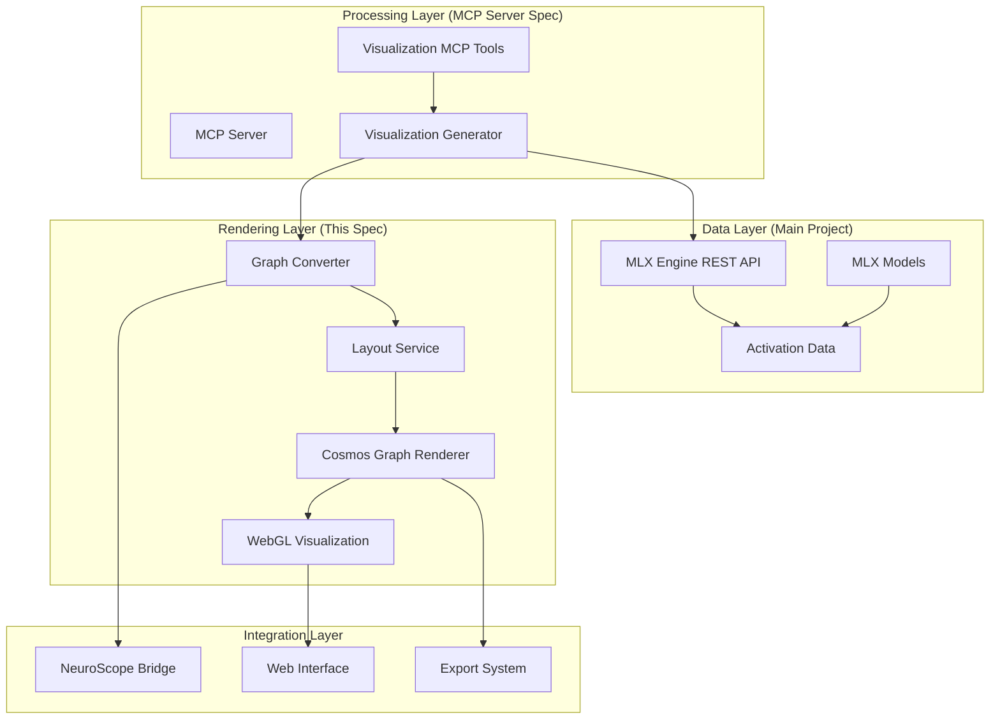

# Cosmos Graph Visualization Integration Specification

This specification defines the integration of **Cosmos Graph**, a high-performance WebGL-based graph visualization library, into the MLX Engine with NeuroScope Integration project. The integration provides interactive visualizations of neural network circuits, attention patterns, activation flows, and model architecture graphs to enhance mechanistic interpretability capabilities.

## 🏗️ Architecture Overview

The Cosmos Graph visualization system operates as a **client-side component** that receives graph data from both the MLX Engine REST API and the MCP Server, creating a three-tier visualization architecture:

```
Data Sources → Visualization Processing → Interactive Rendering
```

This design enables:
- **High-Performance Rendering**: WebGL-accelerated visualization of complex neural networks
- **Interactive Analysis**: Real-time exploration of model internals through graph interactions
- **Multi-Format Export**: Publication-quality outputs in PNG, SVG, and JSON formats

## 🔗 Relationship to Other Specifications

### MLX Engine Integration (Main Project)
- **Data Source**: Visualization system **consumes** activation data and model information from MLX Engine REST API
- **Integration Points**: New visualization endpoints added to MLX Engine REST API
- **Data Flow**: MLX Engine → Activation Data → Graph Conversion → Cosmos Graph Rendering

### MCP Server Specification
- **Tool Integration**: Visualization capabilities **exposed** through MCP tools in the MCP server
- **Agent Access**: LLM agents can request visualizations through natural language via MCP tools
- **Shared Components**: Both specs use the same graph data structures and conversion pipeline



## 🎯 Core Visualization Capabilities

### 1. Neural Circuit Visualization
- **Interactive Circuit Graphs**: Nodes represent neurons/components, edges show connections
- **Activation Strength Mapping**: Edge thickness and color intensity represent connection weights
- **Component Details**: Click interactions reveal detailed neuron/layer information
- **Multi-Layer Navigation**: Layer-by-layer exploration of circuit hierarchies

### 2. Attention Pattern Analysis
- **Attention Head Graphs**: Visualize attention mechanisms as interactive networks
- **Token Relationship Mapping**: Show how attention connects different tokens
- **Layer-by-Layer Analysis**: Navigate through transformer attention layers
- **Strength Visualization**: Node size represents attention strength

### 3. Activation Flow Visualization
- **Information Flow Graphs**: Track how information flows through model layers
- **Residual Stream Analysis**: Visualize residual stream connections and transformations
- **Token Processing Paths**: Show how specific tokens are processed through the network
- **Temporal Dynamics**: Visualize activation changes over generation steps

### 4. Model Architecture Graphs
- **Complete Model Structure**: Full transformer architecture visualization
- **Component Relationships**: Show connections between layers, attention heads, and MLPs
- **Scale-Adaptive Rendering**: Handle large models with level-of-detail rendering
- **Interactive Exploration**: Zoom, pan, and filter large architecture graphs

### 5. Comparative Analysis
- **Side-by-Side Visualization**: Compare circuits or models simultaneously
- **Synchronized Navigation**: Coordinated zoom and pan across multiple graphs
- **Difference Highlighting**: Highlight structural differences between models
- **Alignment Tools**: Tools to facilitate visual comparison

## 🛠️ Implementation Architecture

### Client-Side Rendering (Browser)
- **Cosmos Graph Library**: High-performance WebGL-based graph rendering
- **Interactive Controls**: Zoom, pan, node selection, and filtering
- **Export Capabilities**: PNG, SVG, and JSON export functionality
- **Fallback Support**: Canvas 2D and SVG fallbacks for unsupported browsers

### Server-Side Processing (Node.js)
- **Graph Data Conversion**: Transform MLX Engine data to Cosmos Graph format
- **Layout Algorithms**: Force-directed, hierarchical, and circular layouts
- **Performance Optimization**: Graph simplification for large datasets
- **Caching System**: Intelligent caching of generated visualizations

### MCP Tool Integration
- **Visualization MCP Tools**: `viz_create_circuit_graph`, `viz_create_attention_graph`, etc.
- **Natural Language Access**: Request visualizations through conversational interface
- **Automatic Generation**: AI-driven visualization type selection
- **Embedding Support**: Generate embeddable visualization code

### Testing Environment
- **Node.js Express Server**: Development server for testing Cosmos Graph integration
- **Interactive Demo**: Full-screen visualization demo with sample neural circuits
- **Browser Compatibility Testing**: Comprehensive testing across browsers and devices
- **Performance Benchmarking**: Testing with large graphs (1000+ nodes)

## 📊 Data Structures & Formats

### Graph Data Format
```javascript
const graphData = {
  id: "unique_graph_id",
  nodes: [
    {
      id: "node_1",
      label: "Attention Head 8.3",
      type: "attention_head",
      value: 0.8,  // Size/importance (0-1)
      color: "#4285f4",
      metadata: {
        layer: 8,
        head: 3,
        activation_strength: 0.8,
        semantic_role: "indirect_object_identification"
      }
    }
  ],
  links: [
    {
      id: "link_1",
      source: "node_1",
      target: "node_2",
      weight: 0.6,  // Connection strength (0-1)
      type: "attention",
      color: "#cccccc",
      metadata: {
        connection_type: "circuit",
        causal_strength: 0.6,
        attention_weight: 0.75
      }
    }
  ],
  metadata: {
    title: "IOI Circuit Visualization",
    type: "circuit",
    model_info: {
      model_id: "gpt-oss-20b",
      architecture: "transformer",
      num_layers: 20
    }
  }
}
```

### Cosmos Graph Configuration
```javascript
const cosmosConfig = {
  // Performance settings
  nodeSize: (node) => node.value * 10 + 3,
  linkWidth: (link) => link.weight * 3 + 1,
  linkArrows: true,
  
  // Visual settings
  backgroundColor: '#1a1a1a',
  nodeColor: (node) => node.color,
  linkColor: (link) => link.color,
  
  // Physics simulation
  simulation: {
    repulsion: 0.3,
    linkSpring: 0.8,
    linkDistance: 30,
    gravity: 0.1
  },
  
  // Interaction settings
  enableZoom: true,
  enablePan: true,
  showLabels: true
}
```

## 🚀 Current Implementation Status

Based on the existing implementation in `mcp-server/src/visualization/`:

✅ **Foundation Complete**
- Cosmos Graph integration with WebGL rendering
- Graph data conversion pipeline
- Interactive demo with sample neural circuits
- Browser compatibility testing framework
- Export functionality (PNG, SVG, JSON)

✅ **Core Components Implemented**
- **WebGL Capabilities Detection**: Automatic fallback for unsupported browsers
- **Graph Converter**: MLX data to Cosmos Graph format conversion
- **Visualization Generator**: Orchestrates data fetching and graph generation
- **Interactive Demo**: Full-screen visualization with sample 10-node neural circuit

✅ **Testing Infrastructure**
- **Node.js Test Server**: Express server for serving Cosmos Graph assets
- **Interactive Browser Tests**: Comprehensive WebGL and visualization testing
- **Performance Testing**: Large graph handling (1000+ nodes)
- **Fallback Testing**: Canvas 2D and SVG fallback mechanisms

🚧 **In Progress**
- MCP tool integration for agent access
- MLX Engine REST API data integration
- NeuroScope bridge implementation
- Web interface embedding components

## 🔧 Configuration & Setup

### Prerequisites
1. **Modern Browser**: WebGL 1.0+ support required for optimal performance
2. **Node.js 18+**: For development server and testing
3. **MLX Engine REST API**: Running for real data integration

### Quick Start
```bash
# Navigate to visualization directory
cd mcp-server/src/visualization

# Install Cosmos Graph and dependencies
npm install

# Start development server
node server.js

# Open interactive demo
# http://localhost:8888/

# Run browser tests
# http://localhost:8888/test_browser.html
```

### Browser Requirements
- **Minimum**: WebGL 1.0, ES2015+ JavaScript, Canvas 2D context
- **Recommended**: WebGL 2.0, hardware acceleration, 4GB+ RAM
- **Fallback**: SVG support for browsers without WebGL

## 🎨 Visualization Features

### Interactive Demo Capabilities
- **Full-Screen Visualization**: Immersive graph rendering experience
- **Sample Neural Circuit**: Pre-loaded 10-node transformer circuit
- **Real-Time Physics**: Dynamic force-directed layout simulation
- **Interactive Controls**: Click nodes, drag to pan, scroll to zoom
- **Export Functionality**: Download high-quality PNG images

### Sample Neural Circuit Structure
The demo includes a representative transformer circuit:
- **Input Layer**: Token and position embeddings
- **Attention Layer**: Self-attention and cross-attention heads
- **Processing Layer**: Feature detectors and pattern matchers
- **Circuit Layer**: IOI (Indirect Object Identification) and induction circuits
- **Output Layer**: Logit predictions

### Rendering Modes
1. **Cosmos Graph WebGL** (Primary):
   - Hardware-accelerated rendering via @cosmos.gl/graph
   - Real-time physics simulation with smooth interactions
   - High-performance rendering for complex graphs

2. **Canvas 2D Fallback** (Automatic):
   - Software rendering when WebGL unavailable
   - Static layout with color coding and legend
   - Maintained export functionality

3. **SVG Fallback** (Maximum Compatibility):
   - Static visualization for unsupported browsers
   - Vector graphics with full accessibility support

## 📈 Performance Characteristics

### Scalability Targets
- **Small Graphs** (10-100 nodes): 60 FPS interactive performance
- **Medium Graphs** (100-1000 nodes): 30 FPS with smooth interactions
- **Large Graphs** (1000+ nodes): Level-of-detail rendering with progressive loading
- **Memory Usage**: <2GB for typical visualization workflows

### Optimization Strategies
- **Automatic Graph Simplification**: Reduce complexity for large datasets
- **Level-of-Detail Rendering**: Show/hide details based on zoom level
- **Progressive Loading**: Load graph data incrementally
- **Intelligent Caching**: Cache generated layouts and visualizations

## 🔍 Integration Points

### MCP Server Integration
```javascript
// Example MCP tool for circuit visualization
const vizCreateCircuitGraph = {
  name: 'viz_create_circuit_graph',
  description: 'Create interactive circuit visualization',
  inputSchema: {
    type: 'object',
    properties: {
      circuit_id: { type: 'string' },
      model_id: { type: 'string' },
      layout: { enum: ['force', 'hierarchical', 'circular'] },
      theme: { enum: ['light', 'dark', 'custom'] }
    },
    required: ['circuit_id', 'model_id']
  },
  handler: async (params) => {
    // Generate visualization and return embed code
  }
}
```

### MLX Engine Data Flow
```javascript
// Example data integration
const circuitData = await fetch('http://localhost:8080/activations/circuit/IOI');
const activations = await circuitData.json();

// Convert to graph format
const graphData = GraphConverter.convertMLXToGraph(activations);

// Render with Cosmos Graph
const cosmos = new Graph(container, cosmosConfig);
cosmos.setData(graphData.nodes, graphData.links);
```

### NeuroScope Bridge
```javascript
// Example Smalltalk integration
const smalltalkCode = NeuroScopeBridge.generateVisualizationCode(graphData);
// Generates Smalltalk code that can display the visualization in NeuroScope
```

## 🎯 Success Metrics

### Functional Completeness
- ✅ All major graph types supported (circuit, attention, flow, architecture)
- ✅ Interactive features working (zoom, pan, click, hover)
- ✅ Export functionality for all formats (PNG, SVG, JSON)
- ✅ Cross-browser compatibility with fallback support

### Performance Targets
- **Rendering Speed**: <1s initialization, <100ms interaction response
- **Memory Efficiency**: <1GB for graphs with 1000+ nodes
- **Browser Support**: 95%+ compatibility across modern browsers
- **Export Quality**: Publication-ready outputs at 300+ DPI

### Integration Quality
- **MCP Tools**: Seamless integration with conversational interface
- **MLX Engine**: Real-time data integration with activation capture
- **NeuroScope**: Complete Smalltalk bridge functionality
- **Web Embedding**: Easy integration into existing web interfaces

## 🔗 Related Resources

- **Main Project**: [MLX Engine with NeuroScope Integration](../../../README.md)
- **MCP Server Spec**: [Mechanistic Interpretability MCP Server](../mcp-server/README.md)
- **Implementation**: [Visualization Implementation](../../mcp-server/src/visualization/README.md)
- **Cosmos Graph**: [Official Documentation](https://cosmos.uber.com/graph/)
- **WebGL Specification**: [Khronos WebGL](https://www.khronos.org/webgl/)

## 🐛 Troubleshooting

### Common Issues
1. **WebGL Not Supported**: Enable hardware acceleration, use fallback modes
2. **Performance Issues**: Reduce graph complexity, enable level-of-detail rendering
3. **Import Errors**: Verify Node.js configuration and dependency installation
4. **Export Failures**: Check browser permissions and memory availability

### Debug Mode
```javascript
// Enable debug logging
globalThis.DEBUG_VISUALIZATION = true;
```

---

*This specification defines the high-performance visualization system that makes neural network internals visually accessible through interactive WebGL-based graph rendering, integrated with both the MLX Engine data pipeline and the MCP server's agent interface.*