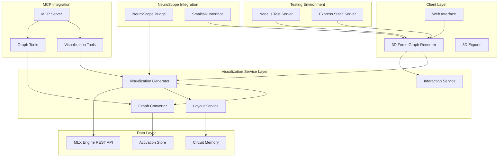
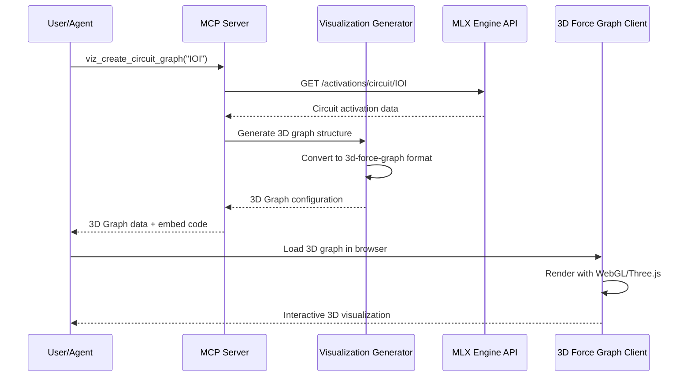

# Design Document

## Overview

The 3D Force Graph Visualization Integration extends the MLX Engine with NeuroScope Integration project by adding high-performance, interactive 3D graph visualizations using the 3d-force-graph JavaScript library. This integration provides immersive visual representations of neural network circuits, attention patterns, activation flows, and model architecture graphs, enhancing the mechanistic interpretability capabilities with powerful 3D visual analysis tools.

The design leverages 3d-force-graph's WebGL-based Three.js rendering engine to handle large-scale 3D graphs with thousands of nodes while maintaining smooth interaction performance. The integration follows the existing architecture patterns, extending both the **MLX Engine REST API Server** with visualization endpoints and the **Mechanistic Interpretability MCP Server** with 3D graph generation tools.

**Architecture Integration**: The 3d-force-graph visualization system operates as a **client-side component** that receives graph data from both the MLX Engine REST API and the MCP Server. This three-tier architecture enables:
- **MLX Engine**: Provides activation data and model information
- **MCP Server**: Processes data into 3D graph structures and provides visualization tools
- **3D Force Graph Client**: Renders interactive 3D visualizations in web browsers using WebGL

The system supports both **embedded 3D visualizations** in the NeuroScope web interface and **standalone 3D graph applications** for dedicated analysis workflows.

**Testing Environment**: For development and testing, a **Node.js Express server** provides a simple way to serve 3d-force-graph assets and test the 3D visualization components without the complexity of the full MCP integration.

## Architecture

### High-Level Architecture



### Integration Points

The 3d-force-graph visualization system integrates with existing components through well-defined interfaces:

1. **MLX Engine REST API**: New visualization endpoints for 3D graph data
2. **MCP Server**: New visualization tools for 3D graph generation
3. **NeuroScope Bridge**: 3D graph data conversion to Smalltalk format
4. **Web Interface**: Embedded 3d-force-graph components

**Testing Integration**: A Node.js Express server provides a development environment for testing 3d-force-graph integration without requiring the full MCP server setup.

### 3D Force Graph Integration Architecture



## Components and Interfaces

### 1. 3D Force Graph Renderer (Client-Side)

**Purpose**: High-performance WebGL-based 3D graph rendering using the 3d-force-graph library built on Three.js.

**Key Classes**:
```javascript
class ForceGraph3DRenderer {
  constructor(container, config) {
    this.graph = null;
    this.container = container;
    this.config = config;
    this.scene = null;
    this.camera = null;
    this.renderer = null;
  }
  
  async loadGraph(graphData) {
    // Implementation using ForceGraph3D
  }
  
  updateNodeData(nodeUpdates) {
    // Implementation with 3D positioning
  }
  
  updateLinkData(linkUpdates) {
    // Implementation with 3D link rendering
  }
  
  async exportImage(format) {
    // Returns Promise<Blob> - screenshot or 3D model
  }
  
  exportData() {
    // Returns Graph3DExportData
  }
  
  setCameraPosition(x, y, z) {
    // 3D camera positioning
  }
  
  animateToNode(nodeId) {
    // Smooth camera animation to node
  }
}

// NodeData structure for 3D:
// {
//   id: string,
//   label: string,
//   type: 'neuron' | 'attention_head' | 'layer' | 'circuit',
//   val: number,             // Node size in 3D
//   color: string,
//   x?: number,              // 3D position
//   y?: number,
//   z?: number,
//   fx?: number,             // Fixed position
//   fy?: number,
//   fz?: number,
//   metadata: object
// }

// LinkData structure for 3D:
// {
//   source: string | object,
//   target: string | object,
//   weight: number,          // Connection strength
//   type: 'activation' | 'attention' | 'circuit',
//   color: string,
//   width?: number,          // Link width in 3D
//   particles?: number,      // Particle animation count
//   metadata: object
// }

class InteractionController3D {
  constructor(renderer) {
    this.renderer = renderer;
  }
  
  onNodeClick(callback) {
    // callback: (node, event) => void
  }
  
  onNodeHover(callback) {
    // callback: (node | null, prevNode) => void
  }
  
  onLinkClick(callback) {
    // callback: (link, event) => void
  }
  
  onBackgroundClick(callback) {
    // callback: (event) => void
  }
  
  highlightNodes(nodeIds) {
    // nodeIds: string[] - 3D highlighting
  }
  
  filterGraph(predicate) {
    // predicate: (node, link) => boolean
  }
  
  setCameraControls(enabled) {
    // Enable/disable 3D camera controls
  }
  
  focusOnNode(nodeId, distance) {
    // Animate camera to focus on specific node
  }
}
```

**3D Force Graph Configuration**:
```javascript
// ForceGraph3DConfig structure:
// {
//   // 3D Performance settings
//   nodeVal: number | function(node) { return number; },
//   nodeColor: string | function(node) { return string; },
//   nodeThreeObject: function(node) { return THREE.Object3D; },
//   
//   // 3D Link settings
//   linkWidth: number | function(link) { return number; },
//   linkColor: string | function(link) { return string; },
//   linkDirectionalArrowLength: number,
//   linkDirectionalParticles: number | function(link) { return number; },
//   
//   // 3D Visual settings
//   backgroundColor: string,
//   showNavInfo: boolean,
//   
//   // 3D Force simulation
//   d3Force: {
//     charge: number,
//     link: number,
//     center: number
//   },
//   
//   // 3D Camera settings
//   cameraPosition: { x: number, y: number, z: number },
//   controlType: 'trackball' | 'orbit' | 'fly',
//   enablePointerInteraction: boolean,
//   enableNavigationControls: boolean
// }
```

### 2. Visualization Generator (Server-Side)

**Purpose**: Converts MLX Engine activation data and circuit information into 3d-force-graph-compatible 3D graph structures.

**Key Classes**:
```javascript
class VisualizationGenerator {
  constructor(mlxClient) {
    this.mlxClient = mlxClient;
  }
  
  async generateCircuitGraph(circuitId) {
    // Returns Promise<Graph3DData>
  }
  
  async generateAttentionGraph(layerRange) {
    // layerRange: [number, number]
    // Returns Promise<Graph3DData> with 3D layer positioning
  }
  
  async generateActivationFlowGraph(tokens) {
    // tokens: string[]
    // Returns Promise<Graph3DData> with temporal 3D positioning
  }
  
  async generateModelArchitectureGraph(modelId) {
    // Returns Promise<Graph3DData> with hierarchical 3D layout
  }
  
  async generateComparisonGraph(graphIds) {
    // graphIds: string[]
    // Returns Promise<Graph3DData> with side-by-side 3D positioning
  }
}

class Graph3DConverter {
  convertCircuitToGraph(circuit, activations) {
    // Returns Graph3DData with 3D positioning
  }
  
  convertAttentionToGraph(attentionData) {
    // attentionData: AttentionPattern[]
    // Returns Graph3DData with layer-based 3D positioning
  }
  
  convertActivationsToGraph(activations) {
    // Returns Graph3DData with temporal 3D flow
  }
  
  convertModelToGraph(modelInfo) {
    // Returns Graph3DData with architectural 3D layout
  }
  
  calculate3DPositions(nodes, layoutType) {
    // layoutType: 'layered' | 'spherical' | 'hierarchical'
    // Returns nodes with x, y, z coordinates
  }
}

// Graph3DData structure:
// {
//   nodes: NodeData[],
//   links: LinkData[],
//   metadata: {
//     title: string,
//     description: string,
//     type: GraphType,
//     created_at: Date,
//     model_info: ModelInfo
//   },
//   layout: {
//     algorithm: 'force3d' | 'layered3d' | 'spherical' | 'hierarchical3d',
//     parameters: object,
//     bounds: { x: [number, number], y: [number, number], z: [number, number] }
//   },
//   styling: {
//     theme: 'light' | 'dark' | 'custom',
//     colorScheme: string[],
//     nodeScale: [number, number],
//     linkScale: [number, number],
//     camera: { x: number, y: number, z: number, lookAt: { x: number, y: number, z: number } }
//   }
// }

// GraphType: 'circuit' | 'attention' | 'activation_flow' | 'model_architecture' | 'comparison'
```

### 3. 3D Layout Service

**Purpose**: Provides intelligent 3D graph layout algorithms optimized for different visualization types in 3D space.

**Key Classes**:
```javascript
class Layout3DService {
  calculateCircuitLayout3D(nodes, links) {
    // nodes: NodeData[], links: LinkData[]
    // Returns Layout3DResult with x, y, z coordinates
  }
  
  calculateAttentionLayout3D(nodes, links) {
    // Returns Layout3DResult with layer-based 3D positioning
  }
  
  calculateHierarchicalLayout3D(nodes, links) {
    // Returns Layout3DResult with tree-like 3D structure
  }
  
  calculateSphericalLayout3D(nodes, links) {
    // Returns Layout3DResult with spherical 3D positioning
  }
  
  calculateComparisonLayout3D(graphs) {
    // graphs: Graph3DData[]
    // Returns Layout3DResult with side-by-side 3D positioning
  }
}

// Layout3DResult structure:
// {
//   nodePositions: object, // Record<string, { x: number, y: number, z: number }>
//   bounds: { 
//     minX: number, maxX: number, 
//     minY: number, maxY: number, 
//     minZ: number, maxZ: number 
//   },
//   algorithm: string,
//   parameters: object,
//   cameraPosition: { x: number, y: number, z: number },
//   cameraTarget: { x: number, y: number, z: number }
// }

class Layout3DOptimizer {
  optimizeForPerformance(graphData) {
    // Returns Graph3DData with LOD and culling optimizations
  }
  
  optimizeForClarity(graphData) {
    // Returns Graph3DData with improved 3D spatial separation
  }
  
  optimizeForComparison(graphs) {
    // graphs: Graph3DData[]
    // Returns Graph3DData[] with aligned 3D positioning
  }
  
  calculateOptimal3DSpacing(nodes, links) {
    // Returns optimal 3D spacing parameters
  }
}
```

### 4. MCP Visualization Tools

**Purpose**: Provides MCP tools for generating and managing 3d-force-graph visualizations.

**MCP Tools**:
```javascript
// Core 3D visualization tools
const vizTools = [
  'viz_create_circuit_graph',      // Generate 3D circuit visualization
  'viz_create_attention_graph',    // Generate 3D attention pattern visualization
  'viz_create_flow_graph',         // Generate 3D activation flow visualization
  'viz_create_architecture_graph', // Generate 3D model architecture visualization
  'viz_create_comparison_graph',   // Generate side-by-side 3D comparison
  'viz_export_graph',              // Export 3D graph in various formats
  'viz_update_graph',              // Update existing 3D graph data
  'viz_apply_layout',              // Apply specific 3D layout algorithm
  'viz_customize_styling',         // Apply custom 3D styling and materials
  'viz_embed_graph',               // Generate embeddable 3D graph code
  'viz_set_camera',                // Set 3D camera position and target
  'viz_animate_camera'             // Animate 3D camera transitions
];

// VizCreateCircuitGraphParams structure:
// {
//   circuit_id: string,
//   model_id: string,
//   layout?: 'force3d' | 'layered3d' | 'spherical' | 'hierarchical3d',
//   theme?: 'light' | 'dark' | 'custom',
//   show_weights?: boolean,
//   filter_threshold?: number,
//   camera_position?: { x: number, y: number, z: number },
//   enable_particles?: boolean,
//   node_3d_objects?: boolean
// }

// VizCreateCircuitGraphResult structure:
// {
//   success: boolean,
//   graph_id: string,
//   graph_data: Graph3DData,
//   embed_code: string,
//   preview_url: string,
//   export_options: string[], // Includes '3d-model', 'screenshot', 'json'
//   camera_controls: CameraControlsInfo
// }
```

### 5. Web Interface Integration

**Purpose**: Embeds 3d-force-graph visualizations into the existing NeuroScope web interface.

**Key Components**:
```javascript
class Visualization3DPanel {
  constructor(container) {
    this.container = container;
    this.renderer = null;
    this.toolbar = null;
    this.cameraControls = null;
  }
  
  async loadVisualization(graphData) {
    // Returns Promise<void> - loads 3D graph
  }
  
  updateVisualization(updates) {
    // updates: Graph3DUpdate
  }
  
  async exportVisualization(format) {
    // format: ExportFormat ('screenshot' | '3d-model' | 'json')
    // Returns Promise<Blob>
  }
  
  setCameraPosition(x, y, z, lookAt) {
    // Set 3D camera position and target
  }
  
  animateToNode(nodeId, duration) {
    // Smooth camera animation to focus on node
  }
}

class Visualization3DToolbar {
  constructor() {
    this.controls = [];
  }
  
  addLayoutControl() {
    // 3D layout options
  }
  
  addFilterControl() {
    // 3D filtering options
  }
  
  addExportControl() {
    // 3D export options (screenshot, 3D model)
  }
  
  addCameraControl() {
    // 3D camera positioning controls
  }
  
  addComparisonControl() {
    // 3D comparison view controls
  }
  
  addAnimationControl() {
    // 3D animation and particle controls
  }
  
  onControlChange(callback) {
    // callback: (control: string, value: any) => void
  }
}

class Visualization3DEmbedder {
  generateEmbedCode(graphId, options) {
    // options: Embed3DOptions
    // Returns string with 3d-force-graph embed code
  }
  
  createStandaloneViewer(graphData) {
    // Returns string with full 3D viewer HTML
  }
  
  generateShareableLink(graphId) {
    // Returns string with 3D graph state in URL
  }
  
  generate3DModelExport(graphId) {
    // Returns string with GLB/GLTF export
  }
}
```

### 6. Export and Sharing System

**Purpose**: Enables export of 3D visualizations in multiple formats including 3D models and sharing capabilities.

**Key Classes**:
```javascript
class Export3DManager {
  async exportScreenshot(graphId, options) {
    // options: ScreenshotExportOptions
    // Returns Promise<Blob> - PNG screenshot of 3D view
  }
  
  async export3DModel(graphId, options) {
    // options: Model3DExportOptions
    // Returns Promise<Blob> - GLB/GLTF 3D model
  }
  
  async exportJSON(graphId) {
    // Returns Promise<Graph3DExportData>
  }
  
  async exportInteractive(graphId) {
    // Returns Promise<string> - HTML with embedded 3d-force-graph
  }
  
  async exportVR(graphId, options) {
    // options: VRExportOptions
    // Returns Promise<Blob> - VR-compatible format
  }
}

// ScreenshotExportOptions structure:
// {
//   width: number,
//   height: number,
//   scale: number,
//   backgroundColor: string,
//   includeLabels: boolean,
//   cameraPosition: { x: number, y: number, z: number },
//   cameraTarget: { x: number, y: number, z: number }
// }

// Model3DExportOptions structure:
// {
//   format: 'glb' | 'gltf' | 'obj',
//   includeTextures: boolean,
//   includeMaterials: boolean,
//   includeAnimations: boolean,
//   compression: 'none' | 'draco',
//   scale: number
// }

// Graph3DExportData structure:
// {
//   graph_data: Graph3DData,
//   force_graph_3d_config: ForceGraph3DConfig,
//   export_metadata: {
//     exported_at: Date,
//     version: string,
//     source: string,
//     camera_state: CameraState,
//     three_js_version: string
//   }
// }
```

## Data Models

### 3D Graph Data Structures

```javascript
// Graph3DData structure:
// {
//   id: string,
//   nodes: NodeData[],
//   links: LinkData[],
//   metadata: GraphMetadata,
//   layout: Layout3DConfiguration,
//   styling: Styling3DConfiguration
// }

// NodeData structure for 3D:
// {
//   id: string,
//   label: string,
//   type: NodeType,
//   val: number,              // Node size in 3D
//   color: string,
//   x?: number,               // 3D position
//   y?: number,
//   z?: number,
//   fx?: number,              // Fixed position
//   fy?: number,
//   fz?: number,
//   metadata: {
//     layer?: number,
//     component?: string,
//     activation_strength?: number,
//     semantic_role?: string,
//     three_object?: string,  // Custom Three.js object type
//     // Additional properties as needed
//   }
// }

// LinkData structure for 3D:
// {
//   id: string,
//   source: string | object,
//   target: string | object,
//   weight: number,
//   type: LinkType,
//   color: string,
//   width?: number,           // Link width in 3D
//   particles?: number,       // Particle animation count
//   metadata: {
//     connection_type?: string,
//     attention_weight?: number,
//     causal_strength?: number,
//     animation_speed?: number,
//     // Additional properties as needed
//   }
// }

// NodeType: 'neuron' | 'attention_head' | 'layer' | 'circuit' | 'token' | 'feature'
// LinkType: 'activation' | 'attention' | 'circuit' | 'causal' | 'similarity'

// GraphMetadata structure:
// {
//   title: string,
//   description: string,
//   type: GraphType,
//   created_at: Date,
//   model_info: {
//     model_id: string,
//     architecture: string,
//     num_layers: number
//   },
//   analysis_info: {
//     circuit_id?: string,
//     layer_range?: [number, number],
//     tokens?: string[],
//     phenomenon?: string
//   },
//   camera_info: {
//     initial_position: { x: number, y: number, z: number },
//     initial_target: { x: number, y: number, z: number },
//     controls_type: 'trackball' | 'orbit' | 'fly'
//   }
// }
```

### 3D Force Graph Integration Models

```javascript
// ForceGraph3DConfig structure:
// {
//   // 3D Node settings
//   nodeVal: number | function(node) { return number; },
//   nodeColor: string | function(node) { return string; },
//   nodeThreeObject: function(node) { return THREE.Object3D; },
//   nodeThreeObjectExtend: boolean,
//   
//   // 3D Link settings
//   linkWidth: number | function(link) { return number; },
//   linkColor: string | function(link) { return string; },
//   linkDirectionalArrowLength: number,
//   linkDirectionalArrowColor: string | function(link) { return string; },
//   linkDirectionalParticles: number | function(link) { return number; },
//   linkDirectionalParticleSpeed: number | function(link) { return number; },
//   
//   // 3D Visual settings
//   backgroundColor: string,
//   showNavInfo: boolean,
//   nodeLabel: string | function(node) { return string; },
//   
//   // 3D Force simulation
//   d3Force: object,
//   d3AlphaDecay: number,
//   d3VelocityDecay: number,
//   
//   // 3D Camera and controls
//   cameraPosition: { x: number, y: number, z: number },
//   controlType: 'trackball' | 'orbit' | 'fly',
//   enablePointerInteraction: boolean,
//   enableNavigationControls: boolean,
//   
//   // 3D Performance settings
//   rendererConfig: object,
//   enableVR: boolean
// }

// Visualization3DState structure:
// {
//   graph_id: string,
//   camera_position: { x: number, y: number, z: number },
//   camera_target: { x: number, y: number, z: number },
//   camera_up: { x: number, y: number, z: number },
//   selected_nodes: string[],
//   highlighted_nodes: string[],
//   active_filters: FilterConfiguration[],
//   layout_state: Layout3DState,
//   animation_state: {
//     particles_enabled: boolean,
//     rotation_enabled: boolean,
//     auto_rotate_speed: number
//   }
// }
```

### MLX Engine Integration Models

```javascript
// Visualization3DRequest structure:
// {
//   type: GraphType,
//   model_id: string,
//   parameters: {
//     circuit_id?: string,
//     layer_range?: [number, number],
//     tokens?: string[],
//     phenomenon?: string,
//     comparison_targets?: string[]
//   },
//   options: {
//     layout: 'force3d' | 'layered3d' | 'spherical' | 'hierarchical3d',
//     theme: string,
//     filters: FilterConfiguration[],
//     styling: Styling3DOverrides,
//     camera: {
//       position: { x: number, y: number, z: number },
//       target: { x: number, y: number, z: number },
//       controls: 'trackball' | 'orbit' | 'fly'
//     },
//     animation: {
//       particles: boolean,
//       auto_rotate: boolean,
//       transition_duration: number
//     }
//   }
// }

// Visualization3DResponse structure:
// {
//   success: boolean,
//   graph_id: string,
//   graph_data: Graph3DData,
//   force_graph_3d_config: ForceGraph3DConfig,
//   embed_code: string,
//   preview_url: string,
//   export_formats: string[], // ['screenshot', '3d-model', 'json', 'vr']
//   camera_controls: CameraControlsInfo,
//   error?: string
// }
```

## Error Handling

### 3D Visualization-Specific Errors

```javascript
class Visualization3DError extends Error {
  constructor(message, code, graphId) {
    super(message);
    this.name = 'Visualization3DError';
    this.code = code;
    this.graphId = graphId;
  }
}

class WebGLRenderingError extends Visualization3DError {
  constructor(message, graphId, cause) {
    super(`3D rendering failed: ${message}`, 'WEBGL_ERROR', graphId);
    this.cause = cause;
  }
}

class ThreeJSError extends Visualization3DError {
  constructor(message, graphId, threeJSError) {
    super(`Three.js error: ${message}`, 'THREEJS_ERROR', graphId);
    this.threeJSError = threeJSError;
  }
}

class Data3DConversionError extends Visualization3DError {
  constructor(message, dataType) {
    super(`3D data conversion failed for ${dataType}: ${message}`, 'CONVERSION_ERROR');
  }
}

class Performance3DError extends Visualization3DError {
  constructor(nodeCount, linkCount) {
    super(
      `3D graph too large for optimal performance: ${nodeCount} nodes, ${linkCount} links`,
      'PERFORMANCE_ERROR'
    );
  }
}

class CameraError extends Visualization3DError {
  constructor(message, cameraState) {
    super(`Camera error: ${message}`, 'CAMERA_ERROR');
    this.cameraState = cameraState;
  }
}
```

### Error Recovery Strategies

1. **3D Rendering Failures**:
   - Fall back to 2D visualization
   - Reduce 3D graph complexity automatically
   - Provide WebGL compatibility detection

2. **Performance Issues**:
   - Implement 3D level-of-detail rendering
   - Apply automatic node culling for large graphs
   - Offer progressive 3D loading with instancing

3. **Data Conversion Errors**:
   - Validate 3D positioning data before conversion
   - Provide detailed error messages with 3D context
   - Suggest 3D data format corrections

4. **Browser Compatibility**:
   - Detect WebGL and WebGL2 support
   - Provide 2D fallback renderers
   - Show 3D compatibility warnings
   - Test Three.js compatibility

### Graceful Degradation

```javascript
class Visualization3DFallback {
  static detect3DCapabilities() {
    // Returns Browser3DCapabilities
  }
  
  static selectRenderer(capabilities) {
    // capabilities: Browser3DCapabilities
    // Returns RendererType ('webgl2' | 'webgl' | '2d-fallback')
  }
  
  static simplify3DGraph(graphData, targetComplexity) {
    // Returns Graph3DData with reduced complexity
  }
  
  static provideFallbackVisualization(graphData) {
    // Returns string (2D SVG fallback or simplified 3D)
  }
  
  static testThreeJSCompatibility() {
    // Returns ThreeJSCompatibility
  }
}

// Browser3DCapabilities structure:
// {
//   webgl: boolean,
//   webgl2: boolean,
//   maxTextureSize: number,
//   maxVertexUniforms: number,
//   maxFragmentUniforms: number,
//   performanceLevel: 'high' | 'medium' | 'low',
//   threeJSSupport: boolean,
//   vrSupport: boolean,
//   maxRenderbufferSize: number
// }
```

## Testing Strategy

### Unit Testing

1. **3D Graph Conversion Tests**: Validate conversion from MLX data to 3d-force-graph format
2. **3D Layout Algorithm Tests**: Test 3D layout algorithms with various graph types
3. **3D Rendering Tests**: Test 3d-force-graph integration and WebGL rendering
4. **3D Export Tests**: Validate export functionality across formats including 3D models

### Integration Testing

1. **MLX Engine Integration**: Test complete data flow from MLX Engine to 3D visualization
2. **MCP Tool Tests**: Validate all 3D visualization MCP tools
3. **Web Interface Integration**: Test embedded 3D visualizations in NeuroScope
4. **Cross-Browser Testing**: Ensure WebGL compatibility across browsers
5. **Three.js Integration**: Test Three.js compatibility and performance

### Performance Testing

1. **Large 3D Graph Testing**: Test with 3D graphs containing 1000+ nodes
2. **WebGL Memory Testing**: Monitor GPU memory consumption during 3D rendering
3. **3D Interaction Performance**: Test camera controls, node selection, and 3D navigation
4. **3D Export Performance**: Benchmark export times for screenshots and 3D models
5. **Frame Rate Testing**: Ensure 60fps performance in 3D environments

### Visual Testing

1. **3D Screenshot Comparison**: Automated visual regression testing for 3D views
2. **3D Layout Consistency**: Ensure consistent 3D layouts across runs
3. **3D Color Accuracy**: Validate 3D materials, lighting, and accessibility
4. **Responsive 3D Design**: Test 3D visualizations at different screen sizes
5. **Camera State Testing**: Test camera position and animation consistency

### User Experience Testing

1. **3D Interaction Testing**: Test all 3D interactions (camera controls, node selection)
2. **3D Accessibility Testing**: Ensure 3D visualizations are accessible
3. **Mobile 3D Testing**: Test 3D touch interactions on mobile devices
4. **VR Compatibility Testing**: Test VR mode functionality where supported
5. **Performance Perception**: Test perceived performance in 3D environments

## Testing Environment Details

### Node.js Test Server (Development Only)

For development and testing of 3d-force-graph integration, a simple Node.js Express server provides module resolution:

**Project Structure**:
```
mcp-server/
├── package.json              # Node.js dependencies for testing
├── server.js                 # Express server for serving test assets
├── 3d-force-graph-test.html  # Test 3D visualization interface
├── node_modules/             # npm dependencies including 3d-force-graph
│   └── 3d-force-graph/
│       └── dist/
│           └── 3d-force-graph.min.js  # UMD module for browser
│   └── three/
│       └── build/
│           └── three.min.js   # Three.js dependency
└── src/
    └── visualization/        # MCP 3D visualization implementation
```

**Key Dependencies**:
```json
{
  "dependencies": {
    "3d-force-graph": "^1.70.0",
    "three": "^0.150.0",
    "express": "^4.18.0"
  },
  "type": "module"
}
```

**Server Configuration**:
```javascript
// Serve static files including HTML, CSS, JS
app.use(express.static(__dirname));

// Critical: Serve node_modules for browser access to 3d-force-graph
app.use('/node_modules', express.static(path.join(__dirname, 'node_modules')));
```

**Browser Module Loading**:
```javascript
// Import 3d-force-graph from served node_modules
import ForceGraph3D from '/node_modules/3d-force-graph/dist/3d-force-graph.min.js';

// Make available globally for event handlers
window.ForceGraph3D = ForceGraph3D;
```

**Benefits for Testing**:
1. **Simplified Module Resolution**: No complex import maps or CDN dependencies
2. **Reliable Local Dependencies**: Uses exact npm-installed version of 3d-force-graph
3. **Easy Development**: Standard Node.js development workflow for 3D testing
4. **Isolated Testing**: Test 3d-force-graph integration without full MCP server setup
5. **WebGL Testing**: Test WebGL and Three.js compatibility in controlled environment

## Documentation Updates

### Node.js Visualization Server README

A new README must be created for the Node.js visualization server to document the 3D capabilities:

**Sections to Include:**

1. **Getting Started Section**:
```markdown
## 3D Force Graph Visualization Server

A Node.js web application for visualizing neural network circuits, attention patterns, and activation flows using the 3d-force-graph WebGL library built on Three.js.

### Quick Start

1. Install dependencies:
```bash
npm install
```

2. Start the server:
```bash
npm start
```

3. Open browser to http://localhost:3000

### Features
- Interactive 3D WebGL-based graph visualization
- Real-time 3D neural circuit exploration
- 3D attention pattern analysis with layer separation
- 3D activation flow visualization with temporal positioning
- Export capabilities (Screenshots, 3D models, JSON)
- Immersive 3D camera controls
- VR compatibility (where supported)
- Responsive 3D web interface
```

2. **Usage Examples Section**:
```markdown
### Usage Examples

#### Basic 3D Visualization Workflow

1. **Initialize 3D Force Graph**: Click "Initialize 3D Graph" to set up WebGL renderer
2. **Load Sample 3D Graph**: Click "Load Sample 3D Graph" to display neural circuit in 3D
3. **Interact**: Use mouse to rotate, zoom, and pan in 3D space
4. **Camera Controls**: Use trackball controls to navigate the 3D environment
5. **Randomize 3D Layout**: Click "Randomize 3D Layout" to scramble and watch 3D physics

#### Integrating with MLX Engine

```javascript
// Fetch circuit data from MLX Engine
const circuitData = await fetch('http://localhost:8080/activations/circuit/IOI');
const activations = await circuitData.json();

// Convert to 3D graph format
const graph3DData = Graph3DDataGenerator.convertMLXTo3DGraph(activations);

// Load into 3D Force Graph
graph3D.graphData(graph3DData);
```

#### Custom 3D Graph Creation

```javascript
const custom3DNodes = [
  { id: 'node1', label: 'Input', val: 0.8, color: '#58a6ff', x: -50, y: 0, z: 0 },
  { id: 'node2', label: 'Hidden', val: 0.6, color: '#f85149', x: 0, y: 0, z: 0 },
  { id: 'node3', label: 'Output', val: 0.9, color: '#3fb950', x: 50, y: 0, z: 0 }
];

const custom3DLinks = [
  { source: 'node1', target: 'node2', width: 0.7, particles: 2 },
  { source: 'node2', target: 'node3', width: 0.8, particles: 3 }
];

graph3D.graphData({ nodes: custom3DNodes, links: custom3DLinks });
```
```

3. **Configuration Section Update**:
```markdown
### Visualization Configuration

Add to your MCP server configuration:

```javascript
// MCPServerConfig structure:
// {
//   // ... existing config ...
//   
//   visualization: {
//     force_graph_3d: {
//       maxNodes: number,        // Maximum nodes per 3D graph (default: 5000)
//       maxLinks: number,        // Maximum links per 3D graph (default: 10000)
//       defaultTheme: string,    // Default theme: 'light' | 'dark' | 'custom'
//       enableWebGL: boolean,    // Enable WebGL rendering (default: true)
//       enableWebGL2: boolean,   // Enable WebGL2 for better performance (default: true)
//       exportFormats: string[], // Supported export formats ['screenshot', '3d-model', 'json']
//       defaultCameraControls: string, // 'trackball' | 'orbit' | 'fly'
//       enableVR: boolean,       // Enable VR mode where supported
//       particleAnimations: boolean // Enable particle animations on links
//     },
//     storage: {
//       graphCachePath: string,  // Path for caching generated 3D graphs
//       exportPath: string,      // Path for exported 3D visualizations
//       maxCacheSize: number     // Maximum cache size in MB
//     },
//     performance: {
//       renderTimeout: number,   // 3D rendering timeout in milliseconds
//       simplifyThreshold: number, // Auto-simplify 3D graphs above this size
//       enableLOD: boolean,      // Enable level-of-detail rendering for 3D
//       maxFrameRate: number,    // Target frame rate for 3D rendering (default: 60)
//       enableNodeCulling: boolean // Enable frustum culling for performance
//     }
//   }
// }
```
```

4. **Browser Requirements Section**:
```markdown
### Browser Requirements for Visualizations

Cosmos Graph visualizations require modern browser support:

**Minimum Requirements:**
- WebGL 1.0 support
- Three.js compatibility
- ES2015+ JavaScript support
- Hardware-accelerated graphics

**Recommended:**
- WebGL 2.0 support for optimal 3D performance
- Dedicated GPU for complex 3D scenes
- 8GB+ RAM for large 3D graph visualizations
- Modern browser with full WebGL feature support

**Fallback Support:**
- 2D graph fallback for browsers without WebGL
- Simplified 3D layouts for low-performance devices
- Progressive enhancement for older browsers
- Automatic quality reduction based on performance
```

5. **Troubleshooting Section Addition**:
```markdown
### Visualization Troubleshooting

**Common Issues:**

1. **3D Graph Not Rendering**
   - Check WebGL support: Test WebGL context creation
   - Verify Three.js compatibility and version
   - Verify graph data format matches 3d-force-graph requirements
   - Check browser console for WebGL or Three.js errors

2. **3D Performance Issues**
   - Reduce 3D graph complexity with `filter_threshold` parameter
   - Enable level-of-detail rendering and node culling in configuration
   - Use simplified 3D layouts for large graphs
   - Check GPU memory usage and capabilities

3. **3D Export Failures**
   - Ensure sufficient GPU memory for 3D model exports
   - Check export path permissions
   - Verify 3D export format is supported (GLB, GLTF, screenshot)
   - Test WebGL canvas export capabilities

4. **3D Integration Issues**
   - Confirm MLX Engine REST API is accessible
   - Validate 3D activation data format with x, y, z coordinates
   - Check MCP tool parameter schemas for 3D-specific parameters
   - Test camera positioning and 3D scene setup

5. **Camera and Navigation Issues**
   - Verify camera controls are properly initialized
   - Check for conflicting event handlers
   - Test different control types (trackball, orbit, fly)
   - Validate camera position and target coordinates
```
```

### API Documentation Updates

The REST API documentation should include new visualization endpoints:

```markdown
## Visualization Endpoints

### POST /visualizations/create
Create a new graph visualization

**Request Body:**
```json
{
  "type": "circuit" | "attention" | "flow" | "architecture" | "comparison",
  "model_id": "string",
  "parameters": {
    "circuit_id": "string",
    "layer_range": [number, number],
    "tokens": ["string"],
    "phenomenon": "string"
  },
  "options": {
    "layout": "force" | "hierarchical" | "circular",
    "theme": "light" | "dark" | "custom",
    "filters": [],
    "styling": {}
  }
}
```

**Response:**
```json
{
  "success": boolean,
  "graph_id": "string",
  "graph_data": GraphData,
  "embed_code": "string",
  "preview_url": "string"
}
```

### GET /visualizations/{graph_id}
Retrieve existing visualization

### POST /visualizations/{graph_id}/export
Export visualization in specified format

### PUT /visualizations/{graph_id}
Update existing visualization
```